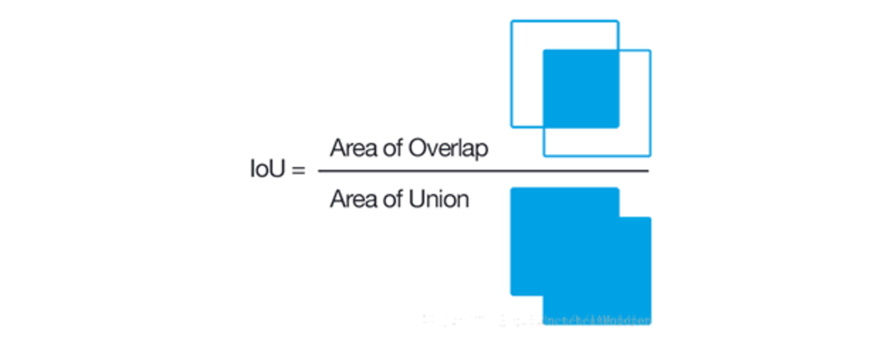
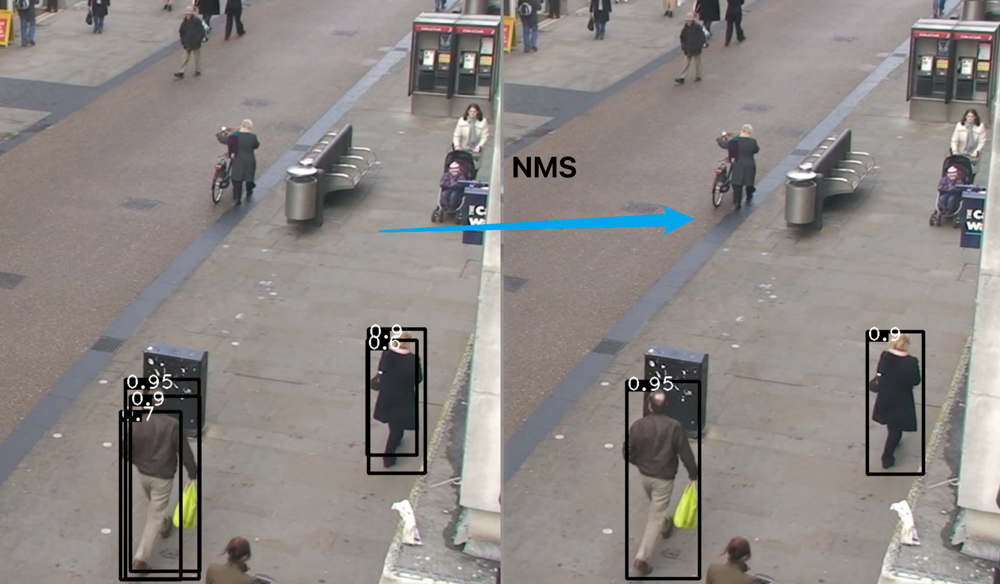
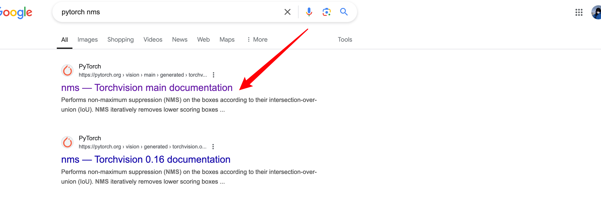

# 目标检测基础知识

## IOU

### IOU是什么？

文字：Intersection over Union、两个box区域的交集比上并集、交并比

[图示](https://zhuanlan.zhihu.com/p/54709759)：

### IOU怎么实现？


思路：（注意维度一致）

- 首先计算两个box左上角点坐标的最大值和右下角坐标的最小值 

- 然后计算交集面积 

- 最后把交集面积除以对应的并集面积

!!! note
	左上角坐标和右下角坐标确定一个框


#### 官方api


  pytorch源码：

（注意矩阵维度的变化）

#### box_iou

```python
def box_iou(boxes1: Tensor, boxes2: Tensor) -> Tensor:
    """
    Return intersection-over-union (Jaccard index) between two sets of boxes.

    Both sets of boxes are expected to be in ``(x1, y1, x2, y2)`` format with
    ``0 <= x1 < x2`` and ``0 <= y1 < y2``.

    Args:
        boxes1 (Tensor[N, 4]): first set of boxes
        boxes2 (Tensor[M, 4]): second set of boxes

    Returns:
        Tensor[N, M]: the NxM matrix containing the pairwise IoU values for every element in boxes1 and boxes2
    """
    if not torch.jit.is_scripting() and not torch.jit.is_tracing():
        _log_api_usage_once(box_iou)
    inter, union = _box_inter_union(boxes1, boxes2)
    iou = inter / union
    return iou
```

**<u>懂了</u>**：boxes1有N个，boxes2有M个，返回的N×M是boxes1中的所有检测框与boxes2中所有检测框的IOU值，boxes：集合、框的集合

#### _box_inter_union

```python
def _box_inter_union(boxes1: Tensor, boxes2: Tensor) -> Tuple[Tensor, Tensor]:
    area1 = box_area(boxes1) # (x1, y1, x2, y2)
    area2 = box_area(boxes2)

    lt = torch.max(boxes1[:, None, :2], boxes2[:, :2])  # [N,M,2] 找到左上角的最大值
    rb = torch.min(boxes1[:, None, 2:], boxes2[:, 2:])  # [N,M,2] 找到右下角的最小值

    wh = _upcast(rb - lt).clamp(min=0)  # [N,M,2]
    inter = wh[:, :, 0] * wh[:, :, 1]  # [N,M]

    union = area1[:, None] + area2 - inter

    return inter, union
```


#### box_area

**是什么？**

给定一系列边界框坐标集合，计算每个边界框的面积  

**返回值**：N的边界框的面积

**怎么实现的？** 面积的计算公式：`(boxes[:, 2] - boxes[:, 0]) * (boxes[:, 3] - boxes[:, 1])`

**边界框的坐标集合？** `(x1, y1, x2, y2)` 

```python
def box_area(boxes: Tensor) -> Tensor:
    """
    Computes the area of a set of bounding boxes, which are specified by their
    (x1, y1, x2, y2) coordinates.

    Args:
        boxes (Tensor[N, 4]): boxes for which the area will be computed. They
            are expected to be in (x1, y1, x2, y2) format with
            ``0 <= x1 < x2`` and ``0 <= y1 < y2``.

    Returns:
        Tensor[N]: the area for each box
    """
    if not torch.jit.is_scripting() and not torch.jit.is_tracing():
        _log_api_usage_once(box_area)
    boxes = _upcast(boxes)
    return (boxes[:, 2] - boxes[:, 0]) * (boxes[:, 3] - boxes[:, 1])
```

#### [Reference  代码实现](https://zhuanlan.zhihu.com/p/54709759)


```python
import torch
import matplotlib.pyplot as plt
import matplotlib.patches as patches

# IOU计算
# 假设box1维度为[N,4]   box2维度为[M,4]
def iou(box1, box2):
    N = box1.size(0)
    M = box2.size(0)

    lt = torch.max(  # 左上角的点
        box1[:, :2].unsqueeze(1).expand(N, M, 2),   # [N,2]->[N,1,2]->[N,M,2]
        box2[:, :2].unsqueeze(0).expand(N, M, 2),   # [M,2]->[1,M,2]->[N,M,2]
    )
    print("lt",lt)
    print("lt shape",lt.shape)

    rb = torch.min(
        box1[:, 2:].unsqueeze(1).expand(N, M, 2),
        box2[:, 2:].unsqueeze(0).expand(N, M, 2),
    )
    print("rb",rb)
    print("rb shape",rb.shape)

    wh = rb - lt  # [N,M,2]
    print("wh",wh)
    wh[wh < 0] = 0   # 两个box没有重叠区域
    inter = wh[:,:,0] * wh[:,:,1]   # [N,M]

    area1 = (box1[:,2]-box1[:,0]) * (box1[:,3]-box1[:,1])  # (N,)
    area2 = (box2[:,2]-box2[:,0]) * (box2[:,3]-box2[:,1])  # (M,)
    area1 = area1.unsqueeze(1).expand(N,M)  # (N,M)
    area2 = area2.unsqueeze(0).expand(N,M)  # (N,M)

    iou = inter / (area1 + area2 - inter)
    return iou

# # 测试代码1
# M=1
# N=1
# box1 = torch.tensor([[20, 30, 40, 50]], dtype=torch.float)  # 手动设置有重叠区域的框
# box2 = torch.tensor([[30, 40, 50, 60]], dtype=torch.float)
# # IOU: tensor([[0.1429]])

# 测试代码2
M=2
N=1
box1 = torch.tensor([[20, 30, 40, 50]], dtype=torch.float)  # 手动设置有重叠区域的框
print(box1.shape)
box2 = torch.tensor([[30, 40, 50, 60], [15, 25, 35, 45]], dtype=torch.float)
print(box2.shape)

# IOU: tensor([[0.1429, 0.3913]])

# 测试代码3
# N=2
# M=3
# box1 = torch.tensor([[20, 30, 40, 50], [60, 70, 80, 90]], dtype=torch.float)  # 手动设置有重叠区域的框
# print(box1.shape)
# box2 = torch.tensor([[30, 40, 50, 60], [70, 80, 90, 100], [15, 25, 35, 45]], dtype=torch.float)
# print(box2.shape)

# print("Box1:", box1)
# print("Box2:", box2)
# print("IOU:", iou(box1, box2))

# # 绘制边界框
# fig, ax = plt.subplots(1)

# # 绘制box1
# for i in range(N):
#     rect = patches.Rectangle((box1[i, 0], box1[i, 1]), box1[i, 2] - box1[i, 0], box1[i, 3] - box1[i, 1], linewidth=1, edgecolor='r', facecolor='none')
#     ax.add_patch(rect)

# # 绘制box2
# for i in range(M):
#     rect = patches.Rectangle((box2[i, 0], box2[i, 1]), box2[i, 2] - box2[i, 0], box2[i, 3] - box2[i, 1], linewidth=1, edgecolor='b', facecolor='none')
#     ax.add_patch(rect)

# plt.xlim(0, 100)
# plt.ylim(0, 100)
# plt.gca().set_aspect('equal', adjustable='box')
# plt.show()
```

其中：

torch.unsqueeze(1) 表示增加一个维度，增加位置为维度1

torch.squeeze(1) 表示减少一个维度

🌰：


$\frac{1}{7}$


## NMS

### NMS是什么？

5个字：过滤冗余框

> 文字描述、数学实例

文字：

- Non-maximum suppression、非极大值抑制算法

[数学实例](https://zhuanlan.zhihu.com/p/60794316)

[图示](https://blog.csdn.net/m0_56569131/article/details/136192324)：

需要给定的输入：预测的边界框及置信度

!!! note  
    非极大值抑制（NMS）算法，用于去除重叠的边界框     
    :param bboxes: 边界框列表，每个边界框格式为[xmin, ymin, xmax, ymax]      
    :param scores: 边界框对应的置信度列表    
    :param iou _thresh: IOU（交并比）阈值，用于判断两个边界框是否重叠                 
    :return: 经过NMS处理后的边界框和置信度列表





### 为什么NMS？

NMS的作用是去除多个预测同一物体的冗余检测框

**哪里需要用？**

以RCNN系列、Yolo系列为首的一些模型在目标检测领域已经取得了非常成熟的应用效果，但不管是单阶段模型（如Yolo、SSD）还是两阶段模型（如RCNN），都需要进行非极大值抑制（Non-Maximum Suppression，简称NMS）的后处理操作。

**缺点**

① O(n)的算法，当框很多时，比较费时；

② 在进行NMS时，并没有使用到图像特征，而是仅仅使用了预测框的参数。也就是说，NMS算法是没有“看到”图像的，这就会导致一个问题，有些离得非常近甚至重合的物体（比如人群中的两个人）对应的检测框会被NMS算法给去除掉而只保留一个，这是因为NMS算法没有“看到“图片，并不知道这里面有两个人，只知道两个框的IoU（intersection over union）非常大而已；

③ NMS需要设置超参数阈值，这需要一定的先验知识，而且在设计时会根据不同的任务case by case，这使得方法不够general

**为什么会有冗余框？**

主要的原因：在对每个anchor进行回归的时候，是独立进行的。

也就是说，假设anchor A和anchor B预测的是同一个人，然而anchor A和anchor B之间并没有信息交换，因此它们会分别预测出相似的结果（甚至可能置信分数都很高）。因此，如果能够让anchor B知道，已经有anchor A在预测这个物体了，就可以避免anchor B去预测重复的冗余框了。

### NMS怎么实现？

> 代码

#### 官方api




source


我扒不到源码

#### 代码实现

1. 选取这类box中scores最大的哪一个，记为box_best，并保留它

2. 计算box_best与其余的box的IOU

3. 如果其IOU>0.5了，那么就舍弃这个box

   （由于可能这两个box表示同一目标，所以保留分数高的哪一个）

4. 从最后剩余的boxes中，再找出最大scores的哪一个，如此循环往复


```python
import torch
import matplotlib.pyplot as plt
import matplotlib.patches as patches

# NMS算法
# bboxes维度为[N,4]，scores维度为[N,], 均为tensor
def nms(bboxes, scores, threshold=0.5):
    x1 = bboxes[:,0]
    y1 = bboxes[:,1]
    x2 = bboxes[:,2]
    y2 = bboxes[:,3]
    areas = (x2-x1)*(y2-y1)   # [N,] 每个bbox的面积
    _, order = scores.sort(0, descending=True)    # 降序排列

    keep = []
    while order.numel() > 0:       # torch.numel()返回张量元素个数
        if order.numel() == 1:     # 保留框只剩一个
            i = order.item()
            keep.append(i)
            break
        else:
            i = order[0].item()    # 保留scores最大的那个框box[i]
            keep.append(i)

        # 计算box[i]与其余各框的IOU(思路很好)
        xx1 = x1[order[1:]].clamp(min=x1[i])   # [N-1,]
        yy1 = y1[order[1:]].clamp(min=y1[i])
        xx2 = x2[order[1:]].clamp(max=x2[i])
        yy2 = y2[order[1:]].clamp(max=y2[i])
        inter = (xx2-xx1).clamp(min=0) * (yy2-yy1).clamp(min=0)   # [N-1,]

        iou = inter / (areas[i]+areas[order[1:]]-inter)  # [N-1,]
        idx = (iou <= threshold).nonzero().squeeze() # 注意此时idx为[N-1,] 而order为[N,]
        if idx.numel() == 0:
            break
        order = order[idx+1]  # 修补索引之间的差值
    return torch.LongTensor(keep)   # Pytorch的索引值为LongTensor

# 测试代码
bboxes = torch.tensor([
    [20, 30, 40, 50],
    [22, 32, 42, 52],
    [100, 100, 120, 130]
], dtype=torch.float)

scores = torch.tensor([0.9, 0.75, 0.6], dtype=torch.float)

# 调用NMS函数
keep_indices = nms(bboxes, scores, threshold=0.5)
print("保留的框索引:", keep_indices)

# # 可视化结果
# fig, ax = plt.subplots(1)

# # 绘制所有边界框
# for i in range(bboxes.size(0)):
#     rect = patches.Rectangle((bboxes[i, 0], bboxes[i, 1]), bboxes[i, 2] - bboxes[i, 0], bboxes[i, 3] - bboxes[i, 1], linewidth=1, edgecolor='r', facecolor='none', label='All Boxes' if i == 0 else "")
#     ax.add_patch(rect)

# # 绘制保留的边界框
# for i in keep_indices:
#     rect = patches.Rectangle((bboxes[i, 0], bboxes[i, 1]), bboxes[i, 2] - bboxes[i, 0], bboxes[i, 3] - bboxes[i, 1], linewidth=2, edgecolor='b', facecolor='none', label='Kept Boxes' if i == keep_indices[0] else "")
#     ax.add_patch(rect)

# # 添加图例
# handles, labels = ax.get_legend_handles_labels()
# by_label = dict(zip(labels, handles))
# ax.legend(by_label.values(), by_label.keys())

# plt.xlim(0, 150)
# plt.ylim(0, 150)
# plt.gca().set_aspect('equal', adjustable='box')
# plt.show()
```

torch.numel() 表示一个张量总元素的个数   

torch.clamp(min, max) 设置上下限

tensor.item() 把tensor元素取出作为numpy数字

[另补充代码示例](https://blog.csdn.net/m0_56569131/article/details/136192324)

## Bounding box regression


## Anchor