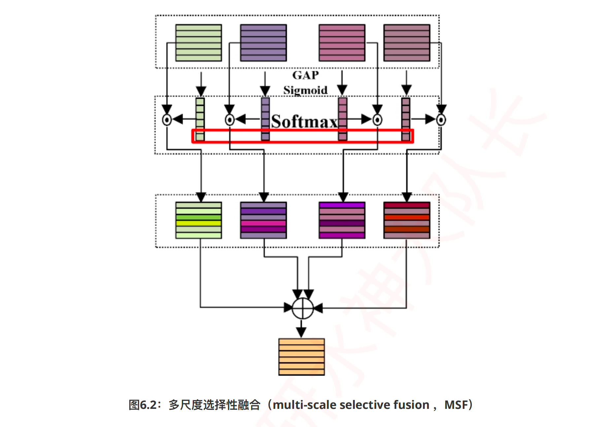

# 特征融合方式

增：attention，skip connection

删

改：conv，Pooling（up，down）

查：查看别人的连接方式

## 	门控融合机制

```python
import torch
import torch.nn as nn
import torch.nn.functional as F
import math
# DONE
class gatedFusion(nn.Module):

    def __init__(self, dim):
        super(gatedFusion, self).__init__()
        self.fc1 = nn.Linear(dim, dim, bias=True)
        self.fc2 = nn.Linear(dim, dim, bias=True)

    def forward(self, x1, x2):
        print("x1.shape",x1.shape)
        print("x2.shape",x2.shape)

        x11 = self.fc1(x1)
        print("x11.shape",x11.shape)

        x22 = self.fc2(x2)
        print("x22.shape",x22.shape)

        # 通过门控单元生成权重表示
        z = torch.sigmoid(x11+x22)
        print("z.shape",z.shape)
        
        # 对两部分输入执行加权和
        out = z*x1 + (1-z)*x2
        return out


if __name__ == '__main__':
    # 时间序列: (B, N, T, C)
    # x1 = torch.randn(1, 10, 24, 64)
    # x2 = torch.randn(1, 10, 24, 64)

    # 图像：(B,H,W,C)
    x1 = torch.randn(1,224,224,64)
    
    x2 = torch.randn(1,224,224,64)
    

    Model = gatedFusion(dim=64)
    out = Model(x1,x2)
    print("out.shape",out.shape)
```


## 	多尺度选择性融合

```python
import math
import torch.nn as nn
import torch
import math
import torch.nn.functional as F

"""SHISRCNet: Super-resolution And Classification Network For Low-resolution Breast Cancer Histopathology Image"""
# DONE 这个结构还行，也可以改奥，很多地方都可以改，加个串并联什么的，或者把 6_1 套进来，重新画个图
class oneConv(nn.Module):
    # 卷积+ReLU函数
    def __init__(self, in_channels, out_channels, kernel_sizes, paddings, dilations):
        super().__init__()
        self.conv = nn.Sequential(
            nn.Conv2d(in_channels, out_channels, kernel_size = kernel_sizes, padding = paddings, dilation = dilations, bias=False),###, bias=False
            # nn.BatchNorm2d(out_channels),
            # nn.ReLU(inplace=True),
        )

    def forward(self, x):
        x = self.conv(x)
        return x

class MSFblock(nn.Module):
    def __init__(self, in_channels):
        super(MSFblock, self).__init__()
        out_channels = in_channels

        self.project = nn.Sequential(
            nn.Conv2d(out_channels, out_channels, 1, bias=False),
            nn.BatchNorm2d(out_channels),
            nn.ReLU(),)
            #nn.Dropout(0.5))
        self.gap = nn.AdaptiveAvgPool2d(1)
        self.softmax = nn.Softmax(dim = 2)
        self.Sigmoid = nn.Sigmoid()
        self.SE1 = oneConv(in_channels,in_channels,1,0,1)
        self.SE2 = oneConv(in_channels,in_channels,1,0,1)
        self.SE3 = oneConv(in_channels,in_channels,1,0,1)
        self.SE4 = oneConv(in_channels,in_channels,1,0,1)

    def forward(self, x0,x1,x2,x3):
        # x1/x2/x3/x4: (B,C,H,W)
        y0 = x0
        y1 = x1
        y2 = x2
        y3 = x3

        # 通过池化聚合全局信息,然后通过1×1conv建模通道相关性: (B,C,H,W)-->GAP-->(B,C,1,1)-->SE1-->(B,C,1,1)
        print(self.gap(x0))
        y0_weight = self.SE1(self.gap(x0))
        print(y0_weight)

        y1_weight = self.SE2(self.gap(x1))
        y2_weight = self.SE3(self.gap(x2))
        y3_weight = self.SE4(self.gap(x3))

        # 将多个尺度的全局信息进行拼接: (B,C,4,1) # 小括号里面有1个数，有 4 个小括号，C 个 4×1 的矩阵
        weight = torch.cat([y0_weight,y1_weight,y2_weight,y3_weight],2)
        print(weight)

        # 首先通过sigmoid函数获得通道描述符表示, 然后通过softmax函数,求每个尺度的权重: (B,C,4,1)--> (B,C,4,1)
        # 每个通道 4 种表示，先得到每种表示的绝对大小，然后得到相对大小
        # sigmoid 绝对的大小，softmax相对大小
        weight = self.softmax(self.Sigmoid(weight))
        print(weight.shape) # torch.Size([4, 3, 4, 1]) # 得到 3 个通道 4 种表示的权重


        # weight[:,:,0]:(B,C,1); (B,C,1)-->unsqueeze-->(B,C,1,1)
        y0_weight = torch.unsqueeze(weight[:,:,0],2)
        print(y0_weight) # unsqueeze 后的1 个数表示一张图H和 W 的权重（完全可以改成坐标注意力）
        # 通道描述符只建模了通道之间的相关性
        print(y0_weight.shape) # torch.Size([4, 3, 1, 1])
        # 小括号里面有 1 个数，有 1 个小括号，有 3 个矩阵。
        y1_weight = torch.unsqueeze(weight[:,:,1],2)
        y2_weight = torch.unsqueeze(weight[:,:,2],2)
        y3_weight = torch.unsqueeze(weight[:,:,3],2)
        # 每张图，3 个特征，4 个特征表示的重要性权重
        # 一堂课，3 个老师，每个老师的不同侧重点，学生学到的=class*teacher1_attn1+......

        # 将权重与对应的输入进行逐元素乘法: (B,C,1,1) * (B,C,H,W)= (B,C,H,W), 然后将多个尺度的输出进行相加
        x_att = y0_weight*y0+y1_weight*y1+y2_weight*y2+y3_weight*y3
        return self.project(x_att)


if __name__ == '__main__':
    # (B,C,H,W)
    # x0 = torch.rand(1, 64, 192, 192)
    # x1 = torch.rand(1, 64, 192, 192)
    # x2 = torch.rand(1, 64, 192, 192)
    # x3 = torch.rand(1, 64, 192, 192)

    # Model = MSFblock(in_channels=64)

    x0 = torch.rand(4, 3, 2, 2)
    x1 = torch.rand(4, 3, 2, 2)
    x2 = torch.rand(4, 3, 2, 2)
    x3 = torch.rand(4, 3, 2, 2)
    # bs=4，channel=RGB=3，size=(2,2)

    Model = MSFblock(in_channels=3)

    # print(Model)

    out = Model(x0,x1,x2,x3)
    print(out.shape)
```



## 	多尺度空间特征提取

```python
import math
import torch.nn as nn
import torch
import math
import torch.nn.functional as F

"""SHISRCNet: Super-resolution And Classification Network For Low-resolution Breast Cancer Histopathology Image"""
# 多尺度空间特征提取
# DONE 先空间（conv）建模，又通道建模（Channel）
class oneConv(nn.Module):
    # 卷积+ReLU函数
    def __init__(self, in_channels, out_channels, kernel_sizes, paddings, dilations):
        super().__init__()
        self.conv = nn.Sequential(
            nn.Conv2d(in_channels, out_channels, kernel_size = kernel_sizes, padding = paddings, dilation = dilations, bias=False),###, bias=False
            # nn.BatchNorm2d(out_channels),
            # nn.ReLU(inplace=True),
        )

    def forward(self, x):
        x = self.conv(x)
        return x

class ASPPConv(nn.Sequential):
    def __init__(self, in_channels, out_channels, dilation):
        modules = [
            nn.Conv2d(in_channels, out_channels, kernel_size=3, padding=dilation, dilation=dilation, bias=False),#groups = in_channels
            nn.BatchNorm2d(out_channels),
            nn.ReLU()
        ]
        super(ASPPConv, self).__init__(*modules)


class MFEblock(nn.Module):
    def __init__(self, in_channels, atrous_rates):
        super(MFEblock, self).__init__()
        out_channels = in_channels
        # modules = []
        # modules.append(nn.Sequential(
            # nn.Conv2d(in_channels, out_channels, 1, bias=False),
            # nn.BatchNorm2d(out_channels),
            # nn.ReLU()))
        rate1, rate2, rate3 = tuple(atrous_rates)
        self.layer1 = nn.Sequential(
            nn.Conv2d(in_channels, out_channels, 3, padding=1, dilation=1, bias=False),#groups = in_channels , bias=False
            nn.BatchNorm2d(out_channels),
            nn.ReLU())
        self.layer2 = ASPPConv(in_channels, out_channels, rate1)
        self.layer3 = ASPPConv(in_channels, out_channels, rate2)
        self.layer4 = ASPPConv(in_channels, out_channels, rate3)
        self.project = nn.Sequential(
            nn.Conv2d(out_channels, out_channels, 1, bias=False),
            nn.BatchNorm2d(out_channels),
            nn.ReLU(),)
            #nn.Dropout(0.5))
        self.gap = nn.AdaptiveAvgPool2d(1)
        self.softmax = nn.Softmax(dim = 2)
        self.Sigmoid = nn.Sigmoid()
        self.SE1 = oneConv(in_channels,in_channels,1,0,1)
        self.SE2 = oneConv(in_channels,in_channels,1,0,1)
        self.SE3 = oneConv(in_channels,in_channels,1,0,1)
        self.SE4 = oneConv(in_channels,in_channels,1,0,1)
    def forward(self, x):
        # x: (B,C,H,W)
        print("x.shape")
        print(x.shape)

        ### 多特征提取: Multi-Features Extraction block, MFEblock
        y0 = self.layer1(x)    # 第一个分支的输入只有x: (B,C,H,W)-->(B,C,H,W)
        y1 = self.layer2(y0+x) # 第二个分支的输入是y0和x: (B,C,H,W)-->(B,C,H,W)
        y2 = self.layer3(y1+x) # 第三个分支的输入是y1和x: (B,C,H,W)-->(B,C,H,W)
        y3 = self.layer4(y2+x) # 第四个分支的输入是y2和x: (B,C,H,W)-->(B,C,H,W)

        # 先提取多特征（kerkel_size），再多尺度特征融合(加权重)

        ###  多尺度融合, multi-scale selective fusion, MSF
        # 通过池化聚合全局信息,然后通过1×1conv建模通道相关性: (B,C,H,W)-->GAP-->(B,C,1,1)-->SE1-->(B,C,1,1)
        y0_weight = self.SE1(self.gap(y0))
        y1_weight = self.SE2(self.gap(y1))
        y2_weight = self.SE3(self.gap(y2))
        y3_weight = self.SE4(self.gap(y3))

        # 将多个尺度的全局信息进行拼接: (B,C,4,1)
        weight = torch.cat([y0_weight,y1_weight,y2_weight,y3_weight],2)
        # 首先通过sigmoid函数获得通道描述符表示, 然后通过softmax函数,求每个尺度的权重: (B,C,4,1)--> (B,C,4,1)
        weight = self.softmax(self.Sigmoid(weight))

        # weight[:,:,0]:(B,C,1); (B,C,1)-->unsqueeze-->(B,C,1,1)
        y0_weight = torch.unsqueeze(weight[:,:,0],2)
        y1_weight = torch.unsqueeze(weight[:,:,1],2)
        y2_weight = torch.unsqueeze(weight[:,:,2],2)
        y3_weight = torch.unsqueeze(weight[:,:,3],2)

        # 将权重与对应的输入进行逐元素乘法: (B,C,1,1) * (B,C,H,W)= (B,C,H,W), 然后将多个尺度的输出进行相加
        x_att = y0_weight*y0+y1_weight*y1+y2_weight*y2+y3_weight*y3
        return self.project(x_att+x) # 加了一个残差连接


if __name__ == '__main__':
    # (B,C,H,W)
    x = torch.rand(1, 64, 192, 192)

    # atrous_rates: 扩张率
    Model = MFEblock(in_channels = 64,atrous_rates = [2,4,8])
    out = Model(x)
    print("out.shape")
    print(out.shape) # torch.Size([1, 64, 192, 192])
```


## 	多尺度空间特征提取

```python
import torch
import torch.nn as nn
import torch.nn.functional as F

"Spatially-Adaptive Feature Modulation for Efficient Image Super-Resolution"
# DONE 卷积，采样，插值，模块可以改，可以加注意力
# 增删改查，查：借鉴这个框架，封自己的模块，再重新画图
# SAFM
class SAFM(nn.Module):
    def __init__(self, dim, n_levels=4):
        super().__init__()
        # 表示有多少个尺度
        self.n_levels = n_levels
        # 每个尺度的通道是多少
        chunk_dim = dim // n_levels

        # Spatial Weighting
        self.mfr = nn.ModuleList([nn.Conv2d(chunk_dim, chunk_dim, 3, 1, 1, groups=chunk_dim) for i in range(self.n_levels)])

        # Feature Aggregation
        self.aggr = nn.Conv2d(dim, dim, 1, 1, 0)

        # Activation
        self.act = nn.GELU()

    def forward(self, x):
        # (B,C,h,w)
        h, w = x.size()[-2:]
        print("x.shape:",x.shape)
        print("分成几份：",self.n_levels)

        # 将通道平均分为n_levels份,n_levels是尺度的个数: (B,C,h,w) --chunk--> (B,C/n_levels,h,w)
        xc = x.chunk(self.n_levels, dim=1)
        print("xc[0].shape:",xc[0].shape)
        print("xc[1].shape:",xc[1].shape)
        print("xc[2].shape:",xc[2].shape)
        print("xc[3].shape:",xc[3].shape)
        # 注意一下怎么索引的

        out = []
        # 遍历多个尺度,四个尺度的下采样比例是[1,2,4,8],第一个尺度保持原有分辨率,因此从第二个尺度开始遍历
        for i in range(self.n_levels):
            if i > 0:
                p_size = (h// 2**i, w//2**i)  
                # 1th: p_size=(h/2,w/2);
                # 2th: p_size=(h/4,w/4); 
                # 3th: p_size=(h/8,w/8)

                s = F.adaptive_max_pool2d(xc[i], p_size) 
                 # 以1th为例, 执行最大池化: (B,C/n_levels,h,w) --> (B,C/n_levels,h/2,w/2)

                s = self.mfr[i](s) 
                # 执行3×3的深度卷积: (B,C/n_levels,h/2,w/2) --> (B,C/n_levels,h/2,w/2)

                s = F.interpolate(s, size=(h, w), mode='nearest')
                #通上采样恢复与输入相同的shape:(B,C/n_levels,h/2,w/2) --> (B,C/n_levels,h,w)
            else:
                s = self.mfr[i](xc[i]) 
                # 0th: 第一个尺度保持原有分辨率(h,w), 然后执行3×3的深度卷积:  (B,C/n_levels,h,w)--> (B,C/n_levels,h,w)
            out.append(s)

        # 将四个尺度的输出在通道上拼接,恢复原shape: (B,C,h,w), 然后通过1×1Conv来聚合多个子空间的不同尺度的通道特征:
        out = self.aggr(torch.cat(out, dim=1))

        # 通过gelu激活函数进行规范化,来得到注意力图,然后与原始输入执行逐元素乘法（空间上的多尺度池化会造成空间上的信息丢失，通过与原始输入相乘能够保留一些空间上的细节）, 得到最终输出
        out = self.act(out) * x
        return out

if __name__ == '__main__':
    # (B,C,H,W)
    x = torch.randn(1, 36, 224, 224)
    Model = SAFM(dim=36)
    out = Model(x)
    print(out.shape)
```


## 	重叠空间缩减注意力


```python
import math
import torch.nn as nn
import torch
import itertools
import torch.nn.functional as F
# from mmcv.cnn.bricks import ConvModule

"TransXNet: Learning Both Global and Local Dynamics with a Dual Dynamic Token Mixer for Visual Recognition"


class OSRAttention(nn.Module):  ### OSRA
    def __init__(self, dim,
                 num_heads=8,
                 qk_scale=None,
                 attn_drop=0,
                 sr_ratio=2,):
        super().__init__()
        assert dim % num_heads == 0, f"dim {dim} should be divided by num_heads {num_heads}."
        self.dim = dim
        self.num_heads = num_heads
        head_dim = dim // num_heads
        self.scale = qk_scale or head_dim ** -0.5
        self.sr_ratio = sr_ratio
        self.q = nn.Conv2d(dim, dim, kernel_size=1)
        self.kv = nn.Conv2d(dim, dim*2, kernel_size=1)
        # 对于图来说，qkv 是卷积得到的，并且卷积核尺寸都是 1 × 1 的，不改变 特征图的尺寸，也就是不改变词的个数
        # 但这个模块有点特殊，对于 kv 降维了
        self.attn_drop = nn.Dropout(attn_drop)
        if sr_ratio > 1:
            #  sr_ratio=2  2+3//2=2
            # output_size = h-k+s+2p/s = 7-5+2+2*2/2=8/2=4
            # x.shape = [1, 64, 7, 7]
            # 分组不影响 输出特征图的大小，影响卷积核的通道数，也就是影响卷积运算的参数量
            self.sr = nn.Sequential(
                nn.Conv2d(dim, dim,kernel_size=sr_ratio+3,stride=sr_ratio,padding=(sr_ratio+3)//2,groups=dim,bias=False),
                nn.BatchNorm2d(dim),
                nn.ReLU(),
                # ConvModule(dim, dim,
                #            kernel_size=sr_ratio+3,
                #            stride=sr_ratio,
                #            padding=(sr_ratio+3)//2,
                #            groups=dim,
                #            bias=False,
                #            norm_cfg=dict(type='BN2d'),
                #            act_cfg=dict(type='GELU')),
                # ConvModule(dim, dim,
                #            kernel_size=1,
                #            groups=dim,
                #            bias=False,
                #            norm_cfg=dict(type='BN2d'),
                #            act_cfg=None,),)
                nn.Conv2d(dim, dim, kernel_size=1, groups=dim, bias=False),# 分组卷积不会改变输出特征的尺寸，只会影响单个卷积核的通道数，也就是减少单个卷积的参数量，从而影响整个卷积操作的参数量
                nn.BatchNorm2d(dim),)
        else:
            self.sr = nn.Identity()
        self.local_conv = nn.Conv2d(dim, dim, kernel_size=3, padding=1, groups=dim)

    def forward(self, x, relative_pos_enc=None):
        B, C, H, W = x.shape

        # print(x.shape) # torch.Size([1, 64, 7, 7])

        # 图的多头注意力机制 拆分的是通道
        q = self.q(x).reshape(B, self.num_heads, C//self.num_heads, -1).transpose(-1, -2)
        # print(self.q(x).shape) # torch.Size([1, 64, 7, 7])

        # B = 1; self.num_heads = 8; C=64; C//self.num_heads=8;
        # print(self.q(x).reshape(B, self.num_heads, C//self.num_heads, -1).shape) 
        #   # torch.Size([1, 8, 8, 49]) → 1 个 batch size;
        #   8个头（每个头分别学习不重叠的通道，8 个老师，课本分成 8 章，每个老师教一章）;
        #   每个头学习 8 个通道；每个通道学习的内容 H*W=7*7 = 49

        # print(q.shape)  # torch.Size([1, 8, 49, 8])
        # 对输入x进行变换得到q,然后通过reshape重塑shape: 
        # (B,C,H,W)--q()->(B,C,H,W)--reshape-->(B,h,d,HW) --transpose--> (B,h,HW,d);  C=h*d
        # self.q = nn.Conv2d(dim, dim, kernel_size=1) 
        # 1×1 卷积不改变特征图大小 padding=kernel_size // 2 → 不变卷积
        # 字母说明：B: batch size
        # h = num_heads 
        # d = head_dim = C // self.num_heads 每个头的维度，相当于每个头分配的通道数，对于图来说，通道数 相当于特征数
        # HW 图的高度乘以宽度相当于序列长度 相当于每个 pixel 表达语义
        # (现实含义)所以这里 q.shape = [1,8,49,8]的意思是，bs=1，heads=8(8句话)，每句话 49 个词（pixel），每个 pixel(词),的特征维 8

        # 通过OSR操作得到k/v表示
        kv = self.sr(x) 
        # 执行空间缩减(spatial reduction)操作,也就是通过卷积来实现下采样,得到kv: (B,C,H,W)-->(B,C,H‘,W’)
        # print(x.shape) # torch.Size([1, 64, 7, 7])
        # self.sr = nn.Sequential 
        # print(kv.shape) # torch.Size([1, 64, 4, 4]) 
        #  self.sr实现了什么功能 答:（空间缩减，减小特征图的尺寸）
        # 为什么要 减少特征图尺寸？


        kv = self.local_conv(kv) + kv  
        # 通过3×3卷积对局部空间建模,并添加残差连接: (B,C,H‘,W’)-->(B,C,H‘,W’)
        # self.local_conv = nn.Conv2d(dim, dim, kernel_size=3, padding=1, groups=dim)
        # padding = 1 = 3//2 = 1 所以这个是不变卷积，也就是输入特征图尺寸和输出特征图尺寸相同
        # 处理后的 kv.shape =  torch.Size([1, 64, 4, 4]) 
        # 为什么要有这一步？  （缩减空间，看模块的设计动机）

        k, v = torch.chunk(self.kv(kv), chunks=2, dim=1) 
        #分割为k、v: (B,C,H‘,W’)--kv()-->(B,2C,H‘,W’)--chunk--> k:(B,C,H‘,W’); v:(B,C,H‘,W’)
        # self.kv = nn.Conv2d(dim, dim*2, kernel_size=1) 卷积核尺寸为 1，不改变输出特征图的大小，通道数翻倍
        # 通道数翻倍以后，又划分成 2 组，又恢复通道数 C，分别分配给k,v
        # chunk后的 k.shape =  1,64,4,4 ; v.shape =  1,64,4,4

        k = k.reshape(B, self.num_heads, C//self.num_heads, -1) 
        # (B,C,H‘,W’) --reshape--> (B,h,d,H'W');  c=h*d
        # 分给多头，8 个头，每个头 8 通道
        # reshape后的 k.shape = 1,8,8,16  bs=1，heads=8，head_dim=8,H'W'=16 16个词，每个词用 head_dim =8 长度为 8 的向量表达

        v = v.reshape(B, self.num_heads, C//self.num_heads, -1).transpose(-1, -2)  
        #(B,C,H‘,W’)--reshape-->(B,h,d,H'W')--transpose-->(B,h,H'W',d)
        # reshape & transpose 后的 v.shape = torch.Size([1, 8, 16, 8])

        attn = (q @ k) * self.scale 
        # 对qk计算注意力矩阵: (B,h,HW,d) @ (B,h,d,H'W') = (B,h,HW,H'W')
        # q和 kv 的来源可以不同，形状也可以不同，但是 kv 的来源必须一致，且形状相同，最后的 attn 输出形状必须和 q 保持一致 
        # q.shape = torch.Size([1, 8, 49, 8])   49 个词
        # k.shape = torch.Size([1, 8, 8, 16])  16 个词
        # v.shape = torch.Size([1, 8, 16, 8]) 
        # attn.shape = torch.Size([1, 8, 49, 16])
        # QK^T = attn.shape = torch.Size([1, 8, 49, 16]) 这 49 个词 对应的与 16 个词之间 两两的相关性（pixel之间的相关性）
        # heads=8，是分成了 8 份，不相交的 8 份，一起学习相关性（表示更多多样化）

        # 为注意力矩阵添加位置编码
        if relative_pos_enc is not None:
            # relative_pos_enc = None,默认为 None，而且也没有传进来，所以不执行 if 语句
            # def forward(self, x, relative_pos_enc=None):
            if attn.shape[2:] != relative_pos_enc.shape[2:]:
                relative_pos_enc = F.interpolate(relative_pos_enc, size=attn.shape[2:],
                                                 mode='bicubic', align_corners=False)
            attn = attn + relative_pos_enc

        attn = torch.softmax(attn, dim=-1) 
        # 对注意力矩阵进行归一化
        # 对 QK^T = attn.shape = torch.Size([1, 8, 49, 16])，16 这个维度进行归一化，相当于 LayerNorm

        attn = self.attn_drop(attn)
        x = (attn @ v).transpose(-1, -2) 
        # 通过注意力矩阵对value进行加权: (B,h,HW,H'W') @ (B,h,H'W',d) = (B,h,HW,d); 
        #  (B,h,HW,d)--transpose-->(B,h,d,HW)
        # 对 value 进行加权 ：v.shape = torch.Size([1, 8, 16, 8])  
        # QK^T = attn.shape = torch.Size([1, 8, 49, 16])
        # Q.shape = torch.Size([1, 8, 49, 8]) 
        # x.shape = 1,8,49,8  与 q 的形状相同，但这次是画了重点的 q

        return x.reshape(B, C, H, W) 
        # 对x进行reshape,重塑为与输入相同的shape: (B,h,HW,d) --> (B, C, H, W)
        # 注意力机制作用在每个像素上


if __name__ == '__main__':
    # (B,C,H,W)
    x = torch.randn(1, 64, 7, 7)
    Model = OSRAttention(dim=64)
    out = Model(x)
    # print(out.shape)
```


对于 2 维图像来说，Linear 就相当于 1×1 的卷积

## 	多尺度注意力聚合


##  融合通道表示的空间注意⼒


```python
import numpy as np
import torch
from torch import nn
from torch.nn import init

"CBAM: Convolutional Block Attention Module "


class ChannelAttention(nn.Module):
    def __init__(self, channel, reduction=16):
        super().__init__()
        self.maxpool = nn.AdaptiveMaxPool2d(1)
        self.avgpool = nn.AdaptiveAvgPool2d(1)
        self.se = nn.Sequential(
            nn.Conv2d(channel, channel // reduction, 1, bias=False),
            nn.ReLU(),
            nn.Conv2d(channel // reduction, channel, 1, bias=False)
        )
        self.sigmoid = nn.Sigmoid()

    def forward(self, x):
        max_result = self.maxpool(x)  # 通过最大池化压缩全局空间信息: (B,C,H,W)--> (B,C,1,1)
        avg_result = self.avgpool(x)  # 通过平均池化压缩全局空间信息: (B,C,H,W)--> (B,C,1,1)
        max_out = self.se(max_result)  # 共享同一个MLP: (B,C,1,1)--> (B,C,1,1)
        avg_out = self.se(avg_result)  # 共享同一个MLP: (B,C,1,1)--> (B,C,1,1)
        output = max_out + avg_out  # (B,C,1,1)
        return output


class SpatialAttention(nn.Module):
    def __init__(self, kernel_size=7):
        super().__init__()
        self.conv = nn.Conv2d(2, 1, kernel_size=kernel_size, padding=kernel_size // 2)
        self.sigmoid = nn.Sigmoid()

    def forward(self, x):
        # x:(B,C,H,W)
        max_result, _ = torch.max(x, dim=1, keepdim=True)  # 通过最大池化压缩全局通道信息:(B,C,H,W)-->(B,1,H,W); 返回通道维度上的: 最大值和对应的索引.
        avg_result = torch.mean(x, dim=1, keepdim=True)  # 通过平均池化压缩全局通道信息:(B,C,H,W)-->(B,1,H,W); 返回通道维度上的: 平均值
        result = torch.cat([max_result, avg_result], 1)  # 在通道上拼接两个矩阵:(B,2,H,W)
        output = self.conv(result)  # 然后重新降维为1维:(B,1,H,W); 在这里并没有按照模型里的的方式先MLP,然后再Add; 而是先concat,再Conv; 实际含义是一致的,就是实现方式不一致。
        return output


class CBAMBlock(nn.Module):

    def __init__(self, channel=512, reduction=16, kernel_size=49, HW=None):
        super().__init__()
        self.ChannelAttention = ChannelAttention(channel=channel, reduction=reduction)
        self.SpatialAttention = SpatialAttention(kernel_size=kernel_size)
        self.joint_channel = channel + HW
        self.MLP = nn.Sequential(
            nn.Conv2d(self.joint_channel, channel // reduction, 1, bias=False),
            nn.ReLU(),
            nn.Conv2d(channel // reduction, self.joint_channel, 1, bias=False)
        )
        self.sigmoid = nn.Sigmoid()

    def init_weights(self):
        for m in self.modules():
            if isinstance(m, nn.Conv2d):
                init.kaiming_normal_(m.weight, mode='fan_out')
                if m.bias is not None:
                    init.constant_(m.bias, 0)
            elif isinstance(m, nn.BatchNorm2d):
                init.constant_(m.weight, 1)
                init.constant_(m.bias, 0)
            elif isinstance(m, nn.Linear):
                init.normal_(m.weight, std=0.001)
                if m.bias is not None:
                    init.constant_(m.bias, 0)

    def forward(self, x):
        # (B,C,H,W)
        B, C, H, W = x.size()
        residual = x
        Channel_x = self.ChannelAttention(x).reshape(B,C,1,1) # (B,C,1,1)-->(B,C,1,1)
        Spatial_x = self.SpatialAttention(x).reshape(B,H*W,1,1) # (B,1,H,W)-->(B,HW,1,1)

        # 拼接,然后通过MLP建立相关性
        CS_x = torch.cat([Channel_x, Spatial_x], 1) # (B,C,1,1)-Conca->(B,HW,1,1)-->(B,C+HW,1,1)
        CS_xx = self.MLP(CS_x) # (B,C+HW,1,1)-降维->(B,M,1,1)-升维->(B,C+HW,1,1)

        # 拆分,然后通过sigmoid得到权重表示
        Channel_x = CS_xx[:,:C,:].reshape(B,C,1,1)  # (B,C,1,1)-->(B,C,1,1)
        Spatial_x = CS_xx[:,C:,:].reshape(B,1,H,W) # (B,HW,1,1)-->(B,1,H,W)
        Channel_weight = self.sigmoid(Channel_x)
        Spatial_weight = self.sigmoid(Spatial_x)

        # 分别得到通道和空间权重之后,既可以单独相乘得到两个输出, 也可以一块与X相乘得到一个输出,视自己的任务来定义
        out1 = x * Channel_weight  # 将输入与通道注意力权重相乘: (B,C,H,W) * (B,C,1,1) = (B,C,H,W)
        out2 = x * Spatial_weight  # 将更新后的输入与空间注意力权重相乘:(B,C,H,W) * (B,1,H,W) = (B,C,H,W)
        return out1,out2


if __name__ == '__main__':
    # (B,C,H,W)  注意: 因为在模型中需要将HW和C拼接起来,所在在输入到模型的时候,最好把通道C和HW做个降维(池化、下采样均可),然后在输入到模型中去,输出之后再恢复shape就可以了！
    input = torch.randn(1, 64, 7, 7)
    B,C,H,W=input.shape
    Model = CBAMBlock(channel=64, reduction=8, kernel_size=7, HW=H*W)
    out1,out2 = Model(input)
    print(out1.shape,out2.shape)


```

