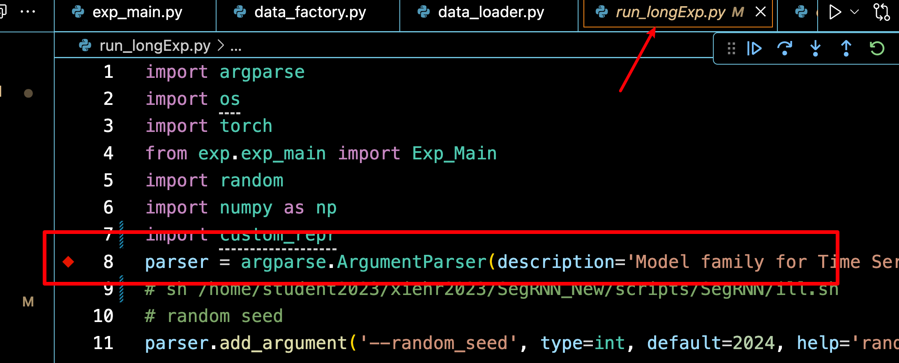

#  复现SegRNN

项目复述逐字稿，留着讲组会用

Hello 大家好，今天我给大家讲 SegRNN 的论文以及对应的代码，我这次有好好的准备，大家可以好好听，然后我们可以随时讨论哈哈哈；

首先，我们从 github 上克隆下来的项目到了本地，首先按照作者的 readme 一步步配置虚拟环境按照 requirements 安装库，运行。以我拿到的这个 SegRNN 项目为例，看到的是 Shell 脚本调用的 python，我看过的很多深度学习的项目都是用的 args 也就是命令行参数来给 python 传相应的参数，而是用的 shell 脚本，可以把 要通过命令行传给 python 的参数，可以直接在脚本中定义好，通过脚本传。

==那这个时候，怎么调试 python 呢？==

我们来看到这个 shell 脚本调用 python 的方法

一般 shell 脚本是存储在 scripts 文件夹下的，以 .sh 结尾的文件。好来看到这个 shell 脚本调用 python 的命名是 `python -u run_longExp.py`  ，`-u` 表示直接修改python 文件传入参数的意思，这里我想说一下，我所讲的内容，都是我根据自己调试这个项目以及遇到的内容学习到的，所以讲的不对的地方一定要告诉我，我们一起讨论。


好，回到正题，现在我们就要修改 shell 调用 python 文件的方法，具体来说就是改成：`python -m debugpy --listen 5998 --wait-for-client run_longExp.py`


现在我来一个个解释这行命令的意思：

`-m debugpy` 的意思就是调用 `debugpy` ，就是调用 `python 调试程序`，对 python 进行调试，注意 `debugpy` 是 python 的一个库，所以我们在使用这个的命令的时候，首先就是 `pip install debugpy`

`-listen 5998` 的意思的监听 `5998` 端口，也就是把 `python` 的调试程序连接到 `5998` 端口，然后调试，当然你设置成别的也就是可以的，

==那我们怎么选择端口呢？==

在命令行终端，运行以下代码，查看设备的空闲端口，然后你随便选一个，在 python 调试的`launch.json`的文件中修改

```
for port in {5000..6000}; do
    (echo > /dev/tcp/localhost/$port) >/dev/null 2>&1 || echo "$port is free"
done
```

==那怎么找到 python 调试文件的 配置文件呢？==

在VSCode按`Command+Shift+P`, 输入`Debug: Add Configuration` 即可打开 `launch.json`，当然了你也可以在 vscode 旁边的小虫子，点 `新建 launch.json`

找到以后，添加以下配置，注意是在 `configration` 的关键字下修改。

```
{
	"version": "0.2.0",
	"configurations": [
		{
			"name": "[这里更换为任意名称]",
			"type": "python",
			"request": "attach",
			"connect": {
				"host": "localhost",
				"port": 5998
			}
		}
	]
}
```

这是我的 launch.json文件的完整样子：

```
{
    // 使用 IntelliSense 了解相关属性。 
    // 悬停以查看现有属性的描述。
    // 欲了解更多信息，请访问: https://go.microsoft.com/fwlink/?linkid=830387
    "version": "0.2.0",
    "configurations": [
        
        {
            "name": "[这里更换为任意名称]",
            "type": "python",
            "request": "attach",
            "connect": {
                "host": "localhost",
                "port": 5998
            }
        },
        {
            "type": "bashdb",
            "request": "launch",
            "name": "Bash-Debug (type in script name)",
            "cwd": "${workspaceFolder}",
            "program": "${command:AskForScriptName}",
            "args": []
        },
        {
            "type": "bashdb",
            "request": "launch",
            "name": "Bash-Debug (select script from list of sh files)",
            "cwd": "${workspaceFolder}",
            "program": "${command:SelectScriptName}",
            "args": []
        },
        {
            "type": "bashdb",
            "request": "launch",
            "name": "Bash-Debug (hardcoded script name)",
            "cwd": "${workspaceFolder}",
            "program": "${workspaceFolder}/path/to/script.sh",
            "args": []
        },
        {
            "type": "bashdb",
            "request": "launch",
            "name": "Bash-Debug (simplest configuration)",
            "program": "${file}"
        }
    ]
}
```

想说明的是，我这里还配置了，脚本的调试，分别是：

`"Bash-Debug (type in script name)"`  表示通过输入脚本名称启动调试

`"Bash-Debug (select script from list of sh files)",` 通过脚本列表选择调试文件，等等，就不说了，因为我也不是特别明白，这里的配置主要是对 shell 脚本的调试，配置了这个，那么 shell 脚本也就可以调试了。

好了，现在关于 `--listen` 参数讲完了，讲下一个参数  `--wait-for-client`

这个的意思是说，我们在启动脚本的时候，要等待连接调试程序，才能正常调试，意思就是 运行脚本以后，点一下左边的小虫子，选择 我们配置的 调试器，就是我们设置的 name，就选我们有监听窗口的那个。

这样我们在 调用的python `run_longExp.py` 上，打断点并运行脚本，就可以调试了。

哦，对了，==怎么运行脚本文件==

在 vscode 的命令行就可以直接运行两种方法，一个是 `./你想运行的脚本文件的路径`，还有就是 `sh 你想运行的脚本文件的路径`，这两种方法，有点区别，但我还没有可以的区分。哦，对了，如果有的时候，可能需要先添加权限，才能正常的运行 shell 脚本，具体就是在运行脚本前执行 chang mode 添加 执行权限，具体的命令就是命令行直接输入： `chmod +x 脚本文件名称`

以上是第一部分的讲解：shell 调用的python，我们怎么进行调试。

现在我们终于可以调试 我们的项目了。开始。

首先**第一个断点**，打到调用的 python 文件的开始，



我把这个  `run_longExp`文件，叫做**项目主文件**，主要包括的模型的迭代训练，整个项目的 python 参数设置，而等一下我们 会看到这个  `run_longExp.py` 会频繁调用 `exp_main.py`，我把它 叫 **模型主文件**，主要包含的东西就是，运行一次模型我们需要加载的训练集、验证集和测试集。

然后应该打的断点就是 `初始化init` 处，和`训练 forward 处、或者 train 处、或者调用的 model(x)处`。

`初始化 init` 处，可以让我们知道 文件之间的调用关系，因为越好的项目封装的越好，但是也越抽象，需要不断的捋明白类之间的调用关系，而类又封装到一个个 python 文件中。

forward 的地方，能让我们看到 数据流动以及变化，这是最重要的部分了。

还有一些你不明白的地方或者什么的，想打断点就打断点。好了，这是我想说的打断点的一下经验。

下面继续开始我的断点 ，我的第二个断点在：

```
Exp = Exp_Main
```

这个断点是我想打 init 断点 `exp = Exp(args)` 和 forward 断点 `exp.train(setting)` 时，遇到第一个比较不明白的地方，我不明白，因为我第一次看到这么做的。

==这里的逻辑是什么呢？==

这里其实是类的重命名，也是 `Exp_Main` 本身就是一个类，但是在项目主文件用这个类的时候，重命名了一下，后面在项目主文件用的时候，用的都是这一个重命名的类，然后用这个重命名的类，进行的实例化。

我现在想说一下，这个`Exp_Main`，是从哪里来的： from exp.exp_main import Exp_Main，是这句话。也就是 这个类 在 exp 文件夹下 exp_main.py 的 Exp_Main 类。记住这个`模型主文件 exp_main.py`，因为经常用。

然后没什么想说的了，进入下一个部分，类的 初始化 `exp = Exp(args)` 

哦，对，你看我这儿，我还在 setting 这打了一个记录点，就是我不明白的地方


断点的类型还是挺多的，直接断点、记录点，条件断点，命中次数断点。记录点不停，就是打印信息。我有些断点之前不明白就是普通断点，明白了就变成了记录点，不想停了但是做个标记，然后不明白的地方也标记一下，也弄成记录点。后面再看。

好，继续回到，`exp = Exp(args)  # set experiments`

==点，步进。==

步进就是一步步执行，会进入到函数内部，逐过程就是逐步执行，不会进入调用的函数，然后还有继续执行，就是一直执行，直到遇到 下一个断点。


因为我已经实现标了一个记录点，然后步进 执行到这句，也触发了记录点。打印了信息。花括号包裹的部分，会自动替换成 python 程序的变量，输出到调试控制台。

想说明的就是，这里能停止，是因为步进到了这里，并不是因为打了记录点。

说完了。然后继续回到 项目的执行。

这里我们可以看到进入了 `Exp_Main`的 `init` 部分，我记这个就是打印一下路径，因为最开始看的时候，太乱了，各种调用，头都晕了。

这里就是说，我们从 项目主文件 run long exp.py，进入了 模型主文件 exp_main.py 模型的的init 和 train训练过程 都在这里了。

输出的意思就是说，我们现在到了 `exp` 文件夹下，`exp_main.py`的 `Exp_Main类` 的 init 方法。

这里有想说的地方，是因为python的继承的，你看这个 class Exp_Main 是继承的父类

==关于 python 的继承和多态想说明的是：==

我现在把类的重命名是理解为 多态，有理解更好的欢迎找我讨论，而类的继承一般就是 类的名称小括号里的东西 `class Exp_Main(Exp_Basic):`，或者你看类 init 方法下面的第一句 super 什么什么的`super(Exp_Main, self).__init__(args)`

然后，对于深度学习来说，一般是继承自 `nn.Module`的，而这里继承的是 `Exp_Basic` ，也就是也是一个自定义函数，那，话不多说，

**步进**，看看它到底是什么东西，诶，然后我们就看到了，Exp_Main有的，Exp_Basic都有，方法都是一样的，但是 Exp_Main 更全，相当于 Exp_Basic是一个模版


现在我们步进到了继承的父类文件，开始逐步执行这里，一步步的


到这里，想说的是，涉及到了 方法的重写，也就是 子类和父类中都有 这个 `self._build_model()`，但是 很明显父类中什么也没有，但是子类更全，方法重写是，先看子类的，子类没有重写，就执行父类，所以当逐步执行的时候，下一步，我们又返回到了 模型主文件的 `._build_model()`，方法。

既然回到了 模型主文件的 `build_model` 方法，那就看，首先定义了一个字典，通过字符串 所以到对应的类，因为索引到了类，我们才能继续操作呀，比如实例化，forward。

然后就到了 model 的定义

  `model = model_dict[self.args.model].Model(self.args).float()`

通过 `self.args.model` 参数去字典中 `model_dict` 中索引到类，然后调用这个类的额 `.Model()` 方法，`float` 不说了，就是转换数据类型

这里传入的参数，也就是 `self.args.model=SegRNN`，是个字符串，通过字典索引到了类，并且是自定义的类，并且，类是先 `init 初始化`，然后 forward 传入数据，进行数据的流动，所以这句应该是也是到了`某个 init` 中，那话不多说，==步进==，如我们所料，就是到了 SegRNN.py Model方法中的 init，


嗯，因为我之前也打了一个记录点，所以调试控制台有输出。现在我们现在的位置，models 文件下下，SegRNN.py 的 Model 类中，并且调用的是 init 方法。


