# 2023、SegRNN

模型架构图

[https://paperswithcode.com/paper/segrnn-segment-recurrent-neural-network-for](https://paperswithcode.com/paper/segrnn-segment-recurrent-neural-network-for)

[https://github.com/lss-1138/SegRNN?tab=readme-ov-file](https://github.com/lss-1138/SegRNN?tab=readme-ov-file)

[Time Series Forecasting on Weather (192) #rank1](https://paperswithcode.com/sota/time-series-forecasting-on-weather-192)

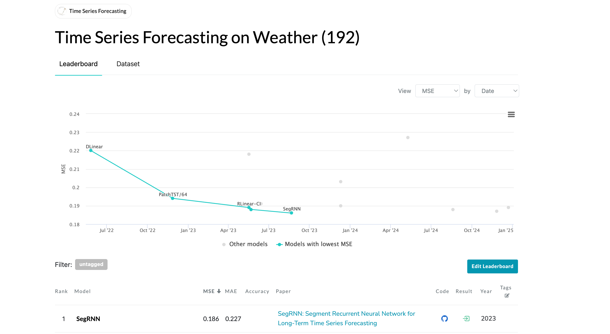

SegRNN: Segment Recurrent Neural Network for Long-Term Time Series Forecasting

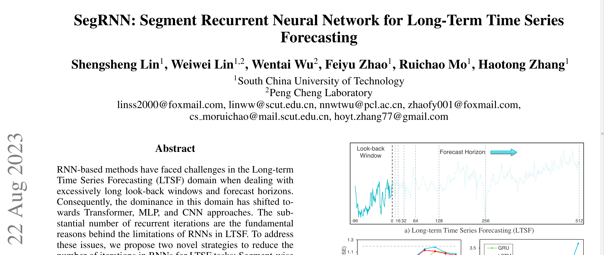

## 摘要

Time Series Forecasting (LTSF) domain when dealing with excessively long look-back windows and forecast horizons.

（过长的回溯窗口）

（过长的预测范围）

导致 RNN 迭代步数过多

To address these issues, we propose two novel strategies to reduce the number of iterations in RNNs for LTSF tasks: Segment-wise Iterations and Parallel Multi-step Forecasting (PMF).

逐段迭代代替逐点迭代

并行多步预测

## 引入

However, extending the forecast horizon poses significant challenges: 

(i) Forecasting further into the future leads to increased uncertainty, resulting in decreased forecast accuracy.

预测范围太远，导致预测精度的下降

 (ii) Longer forecast horizons require models to consider a more extensive historical context for accurate predictions, significantly increasing the complexity of modeling.

过长的预测范围，需要考虑更多的上下文语义信息，显著增加了模型复杂度

图 1，指出问题：

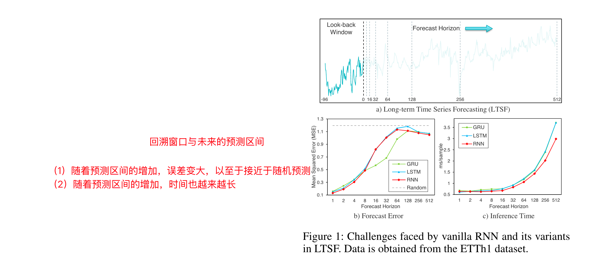 

- 较长的回溯窗口
- 预测范围越长，精度越差、花费时间越多

贡献：

• We propose SegRNN, which utilizes time-series segment technique to replace point-wise iterations with `segmentwise iterations` in LTSF. 

• We further introduce the `PMF technique` to enhance the inference speed and performance of RNNs.

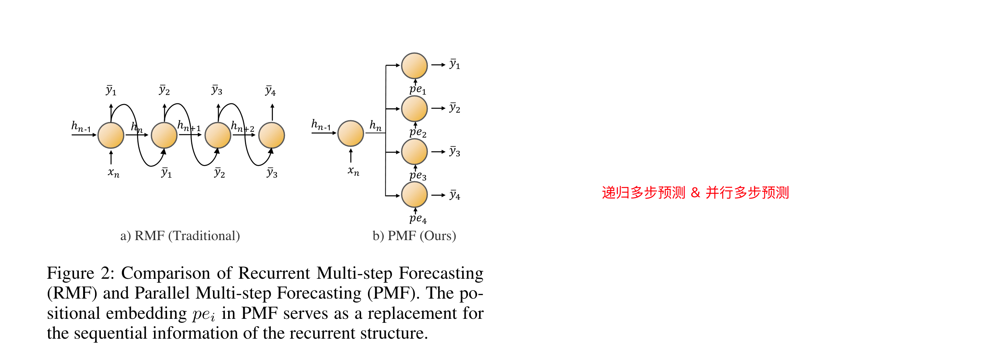

`PMF` 中的位置嵌入 $pe_i$ 作为循环结构的顺序信息的替代。

## 相关工作

- Transformers

> 1. LogTrans (Li et al. 2019), 
> 2. Informer (Zhou et al. 2021), 
> 3. Pyraformer (Liu et al. 2021), 
> 4. Autoformer (Wu et al. 2021), and 
> 5. FEDformer (Zhou et al. 2022), aimed at reducing the complexity of Transformers. 
>
> More recently, 
>
> 1. PatchTST (Nie et al. 2023) and 
> 2. Crossformer (Zhang and Yan 2023) 
>
> leveraged patch-based techniques from computer vision (Dosovitskiy et al. 2021; He et al. 2022),

- MLPs

>  DLinear achieved superiority over then-state-of-the-art Transformerbased models through a simple linear layer and channel independent strategy (Zeng et al. 2023). 
>
> MTS-Mixers (Li et al. 2023), 
>
> TSMixer (Vijay et al. 2023), and 
>
> TiDE (Das et al. 2023). 
>
> The accomplishments of these MLP-based models have raised questions about the necessity of employing complex and cumbersome Transformers for time series prediction.

- CNNs

> - MICN (Wang et al. 2023), 
> - TimesNet(Wu et al. 2023), and 
> - SCINet (LIU et al. 2022)
>
>  have demonstrated impressive results in the LTSF field.

- RNNs

> Numerous efforts have been devoted to utilizing RNNs for short-term and probabilistic forecasting, achieving significant advancements (Lai et al. 2018; Bergsma et al. 2022; Wen et al. 2018; Tan, Xie, and Cheng 2023).
>
> However, in the LTSF domain with ==excessively long look-back windows and forecast horizons==, RNNs have been considered inadequate for effectively capturing long-term dependencies, leading to their gradual abandonment (Zhou et al. 2021, 2022). 
>
> The emergence of SegRNN aims to challenge and change this situation by attempting to address these limitations.

## Preliminaries

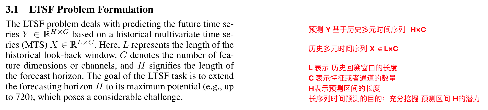

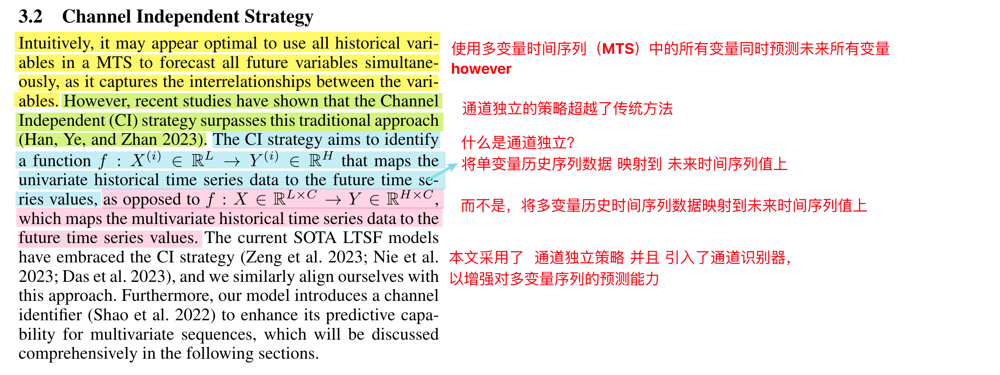

迭代步数过多会造成 梯度爆炸和梯度消失，导致训练阶段的模型收敛问题

The vanilla RNN faces challenges such as vanishing and exploding gradients, which hinder the model’s convergence during training

本文采用的 RNN 单元是 GRU

Therefore, for consistency throughout the text, the SegRNN model is assumed to be based on the GRU cell

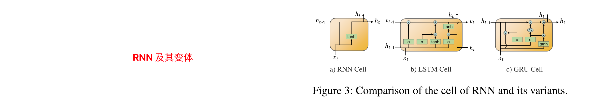

## 模型结构

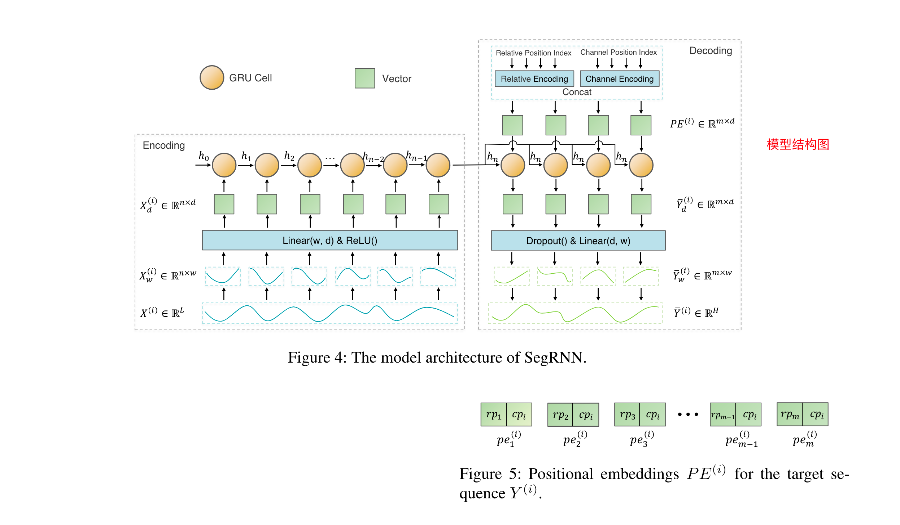

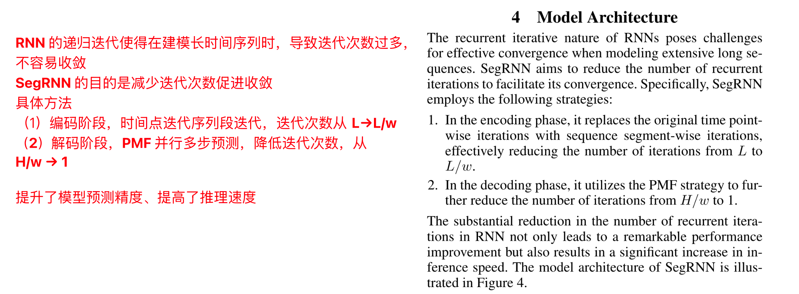

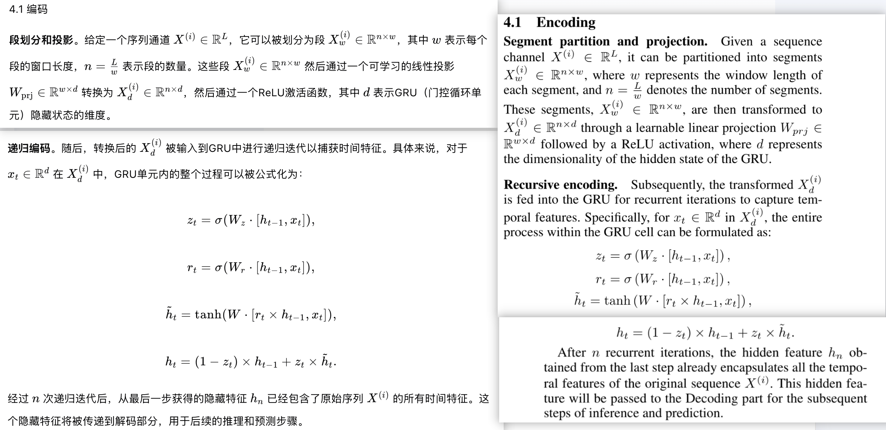

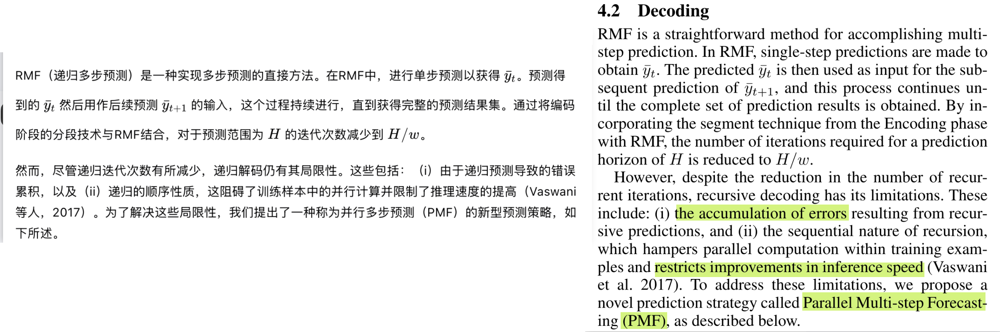

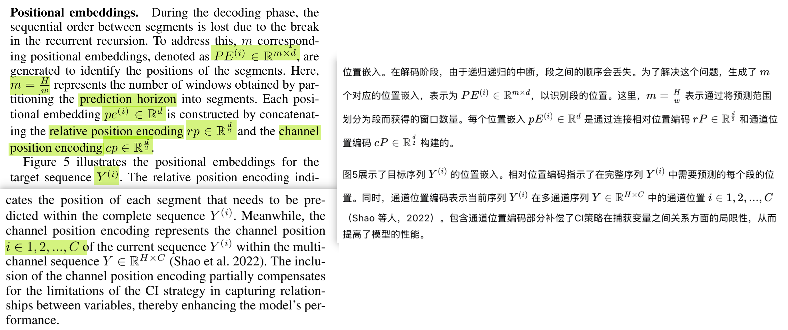

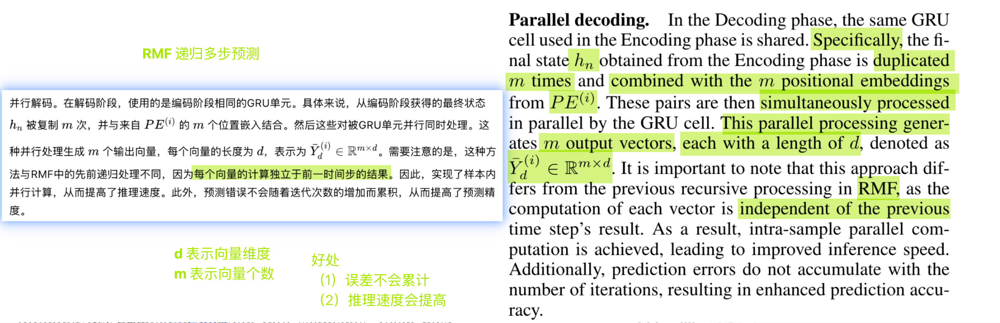

----

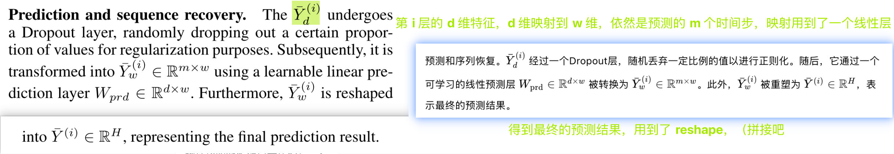

-----

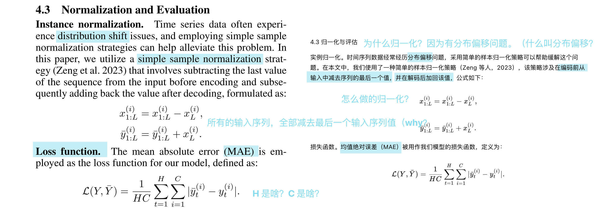

## 实验

### 实验环境

All experiments in this section are implemented in PyTorch and executed on two NVIDIA T4 GPUs, each equipped with 16GB of memory

### 数据集

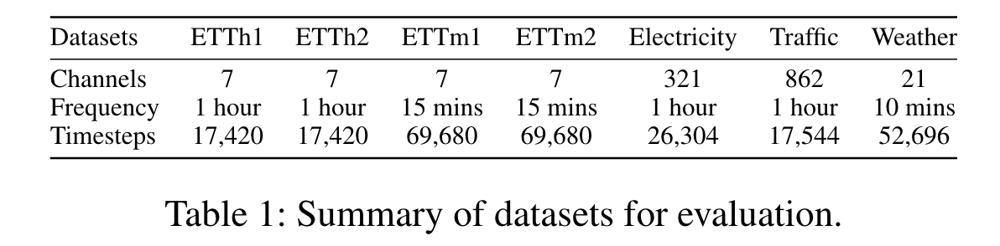

### 参数设置

Model configuration. The uniform configuration of SegRNN consists of a look-back of 720, a segment length of 48, a single GRU layer, a hidden size of 512, 30 training epochs, a learning rate decay of 0.8 after the initial 3 epochs, and early stopping with a patience of 10. The dropout rate, batch size, and learning rate vary based on the scale of the data.

回溯步数：720

分段长度：48

单层GRU，隐含层层数：512

迭代次数：30 次

### 对比实验

对比模型 & 指标

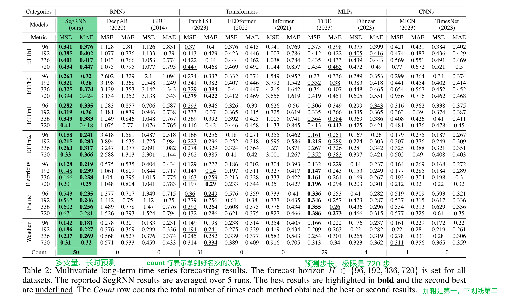

7 个数据集，每个数据集 4 种预测步数，2个指标，所以一共是 56 种组合，SegRNN 拿到了 50 次好名次

### 消融实验

==Segment-wise iterations vs. point-wise iterations.== 

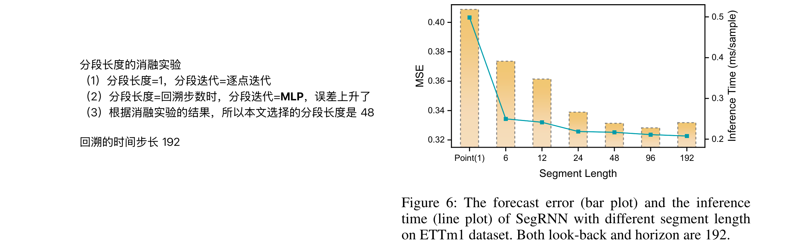

==PMF vs. RMF.==

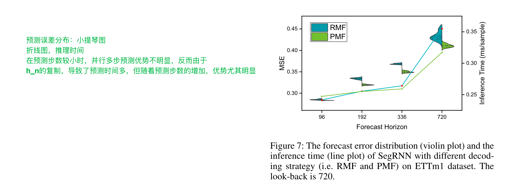

[时序预测篇-SegRNN阅读笔记](https://zhuanlan.zhihu.com/p/684429421)

[SegRNN: Segment Recurrent Neural Network for Long-Term Time Series Forecasting](https://paperswithcode.com/paper/segrnn-segment-recurrent-neural-network-for)

1. 计算量大
2. 模型训练缓慢
3. 梯度爆炸或者梯度消失