# 2023、TimesNet

[TIMESNET: TEMPORAL 2D-VARIATION MODELING
FOR GENERAL TIME SERIES ANALYSIS](https://openreview.net/pdf?id=ju_Uqw384Oq)

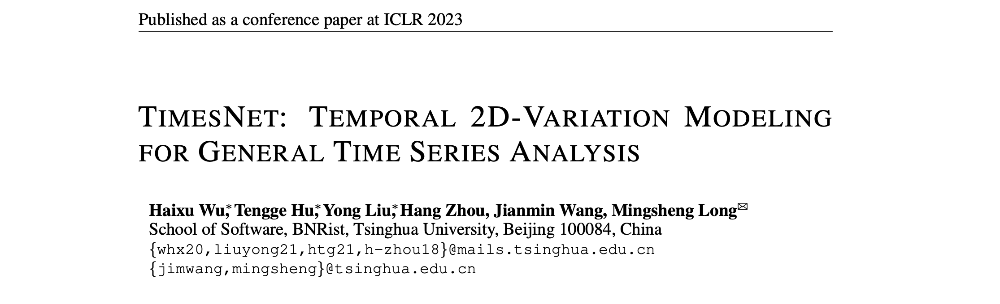

【参看】[论文研读之时序分析通用基础模型：TimesNet 预测/插补/分类/异常检测](https://www.bilibili.com/video/BV1Ka4y1k7XY?spm_id_from=333.788.videopod.sections&vd_source=ddd7d236ab3e9b123c4086c415f4939e)

作者团队

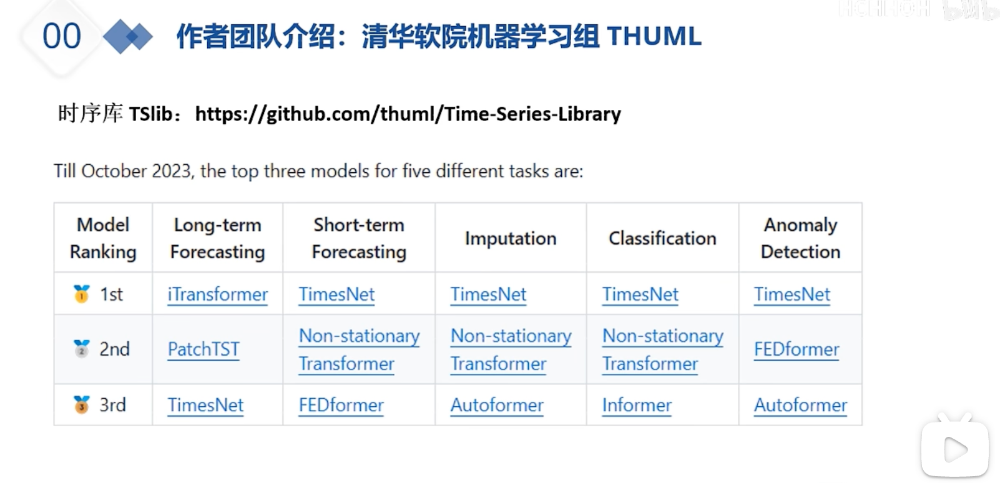

期刊：ICLR2023

## 问题描述

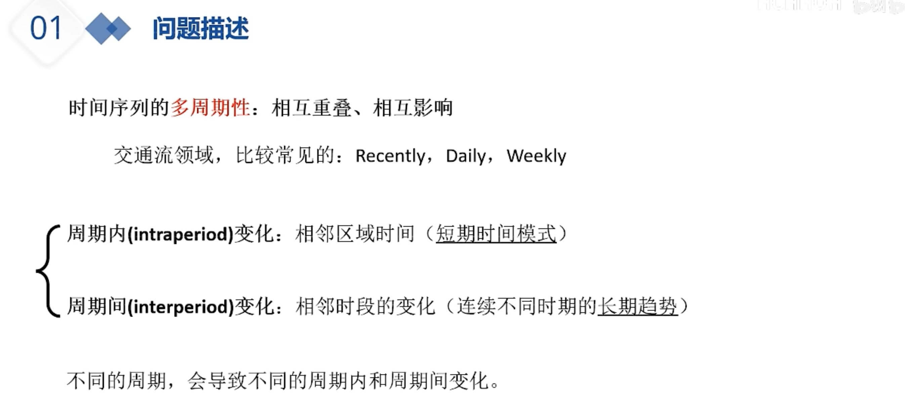

时间序列的多周期性，相互重叠、相互影响

例如交通流领域，一般会用三个周期：

- recently：相邻 1 小时的变换
- daily：周一到周二的变化（周一的早上和周二的早上）
- weekly：每周的变换（每周的周一之间也相互有关系）

这篇文章给了多周期性两个定义

- 周期内变化叫 intra：相邻区域的时间、短期的时间模式
- 周期间变化叫 inter：相邻时段存在一个连续不同时期的一个长期趋势，例如 两个周期之间的周一和周一

不同的周期导致不同的周期内和周期间的变化，跟周期长度是有关系的

## 创新点

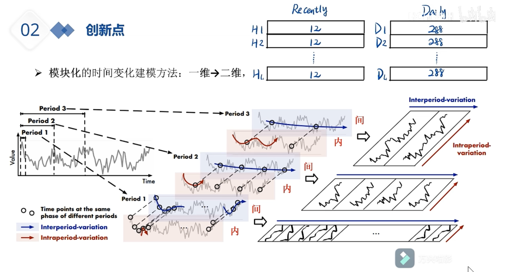

第一个创新点，用模块化对时间变换进行建模，把一维的这个时间序列转成二维的图（或者说矩阵），同时表示周期内和周期间的变化

具体来说：拼接相同度量的时间步

周期间：不同周期同一时段的点串起来

红色表示 周期内，蓝色表示周期间

第二个创新点，设计了 时间模块 times block，自适应的发现多周期，这个模型里面包含了发现多周期的方式；第二方面：从这个二维张量里面可以捕获时间变化

第三个，任务通用的基础模型

## 方法

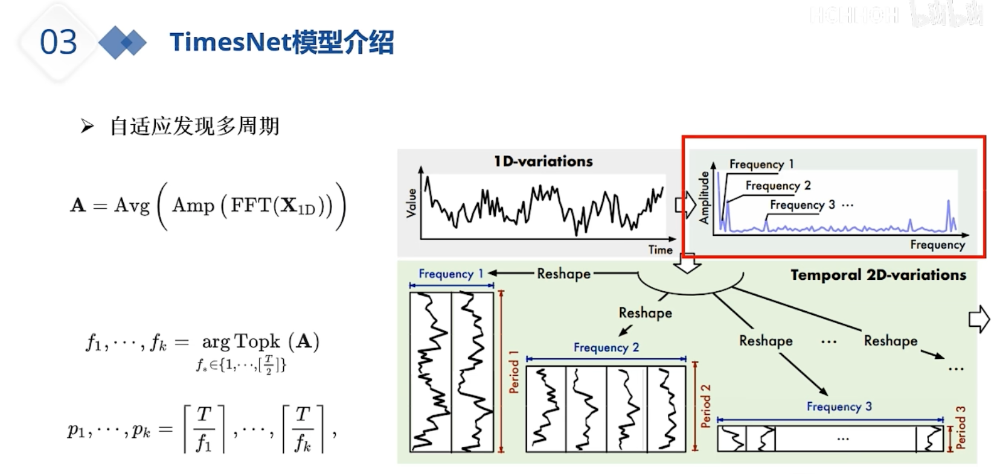

第一个部分，自适应的发现多周期，

补：傅里叶变换

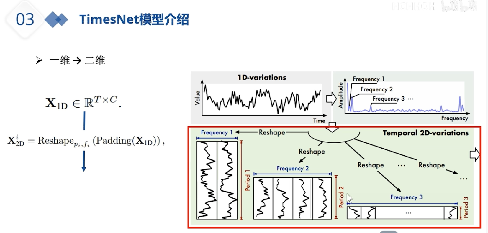

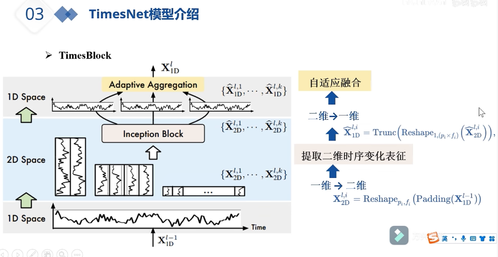

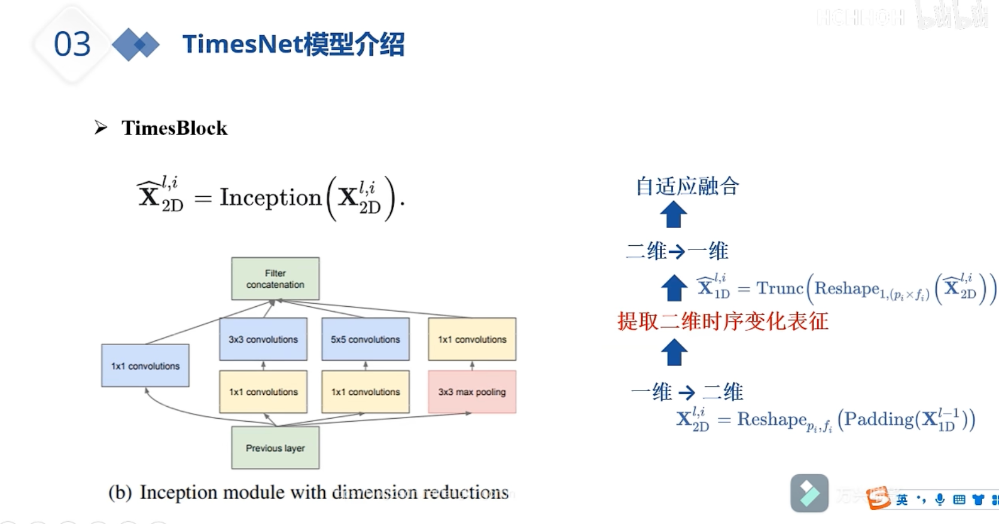

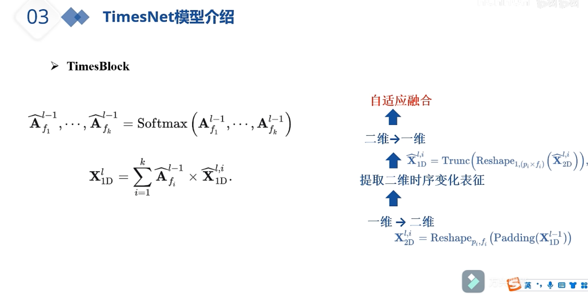

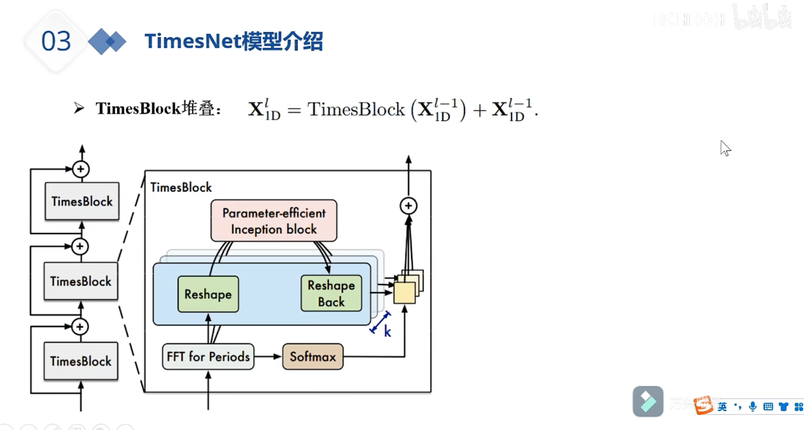

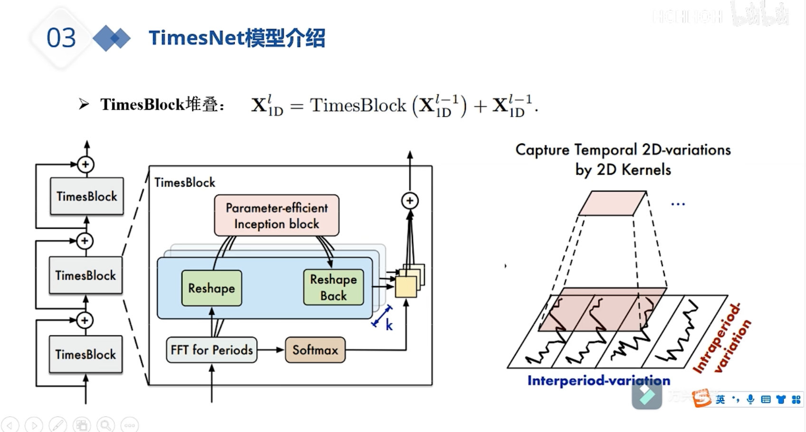

## 实验结果

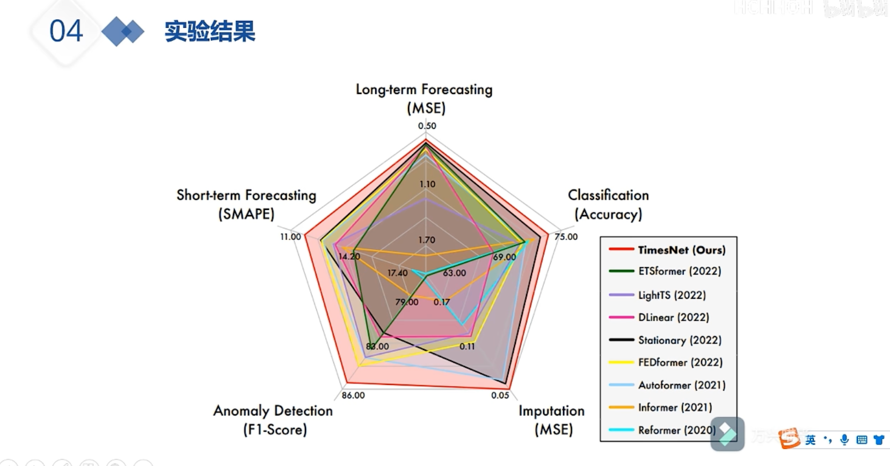

### 长期预测

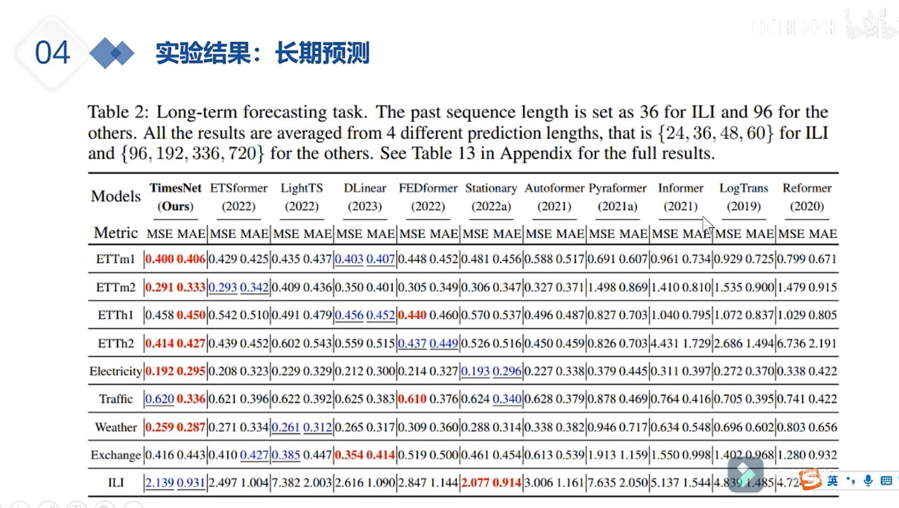

### 短期预测

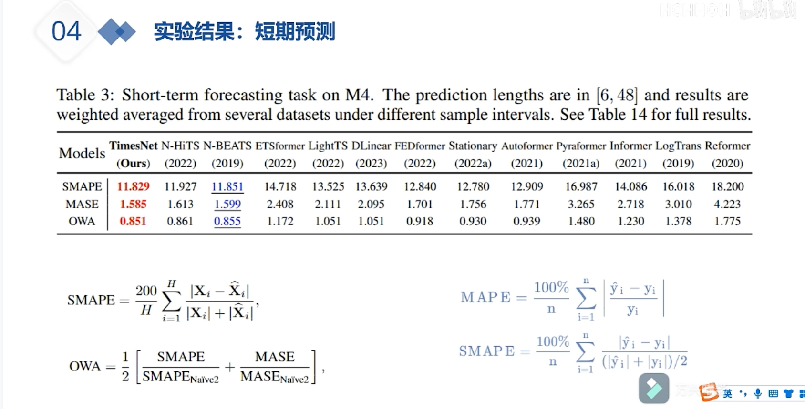

### 插补

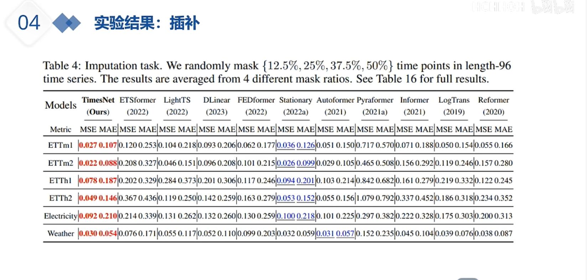

### 分类

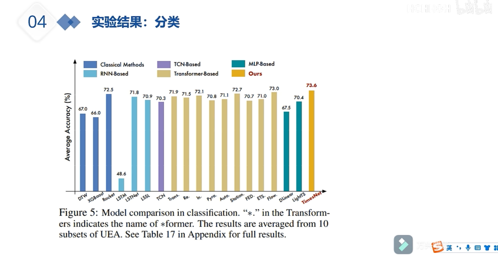

### 异常检测

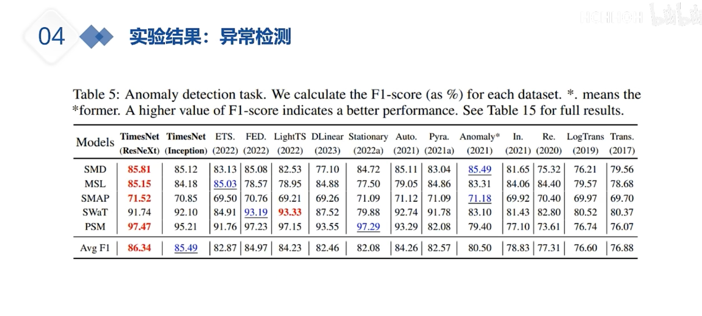