# 2021、 Informer

- [ ] 代码结构图

    

参看：[滑动窗口机制概述](https://blog.csdn.net/m0_53881899/article/details/136281557)

## 模型接受输入

- batch_size：batch中样本的数量，模型训练过程每次以一个batch为输入单位来进行训练。 

- seq_len：Encoder接收的输入序列长度，也是滑动窗口中的窗口长度。
- label_len：Decoder开始阶段接收的已知序列的长度（即“标签”用于引导解码器的预测）。

- pred_len:Decoder预测未来时间点的长度。

 `Informer` 在训练时`Encoder`输入的是`batch_size`个大小的**规范样本**，其中每个规范样本都是通过**滑动窗口技术**从原始数据集样本中提取出来的，**每个规范样本都包含`seq_len`个时间步长的数据点**（即每个规范样本都包含训练集中`seq_len`行连续数据）。

## 滑动窗口

滑动窗口实现原理： 

举个例子，假设我们有一组时间序列数据，这些数据记录了`1000h`的气温（`1000`行），设定`seq_len=72`（窗口长度），`label_len=48`，`pred_len=24`，`batch_size=12`。

初始：从`第1h`开始，放置一个`72h`的滑动窗口，窗口内样本包含`第1h—72h`气温，这时`batch`中的一个规范样本就是当前窗口内的`72h`样本，该规范样本对应的==标签==为25h—72h气温，该规范样本对应的==预测样本==为`73h—96h`气温。

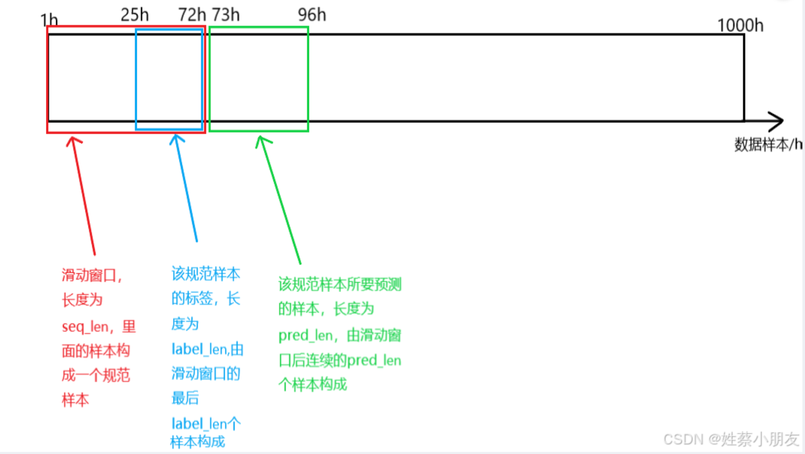

## 关于 embedding

 Embedding原理： 
Embedding对低维数据进行升维时，会把一些特征给放大，或者把笼统的特征给分开。

原理就是矩阵乘法，其中被乘数是时间序列数据，乘数是嵌入矩阵Embedding Matrix，Embedding Matrix在训练过程中根据反向传播算法和优化器进行更新，使得时间序列数据在乘Embedding Matrix后能更好地放大其数据中的特征。

因此，这个Embedding层一直在学习优化，使得整个数据升维过程慢慢形成一个良好的观察点，即Embedding Matrix。

## 随机选择 25 个 K、ProbAttn

的解释是，类比了解一个人可以通过它的为人处世去了解，但也不可能天天观察它怎么做事，那就随意观察 5 天也可以大概的了解到它这个人，或者随意的观察它做的 5 件事就可以了

【[参看](https://www.bilibili.com/video/BV1GNNde1ETs?spm_id_from=333.788.videopod.episodes&vd_source=ddd7d236ab3e9b123c4086c415f4939e&p=3)】

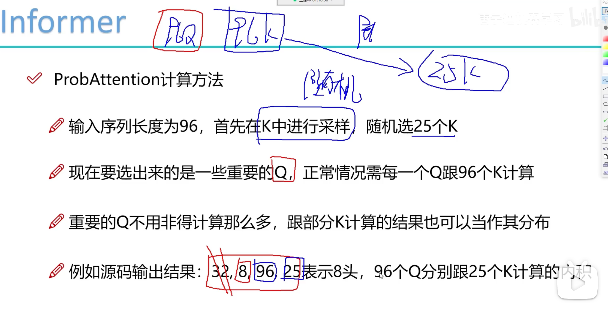

解释输出结果：形状是 `32*8*96*25`

`32`：batch

`8`：`8` 头，怎么理解 `8` 头，首先把特征拆成 `8` 份，然后分别计算，随后再拼接

`96`：`96` 个 query

`25`：`25` 个 key

也就是这里的注意力矩阵是 `96*25`

图示：

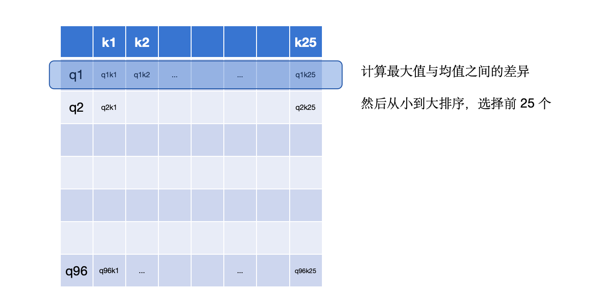

（1）输入序列长度为96，首先在K中进行采样，随机选取25个k。
（2）计算每个q与25个k的内积，现在一个q一共有25个得分。
（3）每个q在25个得分中，选取==最高分的与均值==算差异。
（4）这样我们输入的96个q都有对应的差异得分，我们将差异从大到小排列，选出差异前25大的q。
（5）其他淘汰掉的q使用V向量的平均来代替。

以上解决了原文提到的问题：

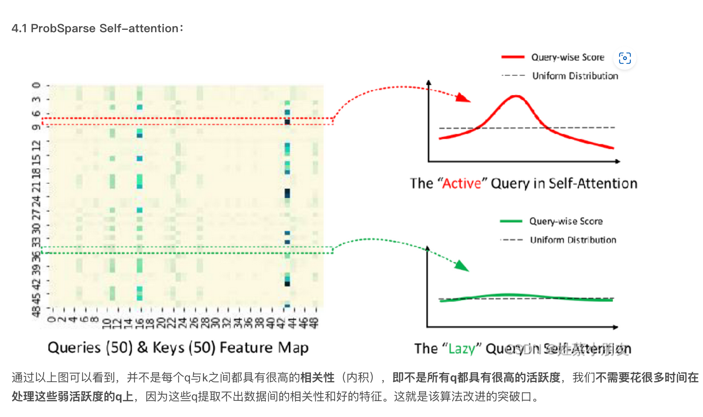

### 说明选出 25 个更新，其余全为均值向量

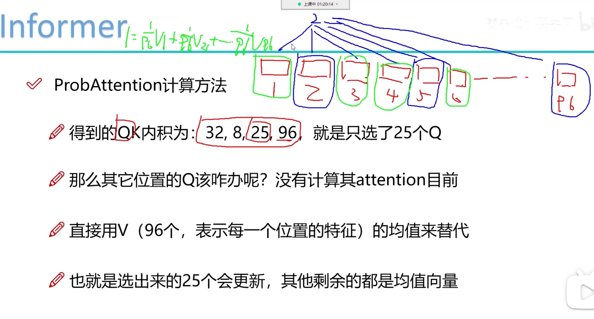

解释形状：32 个 batch，8 个头，选择出 25 个 query，跟 96 个 key 计算注意力

例子：选到了 2 号 query，跟 1——96 号 key 计算注意力，也就是只更新 2 号以及选到的 query，那么没选到的怎么办？

回答：均值填充

**填充公式：** 

为选到的 query 填充：

$\frac{1}{96}V_1+\frac{1}{96}V_2+......+\frac{1}{96}V_{96}$

**理由：**

因为 $lazy \ query$ 的注意力分布就是类似均匀分布的，所以填充的时候用 $V$的均值填充是有道理的

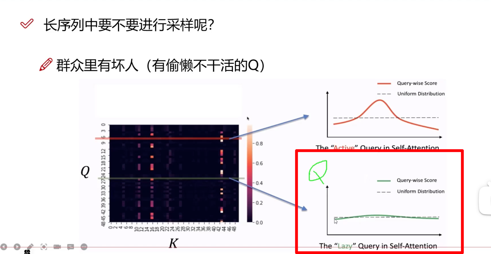

以上说明了 infomer 中注意力权值的计算

期刊：AAAI21(best paper)

## Distilling

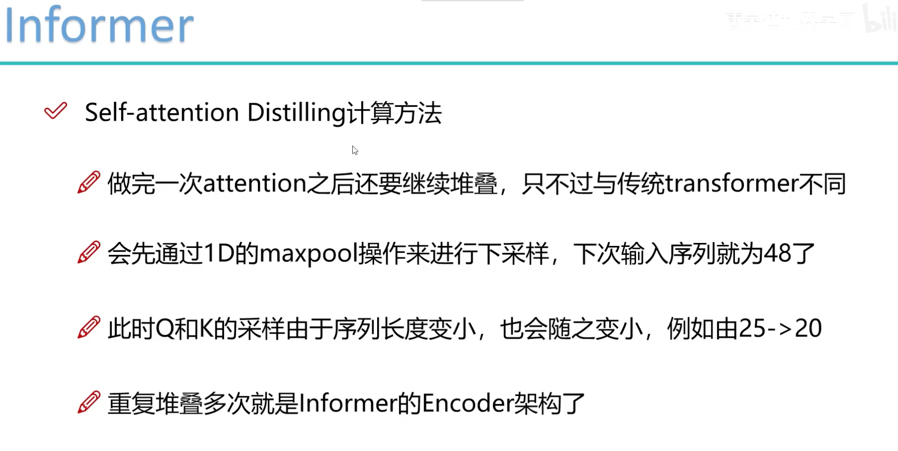

我们处理的单元：是 96 个时间步；一个规范化样本96 个数据点，关于这点[补充见](#跳 111)

在相邻的Attention Block之间加入卷积池化操作，来对特征进行降采样。对==输入维度==进行修剪，堆叠n层，每层==输入序列长度减半==，从而将空间复杂度降低到O(nlogn)

也就是输入序列长度： 96 → 48

> 这样处理之后，下一次self attention考虑的序列长度就不是96，而是48
>
> 思考为什么 序列长度打折扣也可以：
>
> encoder就是把原始序列长度输入数据特征进行提取，原始输入特征是96个特征、48 个特征，24 个特征都是可以的，只要能进行特征提取就可以
>
> encoder 输出的东西要进行预测，输出的预测的跟原始输入序列长度1~96没关系，只需要告诉 decoder前面特征是啥就好了
>
> 序列长度减半的
>
> 🔴 那 输入序列长度减半，也就是 query 减半了，那 key 呢？还是 25 个吗？
>
> 在源码中有参数控制，通过 maxpool 对输入序列减半的时候，序列长度从 96 到 48，key 由 25→20，又经过一层 maxpool，输入序列从 48→24，key 由 20→10
>
> 通过一组参数设置，逐层递减

图示：（中间的板子 是 **注意力的头数** ）

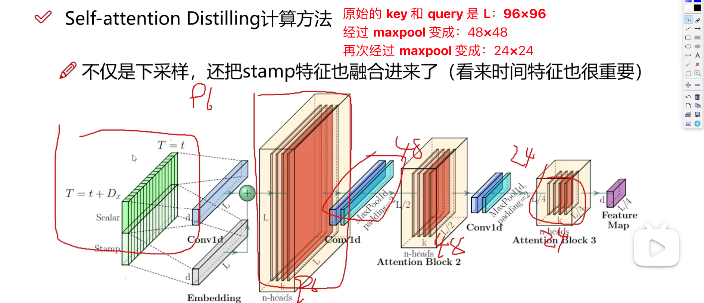

效果：

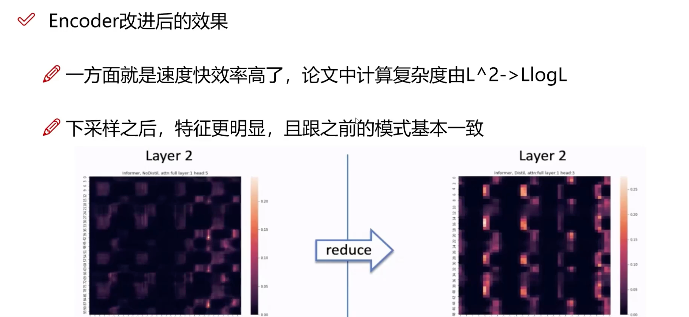

maxpool会把特征鲜明的选出来，逐层筛选

==传统decoder：==

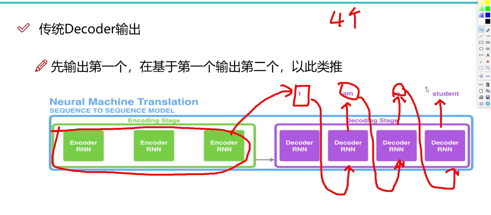

**decoder 的输入：** 

encoder 中的做：self attention

decoder 中做 2 种 **attention**：

①  与 encoder 的输出的做 attention，表示 encoder 中的特征能提供用于指导decoder 的输入

② decoder 输入的自注意力，这一部分需要注意的是 mask 操作，当前位置在做自注意力时，不能看到未来的信息

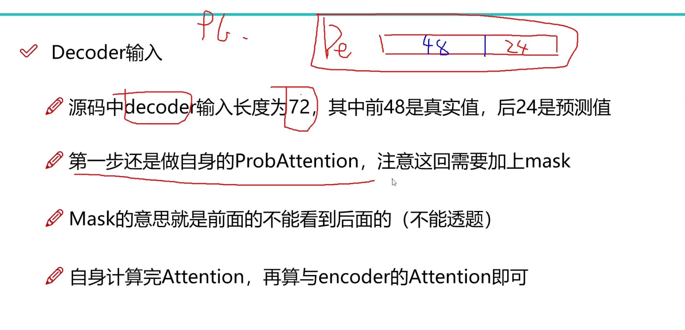

### 模型输入输出角度理解Informer训练和预测过程

数据集：BDG2

(小时维度的数据) 数据规格:17420 * 320

Batch_size:32

 1️⃣ **Encoder Embedding输入** 

> $X_{enc} = 32 × 96 × 320  $
>
> 32为batch大小，一个batch有32个样本，一个样本代表96个时间点的数据。
> 320为每个数据的维度，表示每个时间点数据（每行）有320列。
>
> $X_{mark} = 32 × 96 × 4 $ 
>
> 32 × 96同上，表示每个时间点的数据都要有一个位置编码，Xmark与Xenc每行一一对应。
>
> 4为时间戳，例如我们用小时维度的数据，那么4分别代表年、月、日、小时，

2️⃣ **Decoder Embedding输入：**

> $X_{dec} = 32 × 72 × 320$ 
>
> $X_{mark} = 32 × 72 × 4$ 
>
> - 72=48+24，其中48为Encoder96的后48个时间点数据，用这些真实值来带一带预测值，24为待预测值。
> - 48为绿色部分，24为白色部分填充0（mask机制）

3️⃣ **Embedding输入输出：**

> 将维度为$320$的一个时间点的数据投影成维度为512的数据。
>
>  **输入：**
>
> 32 × 96/72 × 320
>
> 32 × 96/72 × 4
>
> **输出：**
>
> 32 × 96/72 × 512

4️⃣ **ProbSparse Self-attention输入输出**

> **输入：**
>
> 32 × 8 × 96 × 64 (8 × 64 = 512，这也是多头的原理，即8个头)
>
> **Active输出：**
>
> 32 × 8 × 25 × 64 （只取25个活跃q）
>
> **Active+Lazy输出：**
>
> 32 × 8 × 96 × 64 （除了25个活跃q，其余q用V向量的平均来代替）
>
> **多头注意力合并：**
>
> 32 × 96 × 512
>
> **Encoder输入输出：**
>
> <u>多个Encoder和蒸馏层的组合</u>
>
> 输入：
>
> 32 × 96 × 512（来自上面embedding 长度为96的部分）
>
>  输出：
>
> 32 × 51 × 512（这里的51应该是conv1d卷积取整导致的，因为源码要自行调整，所以是这样的）

5️⃣ **Decoder输入输出**

> **输入：**
>
> 32 × 51 × 512 & 32 × 72 × 512
>
> （32 × 51 × 512是Encoder输出，32 × 72 × 512是Decoder Embedding后的输入）
>
> **输出：**
>
> 32 × 72 × 512

## 位置编码

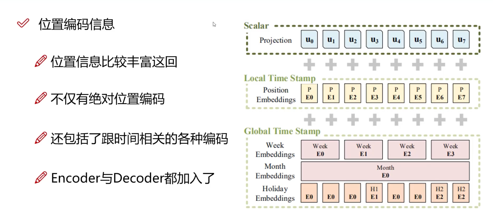

## 实验部分

[时序预测论文精读：长序列预测模型informer上](https://www.bilibili.com/video/BV127CYYQELB?spm_id_from=333.788.videopod.sections&vd_source=ddd7d236ab3e9b123c4086c415f4939e)

本文所用数据集：ETT h1，ETT h2，ETT m1、weather

实验部分：

- 单变量 长序列时间序列预测
- 多变量 ~ （q 的稀疏性假设在很多数据集上成立）

[https://arxiv.org/pdf/2012.07436](https://arxiv.org/pdf/2012.07436)

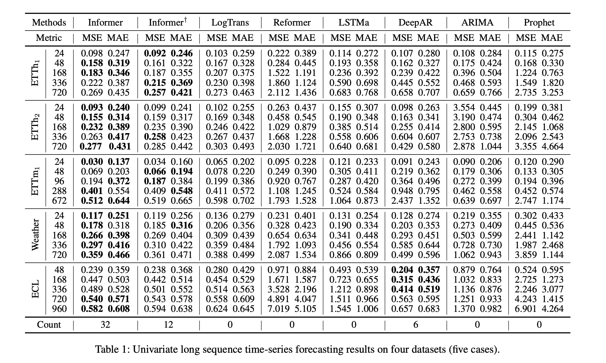
