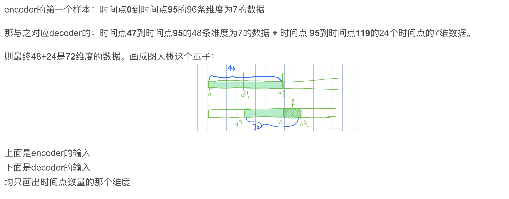

# Informer

参看：[滑动窗口机制概述](https://blog.csdn.net/m0_53881899/article/details/136281557)

## 模型接受输入

- batch_size：batch中样本的数量，模型训练过程每次以一个batch为输入单位来进行训练。 

- seq_len：Encoder接收的输入序列长度，也是滑动窗口中的窗口长度。
- label_len：Decoder开始阶段接收的已知序列的长度（即“标签”用于引导解码器的预测）。

- pred_len:Decoder预测未来时间点的长度。

 `Informer` 在训练时`Encoder`输入的是`batch_size`个大小的**规范样本**，其中每个规范样本都是通过**滑动窗口技术**从原始数据集样本中提取出来的，**每个规范样本都包含`seq_len`个时间步长的数据点**（即每个规范样本都包含训练集中`seq_len`行连续数据）。

## 滑动窗口

滑动窗口实现原理： 

举个例子，假设我们有一组时间序列数据，这些数据记录了`1000h`的气温（`1000`行），设定`seq_len=72`（窗口长度），`label_len=48`，`pred_len=24`，`batch_size=12`。

初始：从`第1h`开始，放置一个`72h`的滑动窗口，窗口内样本包含`第1h—72h`气温，这时`batch`中的一个规范样本就是当前窗口内的`72h`样本，该规范样本对应的==标签==为25h—72h气温，该规范样本对应的==预测样本==为`73h—96h`气温。

## 关于 embedding

 Embedding原理： 
Embedding对低维数据进行升维时，会把一些特征给放大，或者把笼统的特征给分开。

原理就是矩阵乘法，其中被乘数是时间序列数据，乘数是嵌入矩阵Embedding Matrix，Embedding Matrix在训练过程中根据反向传播算法和优化器进行更新，使得时间序列数据在乘Embedding Matrix后能更好地放大其数据中的特征。

因此，这个Embedding层一直在学习优化，使得整个数据升维过程慢慢形成一个良好的观察点，即Embedding Matrix。

## 随机选择 25 个 K、ProbAttn

的解释是，类比了解一个人可以通过它的为人处世去了解，但也不可能天天观察它怎么做事，那就随意观察 5 天也可以大概的了解到它这个人，或者随意的观察它做的 5 件事就可以了

【[参看](https://www.bilibili.com/video/BV1GNNde1ETs?spm_id_from=333.788.videopod.episodes&vd_source=ddd7d236ab3e9b123c4086c415f4939e&p=3)】

解释输出结果：形状是 `32*8*96*25`

`32`：batch

`8`：`8` 头，怎么理解 `8` 头，首先把特征拆成 `8` 份，然后分别计算，随后再拼接

`96`：`96` 个 query

`25`：`25` 个 key

也就是这里的注意力矩阵是 `96*25`

图示：

（1）输入序列长度为96，首先在K中进行采样，随机选取25个k。
（2）计算每个q与25个k的内积，现在一个q一共有25个得分。
（3）每个q在25个得分中，选取==最高分的与均值==算差异。
（4）这样我们输入的96个q都有对应的差异得分，我们将差异从大到小排列，选出差异前25大的q。
（5）其他淘汰掉的q使用V向量的平均来代替。

以上解决了原文提到的问题：

### 说明选出 25 个更新，其余全为均值向量

解释形状：32 个 batch，8 个头，选择出 25 个 query，跟 96 个 key 计算注意力

例子：选到了 2 号 query，跟 1——96 号 key 计算注意力，也就是只更新 2 号以及选到的 query，那么没选到的怎么办？

回答：均值填充

**填充公式：** 

为选到的 query 填充：

$\frac{1}{96}V_1+\frac{1}{96}V_2+......+\frac{1}{96}V_{96}$

**理由：**

因为 $lazy \ query$ 的注意力分布就是类似均匀分布的，所以填充的时候用 $V$的均值填充是有道理的

以上说明了 infomer 中注意力权值的计算

期刊：AAAI21(best paper)

