# 2021、Autoformer

[序列分解预测模型Autoformer](https://www.bilibili.com/video/BV1KZ6ZYDEfK?spm_id_from=333.788.player.switch&vd_source=ddd7d236ab3e9b123c4086c415f4939e) 

- 文章题目：Autoformer: Decomposition Transformers with Auto-Correlation for Long-Term Series Forecasting
-  收录情况： 2021 NeurIPS 
- 作者团队：清华软院吴海旭 
- 开源地址：https://github.com/thuml/Autoformer
- Autoformer:Decomposition Transformers with Auto-Correlation for Long-Term Series Forecasting
- [https://openreview.net/pdf?id=I55UqU-M11y](https://openreview.net/pdf?id=I55UqU-M11y)
- Autoformer: 一种基于自动相关机制的时序预测新架构

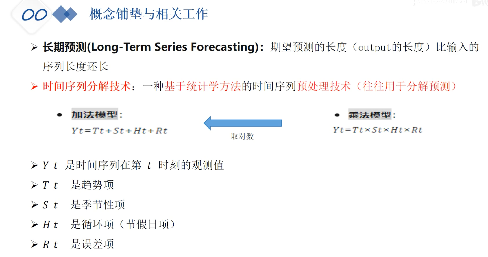

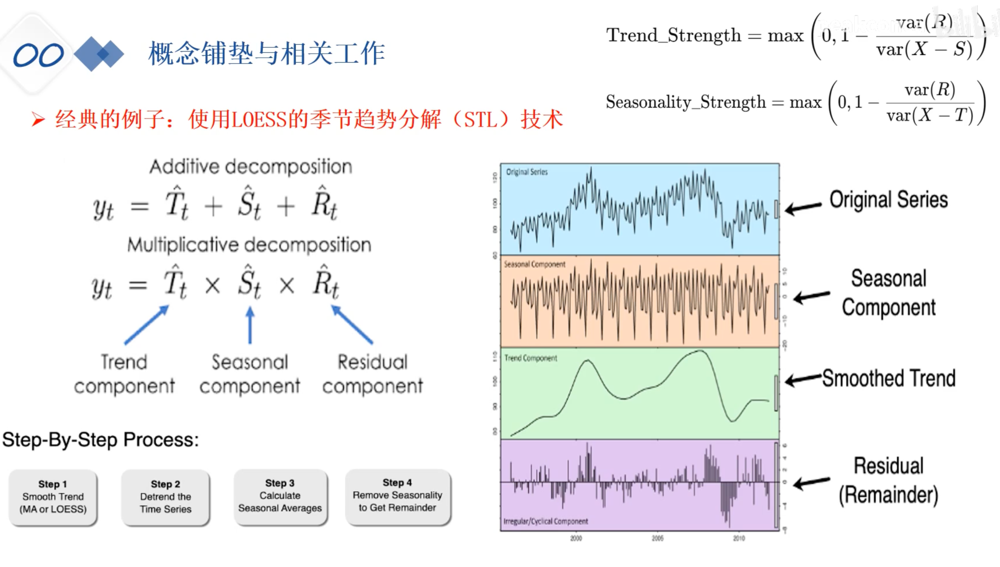

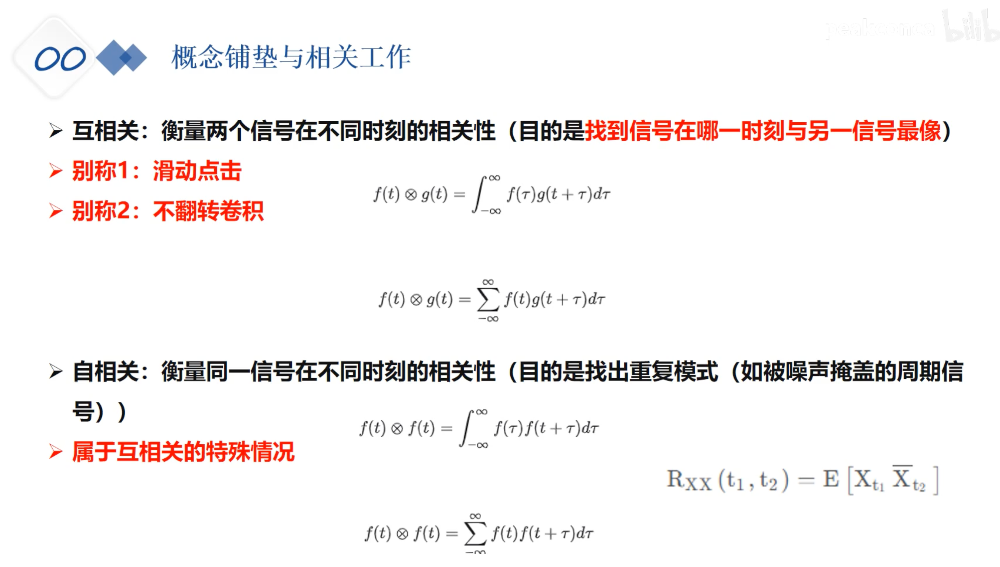

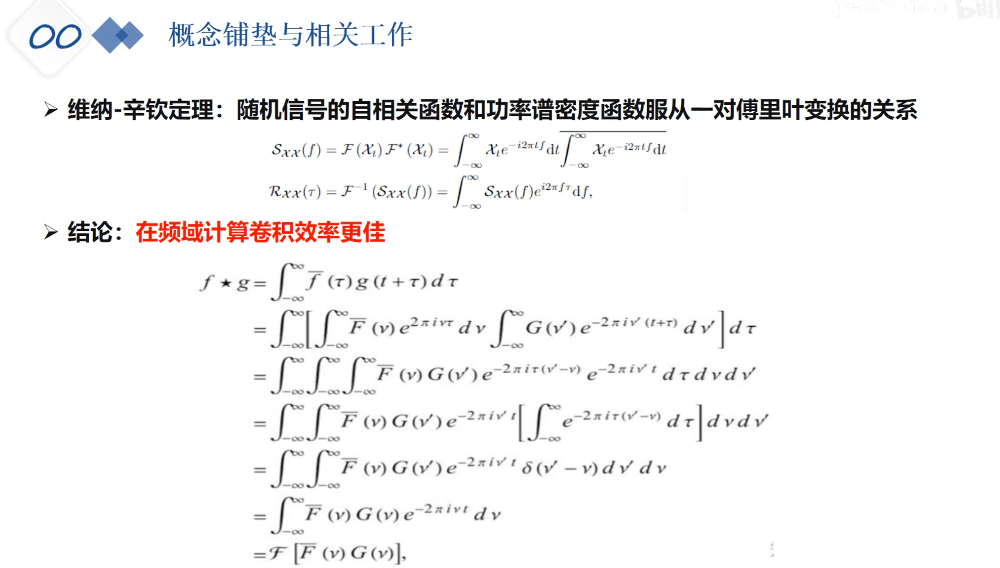

## 问题描述

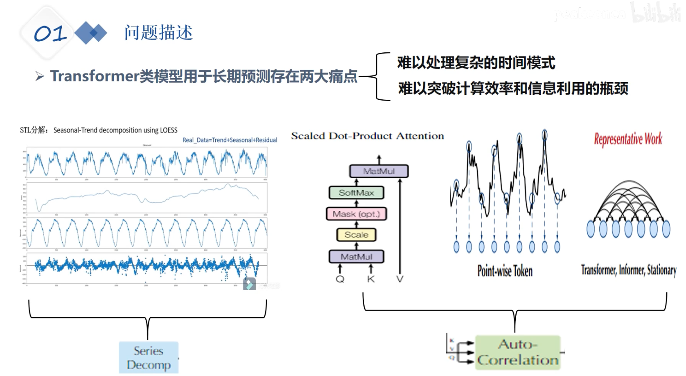

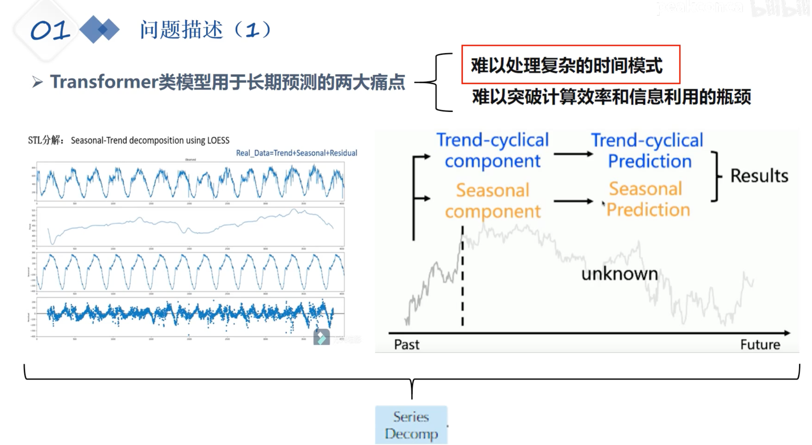

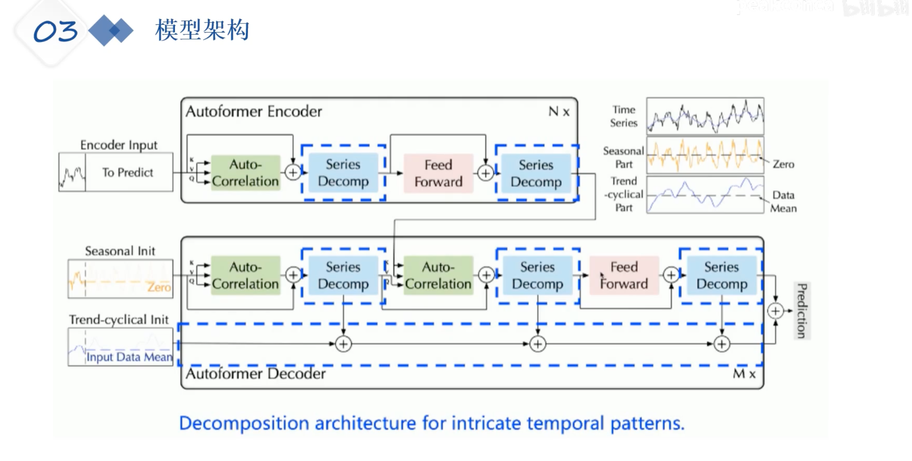

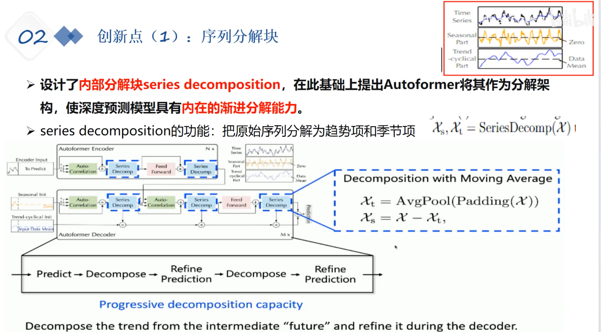

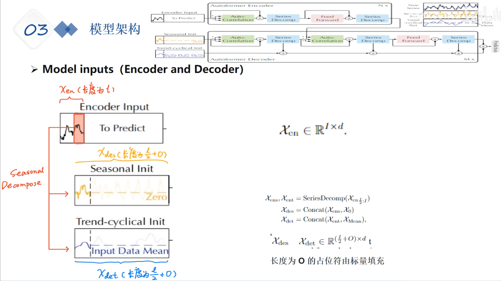

序列分解预测模型

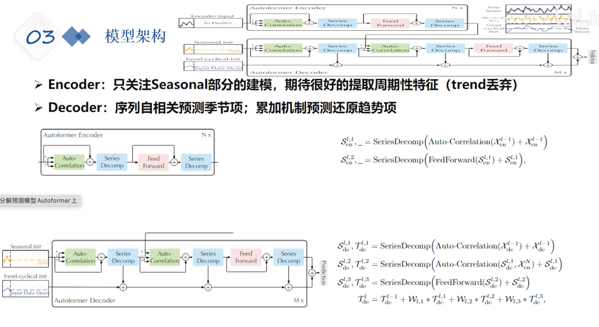

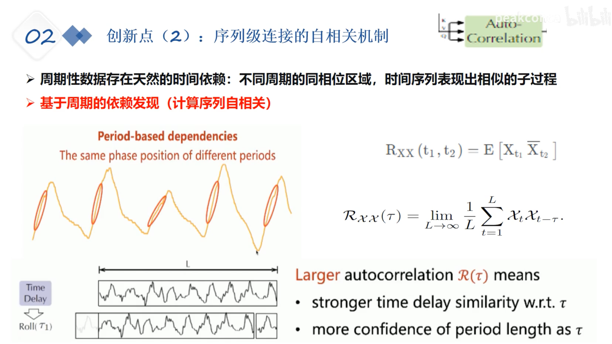

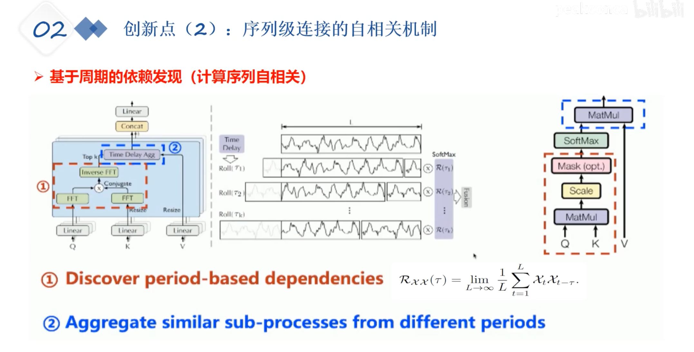 

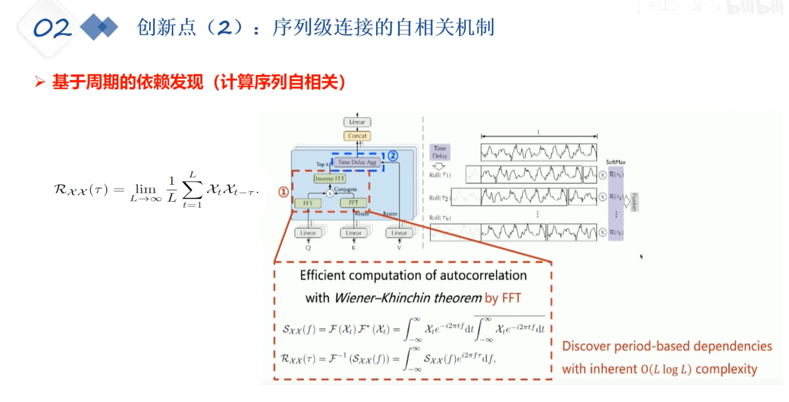

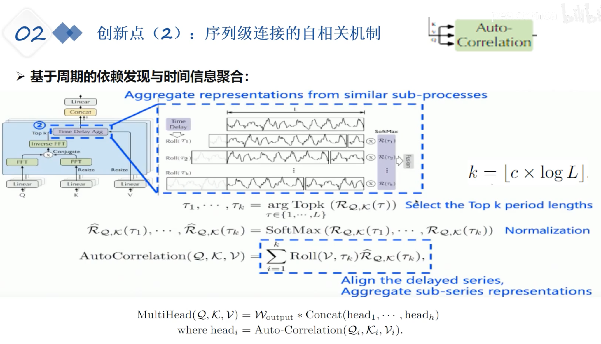

## 原文阅读

[https://blog.csdn.net/sinat_37574187/article/details/144396724](https://blog.csdn.net/sinat_37574187/article/details/144396724)

本文聚焦的两个问题：

However, the forecasting task is extremely challenging under the long-term setting. 

First, it is unreliable to discover the temporal dependencies directly from the long-term time series because the dependencies can be obscured by entangled temporal patterns. 

Second, canonical Transformers with self-attention mechanisms are computationally prohibitive for long-term forecasting because of the quadratic complexity of sequence length.

> （1）直接从长时间序列预测中发现时间模式 不太靠谱。因为距离太长了是其一，还有就是 时间模式错综复杂
>
> （2）还是 Transformer 的计算复杂度太高了。现在一般采用稀疏的逐点计算，但是，损失信息了。

本文采用分解的概念。但是在之前的用处中，分解主要是预处理的步骤，因为未来数据的分解是观测不到的。

