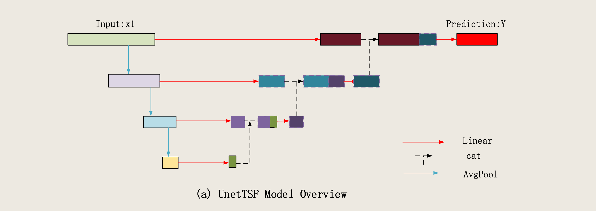

# 2024、UnetTSF

[https://arxiv.org/pdf/2401.03001](https://arxiv.org/pdf/2401.03001)

 

### III. PROPOSED METHOD

时间序列预测问题是在给定长度为 $L$ 的历史数据的情况下，预测长度为 $T$ 的未来数据。输入的历史数据 $X = \{x_1, x_2, x_3, \ldots, x_L\}$  具有固定长度的回看窗口 L，模型输出预测数据  $x = \{x_{L+1}, x_{L+2}, \ldots, x_{L+T}\}$ ，其中  $x_i$ 表示在时间  $t = i$  时维度为 $C$ 的向量，$C$ 表示输入数据集中的通道数。我们设计了 UnetTSF，使用 U-Net [27] 架构，并专门设计了适合时间序列数据的 FPN [12] 和多步融合模块，如图 2 所示。

**UNetTSF model**： UnetTSF由全连接层和池化层组成。模型的左侧主要由时间序列特征金字塔网络（FPN）构成，池化函数用于形成输入数据的描述性特征$ X = \{ X_1, X_2, X_3, ..., X_{\text{stage} } \} $  。这里的“stage”表示Unet网络的层数，模型的右侧是融合模块。全连接层用于将上层特征与局部层特征融合，以输出当前层的最终特征，同时保持特征长度不变。

**Times series FPN** （时间序列特征金字塔网络）：数据分解通常被时间序列预测模型用来从时间序列数据中提取特征。通常，数据被分为季节性、周期性、趋势和波动项。Autoformer 和 DLiner 都使用大规模自适应平滑核从原始数据中提取趋势项。从原始数据中减去趋势项会得到季节性项，这可能会导致某些特征丢失。因此，我们采用多层次提取方法。例如，将数据设置为分为4层（$\text{stage = 4}$），使用具有 $\text{kernel\_size} = 3$、$\text{stride} = 2$ 和 $padding = 0$ 配置的平均池化（$\text{avgpool}$）提取趋势特征，将原始输入数据设为 $x$ ，并通过 $\text{FPN}$ 模块后，形成四个层次的输入数据： $X = [x_1, x_2, x_3, x_4]$ 。
$$
x_1 = x
$$

$$
x_2 = \text{AvgPool}(x_1)
$$

$$
x_3 = \text{AvgPool}(x_2)
$$

$$
x_4 = \text{AvgPool}(x_3)
$$

$$
\text{len}(x_i) = \left\lfloor \frac{x_{i-1} + 2 \times \text{padding} - \text{kernel\_size}}{\text{stride}} + 1 \right\rfloor
$$

如图2(b)所示，时间序列数据的FPN结构可以有效提取趋势特征。金字塔顶层的趋势信息比底层更集中，而底层的季节性特征更为丰富。

<details>
<summary>说明：金字塔顶层的趋势信息比底层更集中，而底层的季节性特征更为丰富</summary>
<p>
首先，关于顶层和底层：底层靠近输入端，序列长度长，所谓的分辨率高
顶层靠近输出端，序列长度短，所谓的分辨率低
其次，关于池化操作在时间序列中的使用，相当于每次丢掉了趋势信息，最顶层的特征最抽象，保留了全局信息和波动信息
需要注意，池化是池化掉了长期趋势信息，尤其是大核池化提取 trend，比如 Autoformer
- 平均池化：会平滑短期波动，部分保留季节性模式的大致形状，尤其是当季节周期远大于池化窗口大小时
- 最大池化会保留显著峰值，这些峰值通常是季节性模式的关键特征
</p>
</details>
**Multi stage fusion module**（多阶段融合模块）：通过时间序列数据的FPN模块，形成了一个多尺度的时间特征 $X$。为了充分利用这些特征，使用多个全连接预测来获得 $Y = [y_1, y_2, y_3, y_4]$。$y_i$ 的长度计算方法与 $x$ 相同，并且使用相同的池化操作来计算每个层级与 $X$ 相同的长度。融合模块采用 $y_i$  和 $y_{i-1}$ 进行拼接，然后使用一个全连接层来输出 $y_i^{'}$，$y_i^{'}$ 和  $y_i$ 的长度是相同的。

$$
\text{len}(y1) = \text{len}(y) = T
$$

$$
y_{i-1}^{'} = \text{Linear}(\text{cat}(y_i^{'}, y_{i-1}))
$$

$$
\text{len}(y_i) = \left\lfloor \frac{y_{i-1} + 2 \times \text{padding} - \text{kernel\_size}}{\text{stride}} + 1 \right\rfloor
$$

源码：[https://github.com/lichuustc/UnetTSF/tree/main/models](https://github.com/lichuustc/UnetTSF/tree/main/models)

怎么配置？

- 官网下载下来模型文件
- 配置文件搬过来，完事。

<details>
<summary>模型文件，已配置好</summary>
<p>

```python
import torch
import torch.nn as nn
import torch.nn.functional as F
import numpy as np
from layers.RevIN import RevIN
import custom_repr
class moving_avg(nn.Module):
    """
    Moving average block to highlight the trend of time series
    """
    def __init__(self, kernel_size, stride):
        super(moving_avg, self).__init__()
        self.kernel_size = kernel_size
        self.avg = nn.AvgPool1d(kernel_size=kernel_size, stride=stride, padding=0)

    def forward(self, x):
        # padding on the both ends of time series
        front = x[:, 0:1, :].repeat(1, (self.kernel_size - 1) // 2, 1)
        end = x[:, -1:, :].repeat(1, (self.kernel_size - 1) // 2, 1)
        x = torch.cat([front, x, end], dim=1)
        x = self.avg(x.permute(0, 2, 1))
        x = x.permute(0, 2, 1)
        return x


class series_decomp(nn.Module):
    """
    Series decomposition block
    """
    def __init__(self, kernel_size):
        super(series_decomp, self).__init__()
        self.moving_avg = moving_avg(kernel_size, stride=1)

    def forward(self, x):
        moving_mean = self.moving_avg(x)
        res = x - moving_mean
        return res, moving_mean

class block_model(nn.Module):
    """
    Decomposition-Linear
    """
    def __init__(self, input_channels, input_len, out_len, individual):
        super(block_model, self).__init__()
        self.channels = input_channels
        self.input_len = input_len
        self.out_len = out_len
        self.individual = individual

        if self.individual:
            self.Linear_channel = nn.ModuleList()
            
            for i in range(self.channels):
                self.Linear_channel.append(nn.Linear(self.input_len, self.out_len))
        else:
            self.Linear_channel = nn.Linear(self.input_len, self.out_len)
        self.ln = nn.LayerNorm(out_len)
        self.relu = nn.ReLU(inplace=True)

    def forward(self, x):
        # x: [Batch, Input length, Channel]
        if self.individual:
            output = torch.zeros([x.size(0),x.size(1),self.out_len],dtype=x.dtype).to(x.device)
            for i in range(self.channels):
                output[:,i,:] = self.Linear_channel[i](x[:,i,:])
        else:
            output = self.Linear_channel(x)
        #output = self.ln(output)
        #output = self.relu(output)
        return output # [Batch, Channel, Output length]


class Model(nn.Module):
    def __init__(self, configs):
        super(Model, self).__init__()

        self.input_channels = configs.enc_in
        self.input_len = configs.seq_len
        self.out_len = configs.pred_len
        self.individual = configs.individual
        # 下采样设定
        self.stage_num = configs.stage_num
        self.stage_pool_kernel = configs.stage_pool_kernel
        self.stage_pool_stride = configs.stage_pool_stride
        self.stage_pool_padding = configs.stage_pool_padding

        self.revin_layer = RevIN(self.input_channels, affine=True, subtract_last=False)
        
        len_in = self.input_len
        len_out = self.out_len
        down_in = [len_in]
        down_out = [len_out]
        i = 0
        while i < self.stage_num - 1:
            linear_in = int((len_in + 2 * self.stage_pool_padding - self.stage_pool_kernel)/self.stage_pool_stride + 1 )
            linear_out = int((len_out + 2 * self.stage_pool_padding - self.stage_pool_kernel)/self.stage_pool_stride + 1 )
            down_in.append(linear_in)
            down_out.append(linear_out)
            len_in = linear_in
            len_out = linear_out
            i = i + 1

        # 最大池化层
        self.Maxpools = nn.ModuleList() 
        # 左边特征提取层
        self.down_blocks = nn.ModuleList()
        for in_len,out_len in zip(down_in,down_out):
            self.down_blocks.append(block_model(self.input_channels, in_len, out_len, self.individual))
            self.Maxpools.append(nn.AvgPool1d(kernel_size=self.stage_pool_kernel, stride=self.stage_pool_stride, padding=self.stage_pool_padding))
        
        # 右边特征融合层
        self.up_blocks = nn.ModuleList()
        len_down_out = len(down_out)
        for i in range(len_down_out -1):
            print(len_down_out, len_down_out - i -1, len_down_out - i - 2)
            in_len = down_out[len_down_out - i - 1] + down_out[len_down_out - i - 2]
            out_len = down_out[len_down_out - i - 2]
            self.up_blocks.append(block_model(self.input_channels, in_len, out_len, self.individual))
        
        #self.linear_out = nn.Linear(self.out_len * 2, self.out_len)

    def forward(self, x):
        x = self.revin_layer(x, 'norm')
        x1 = x.permute(0,2,1)
        e_out = []
        i = 0
        for down_block in self.down_blocks:
            e_out.append(down_block(x1))
            x1 = self.Maxpools[i](x1)
            i = i+1

        e_last = e_out[self.stage_num - 1]
        for i in range(self.stage_num - 1):
            e_last = torch.cat((e_out[self.stage_num - i -2], e_last), dim=2)
            e_last = self.up_blocks[i](e_last)
        e_last = e_last.permute(0,2,1)
        e_last = self.revin_layer(e_last, 'denorm')
        return e_last

import argparse
import os
import torch
import random
import numpy as np

parser = argparse.ArgumentParser(description='Autoformer & Transformer family for Time Series Forecasting')

# random seed
parser.add_argument('--random_seed', type=int, default=2021, help='random seed')

# basic config
parser.add_argument('--is_training', type=int, required=False, default=1, help='status')
parser.add_argument('--model_id', type=str, required=False, default='test', help='model id')
parser.add_argument('--model', type=str, required=False, default='Transformer',
                    help='model name, options: [Autoformer, Informer, Transformer]')

# data loader
parser.add_argument('--data', type=str, required=False, default='ETTh1', help='dataset type')
parser.add_argument('--root_path', type=str, default='./dataset/ETT/', help='root path of the data file')
parser.add_argument('--data_path', type=str, default='ETTh1.csv', help='data file')
parser.add_argument('--features', type=str, default='M',
                    help='forecasting task, options:[M, S, MS]; M:multivariate predict multivariate, S:univariate predict univariate, MS:multivariate predict univariate')
parser.add_argument('--target', type=str, default='OT', help='target feature in S or MS task')
parser.add_argument('--freq', type=str, default='h',
                    help='freq for time features encoding, options:[s:secondly, t:minutely, h:hourly, d:daily, b:business days, w:weekly, m:monthly], you can also use more detailed freq like 15min or 3h')
parser.add_argument('--checkpoints', type=str, default='./checkpoints/', help='location of model checkpoints')

# forecasting task
parser.add_argument('--seq_len', type=int, default=96, help='input sequence length')
parser.add_argument('--label_len', type=int, default=48, help='start token length')
parser.add_argument('--pred_len', type=int, default=720, help='prediction sequence length')

#u_linear
parser.add_argument('--stage_num', type=int, default=4, help='stage num')
parser.add_argument('--stage_pool_kernel', type=int, default=3, help='AvgPool1d kernel_size')
parser.add_argument('--stage_pool_stride', type=int, default=2, help='AvgPool1d stride')
parser.add_argument('--stage_pool_padding', type=int, default=0, help='AvgPool1d padding')

# DLinear
#parser.add_argument('--individual', action='store_true', default=False, help='DLinear: a linear layer for each variate(channel) individually')

# PatchTST
parser.add_argument('--fc_dropout', type=float, default=0.05, help='fully connected dropout')
parser.add_argument('--head_dropout', type=float, default=0.0, help='head dropout')
parser.add_argument('--patch_len', type=int, default=16, help='patch length')
parser.add_argument('--stride', type=int, default=8, help='stride')
parser.add_argument('--padding_patch', default='end', help='None: None; end: padding on the end')
parser.add_argument('--revin', type=int, default=1, help='RevIN; True 1 False 0')
parser.add_argument('--affine', type=int, default=0, help='RevIN-affine; True 1 False 0')
parser.add_argument('--subtract_last', type=int, default=0, help='0: subtract mean; 1: subtract last')
parser.add_argument('--decomposition', type=int, default=0, help='decomposition; True 1 False 0')
parser.add_argument('--kernel_size', type=int, default=25, help='decomposition-kernel')
parser.add_argument('--individual', type=int, default=1, help='individual head; True 1 False 0')

# Formers 
parser.add_argument('--embed_type', type=int, default=0, help='0: default 1: value embedding + temporal embedding + positional embedding 2: value embedding + temporal embedding 3: value embedding + positional embedding 4: value embedding')
parser.add_argument('--enc_in', type=int, default=7, help='encoder input size') # DLinear with --individual, use this hyperparameter as the number of channels
parser.add_argument('--dec_in', type=int, default=7, help='decoder input size')
parser.add_argument('--c_out', type=int, default=7, help='output size')
parser.add_argument('--d_model', type=int, default=512, help='dimension of model')
parser.add_argument('--n_heads', type=int, default=8, help='num of heads')
parser.add_argument('--e_layers', type=int, default=2, help='num of encoder layers')
parser.add_argument('--d_layers', type=int, default=1, help='num of decoder layers')
parser.add_argument('--d_ff', type=int, default=2048, help='dimension of fcn')
parser.add_argument('--moving_avg', type=int, default=25, help='window size of moving average')
parser.add_argument('--factor', type=int, default=1, help='attn factor')
parser.add_argument('--distil', action='store_false',
                    help='whether to use distilling in encoder, using this argument means not using distilling',
                    default=True)
parser.add_argument('--dropout', type=float, default=0.05, help='dropout')
parser.add_argument('--embed', type=str, default='timeF',
                    help='time features encoding, options:[timeF, fixed, learned]')
parser.add_argument('--activation', type=str, default='gelu', help='activation')
parser.add_argument('--output_attention', action='store_true', help='whether to output attention in ecoder')
parser.add_argument('--do_predict', action='store_true', help='whether to predict unseen future data')

#corr
parser.add_argument('--corr_lower_limit', type=float, default=0.6, help='find corr ')

# optimization
parser.add_argument('--num_workers', type=int, default=10, help='data loader num workers')
parser.add_argument('--itr', type=int, default=1, help='experiments times')
parser.add_argument('--train_epochs', type=int, default=80, help='train epochs')
parser.add_argument('--batch_size', type=int, default=32, help='batch size of train input data')
parser.add_argument('--patience', type=int, default=20, help='early stopping patience')
parser.add_argument('--learning_rate', type=float, default=0.0001, help='optimizer learning rate')
parser.add_argument('--des', type=str, default='test', help='exp description')
parser.add_argument('--loss', type=str, default='mse', help='loss function')
parser.add_argument('--lradj', type=str, default='type3', help='adjust learning rate')
parser.add_argument('--pct_start', type=float, default=0.3, help='pct_start')
parser.add_argument('--use_amp', action='store_true', help='use automatic mixed precision training', default=False)

# GPU
parser.add_argument('--use_gpu', type=bool, default=True, help='use gpu')
parser.add_argument('--gpu', type=int, default=0, help='gpu')
parser.add_argument('--use_multi_gpu', action='store_true', help='use multiple gpus', default=False)
parser.add_argument('--devices', type=str, default='0,1,2,3', help='device ids of multile gpus')
parser.add_argument('--test_flop', action='store_true', default=False, help='See utils/tools for usage')

args = parser.parse_args()

# random seed
fix_seed = args.random_seed
random.seed(fix_seed)
torch.manual_seed(fix_seed)
np.random.seed(fix_seed)


args.use_gpu =  True

if args.use_gpu and args.use_multi_gpu:
    args.dvices = args.devices.replace(' ', '')
    device_ids = args.devices.split(',')
    args.device_ids = [int(id_) for id_ in device_ids]
    args.gpu = args.device_ids[0]

# print('Args in experiment:')
# print(args.seq_len)


batch_x = torch.randn(args.batch_size, args.seq_len, args.enc_in)
# ETTh1 => 17420 , channels = 7,Frequence = 7

model = Model(args).float()

outputs = model(batch_x)
```
</p>
</details>

```python
def forward(self, x):
    x = self.revin_layer(x, 'norm')
    x1 = x.permute(0,2,1)
    e_out = []
    i = 0
    for down_block in self.down_blocks:
        e_out.append(down_block(x1))
        x1 = self.Maxpools[i](x1)
        i = i+1

    e_last = e_out[self.stage_num - 1]
    for i in range(self.stage_num - 1):
        e_last = torch.cat((e_out[self.stage_num - i -2], e_last), dim=2)
        e_last = self.up_blocks[i](e_last)
    e_last = e_last.permute(0,2,1)
    e_last = self.revin_layer(e_last, 'denorm')
    return e_last
```

复述形状变化：

> - `pred_len  =720` 

（1）传进来的x 形状 `args.batch_size, args.seq_len, args.enc_in =  [32,96,7]` 

（2）可逆实例归一化，还是x，形状 [32,96,7]

（3）permute 转换维度，得到 x1，形状[32,7,96]，从这里开始所有的时间序列数据封装模式 都是 特征优先。

（4）输入 x1.shape = [32,7,96]，处理 down_block(x1)，输出形状 [32, 7, 720]，这个输出形状并没有参与后续的池化处理。而是存到了 `e_out`    再重复一遍就是定义了 7 个独立的线性层，分别将 96 个输入序列 映射到 720 的预测步长。

<details>
<summary>补充 关于  down_block(x1)</summary>
<p>
结构是：多个并行线性层
block_model(
  (Linear_channel): ModuleList(
    (0-6): 7 x Linear(in_features=96, out_features=720, bias=True)
  )
  (ln): LayerNorm((720,), eps=1e-05, elementwise_affine=True)
  (relu): ReLU(inplace=True)
)
① (0-6): 7 x Linear(in_features=96, out_features=720, bias=True)，表示模型包含 7个独立的线性层，每个线性层专门处理一个输入通道的数据
② (0-6): 表示索引范围，从0到6，共7个元素
③ 7 x: 表示有7个相同类型的模块
④ Linear(in_features=96, out_features=720, bias=True): 每个模块都是一个线性层，输入特征96，输出特征720
⑤ 当 individual=True 时（在代码中 args.individual=1），模型为每个输入通道创建一个独立的线性层。==》"通道独立处理"，常用于多变量时间序列预测
解释：目前都在用的通道独立
① 特化处理: 每个通道(变量)可能有不同的模式和特性，独立处理可以更好地捕捉这些差异
② 避免特征干扰: 不同变量可能有不同的规模和分布，独立处理可以避免变量间的干扰
</p>
</details>

（5）`x1 = self.Maxpools[i](x1)`  输入  x1 形状  [32,7,96]，最大池化以后，输出形状  `torch.Size([32, 7, 47])`

我又理清楚了！！赶紧记下来！

开始：

```python
x = self.revin_layer(x, 'norm')   # torch.Size([32, 96, 7])
x1 = x.permute(0,2,1)  #  [32,7,96]
e_out = []
i = 0
① for down_block in self.down_blocks:
    e_out.append(down_block(x1))
        x1 torch.Size([32, 7, 96])
        down_block的作用就是 
        输入：[Batch, Channel, Input_length]
        输出：[Batch, Channel, Output_length]
        down_block(x1) torch.Size([32, 7, 720])
        e_out.append(torch.Size([32, 7, 720]))
    x1 = self.Maxpools[i](x1)
    	self.Maxpools[0]( x1 torch.Size([32, 7, 96]))
        输出 x1.shape = torch.Size([32, 7, 47])
        i=1
        ② for down_block in self.down_blocks:
            e_out.append(down_block(x1))
            x1.shape = torch.Size([32, 7, 47])
            down_block(x1).shape = torch.Size([32, 7, 359])
            x1 = self.Maxpools[i](x1)
            x1.shape = torch.Size([32, 7, 47])
            x1 = self.Maxpools[i](x1).shape = torch.Size([32, 7, 23])
            i = i+1
            i = 2
            ③ for down_block in self.down_blocks:
                e_out.append(down_block(x1))
                x1.shape = torch.Size([32, 7, 23])
                down_block(x1).shape = torch.Size([32, 7, 179])
                x1 = self.Maxpools[i](x1)
                x1.shape = torch.Size([32, 7, 23])
                x1 = self.Maxpools[i](x1) = torch.Size([32, 7, 11])
                i = 3
                ④ for down_block in self.down_blocks:
                    e_out.append(down_block(x1))
                    x1 = torch.Size([32, 7, 11])
                    down_block(x1) = torch.Size([32, 7, 89])
                    x1 = self.Maxpools[i](x1)
                    x1.shape = torch.Size([32, 7, 11])
                    x1 = self.Maxpools[i](x1) = torch.Size([32, 7, 5])
```

对于这里的 down_block(x1) 来说，

==分别接收== 

- x1 = torch.Size([32, 7, 96]) → down_block(x1) torch.Size([32, 7, 720])
- x1 = torch.Size([32, 7, 47]) → down_block(x1) = torch.Size([32, 7, 359])
- x1 = torch.Size([32, 7, 23]) → down_block(x1) = torch.Size([32, 7, 179])
- x1 = torch.Size([32, 7, 11]) → down_block(x1) = torch.Size([32, 7, 89])

层间是 `x1 = *self*.Maxpools[i](x1)`   输入序列长度减半

层内是 `down_block`，将输入序列映射到输出序列对应的长度

关于 `e_out` 

- `e_out[0].shape = [32,7,720]`
- `e_out[1].shape = [32,7,359]`
- `e_out[2].shape = [32,7,179]`
- `e_out[3].shape = [32,7,89]`

```python
🌈e_last = e_out[self.stage_num - 1]
🔵e_out[self.stage_num - 1] = e_out[3] = torch.Size([32, 7, 89])
🪐for i in range(self.stage_num - 1):
    🌈e_last = torch.cat((e_out[self.stage_num - i -2], e_last), 
                       dim=2)
    🔴e_out[self.stage_num - i -2] = e_out[2] = torch.Size([32, 7, 179])
    🔴e_last = e_out[3] = torch.Size([32, 7, 89])
    🔴e_last = torch.Size([32, 7, 268])
    🌈e_last = self.up_blocks[i](e_last)
    🔵e_last = torch.Size([32, 7, 268])
    🔵e_last = self.up_blocks[i](e_last) = torch.Size([32, 7, 179])
    🪐for i in range(self.stage_num - 1):
        🌈e_last = torch.cat((e_out[self.stage_num - i -2], e_last), 
                           dim=2)
        🔵e_out[self.stage_num - i -2] = e_out[1] = torch.Size([32, 7, 359])
        🔵e_last.shape = e_out[2] = torch.Size([32, 7, 179])
        🔵e_last = cat = torch.Size([32, 7, 538])
        🌈e_last = self.up_blocks[i](e_last)
        🔴e_last.shape = torch.Size([32, 7, 538])
        🔴e_last = self.up_blocks[i](e_last).shape = torch.Size([32, 7, 359])
        🪐for i in range(self.stage_num - 1):
             🌈e_last = torch.cat((e_out[self.stage_num - i -2],
                                 e_last),
                                dim=2)
            
             🔴e_out[self.stage_num - i -2] = e_out[0] =  torch.Size([32, 7, 720])
             🔴e_last = torch.Size([32, 7, 359])
             🔴e_last = cat = torch.Size([32, 7, 1079])
             🌈e_last = self.up_blocks[i](e_last)
            🔵e_last = torch.Size([32, 7, 1079])
            🔵e_last = self.up_blocks[i](e_last) = torch.Size([32, 7, 720])  
```

