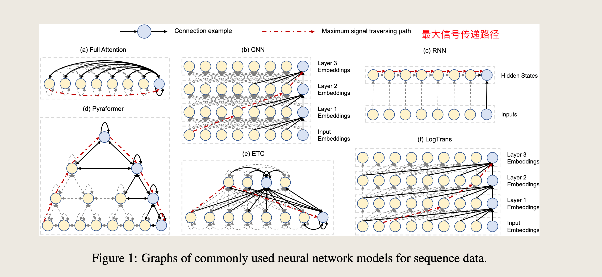

# 2022、Pyraformer

ICLR2022  Oral 蚂蚁集团、上海交通大学

原文：[Pyraformer: Low-complexity Pyramidal Attention for Long-range Time Series Modeling and Forecasting](https://openreview.net/pdf?id=0EXmFzUn5I) 

代码：[https://github.com/ant-research/Pyraformer](https://github.com/ant-research/Pyraformer)

==关键词：==

- 最大信号传递路径 & 复杂度
- Pyraformer ==最大信号传递路径  O(1)，复杂度 O(L)==
- C 叉树
- 自己实现了一个库
- 引理、命题，理论基础比较扎实

- [ ] 本文网络结构图

- [ ] 代码结构图：

- 

### 摘要

Accurate prediction of the future given the past based on time series data is of paramount importance, since it opens the door for decision making and risk management ahead of time. 

In practice, the challenge is to build a flexible but parsimonious model that can capture a wide range of temporal dependencies. 

基于时间序列数据，根据过去的观测来准确预测未来至关重要，因为它为提前进行决策和风险管理提供了可能。

在实践中，挑战在于构建一个灵活且简约的模型，能够捕捉广泛的时序依赖关系。

In this paper, we propose **Pyraformer** by exploring the **multi-resolution representation** of the time series. 

Specifically, we introduce the **pyramidal attention module (PAM)** in which the inter-scale tree structure summarizes features at different resolutions and the intra-scale neighboring connections model the temporal dependencies of different ranges.

在本文中，我们通过探索时间序列的多分辨率表示提出了Pyraformer。

具体来说，我们引入了**金字塔注意力模块（Pyramidal Attention Module, PAM）**，其中跨尺度的树状结构能够总结不同分辨率的特征，而内尺度的邻近连接则能够对不同范围的时序依赖关系进行建模。

==（？）== Under mild conditions, the maximum length of the signal traversing path in Pyraformer is a constant (i.e., $O(1)$) with regard to the sequence length $L$, while its time and space complexity scale linearly with $L$. 

在温和的条件下，Pyraformer中信号遍历路径的最大长度与序列长度$L$无关，是一个常数（即$O(1)$），而其时间和空间复杂度则与L呈线性关系。

Extensive experimental results show that **Pyraformer** typically achieves the highest prediction accuracy in both single-step and long-range multi-step forecasting tasks with the least amount of time and memory consumption, especially when the sequence is long1.

大量的实验结果表明，Pyraformer通常在单步预测和长距离多步预测任务中均能实现最高的预测精度，且在时间和内存消耗方面表现最为出色，尤其是在处理长序列时。 

> 摘要总结：
>
> 基于金字塔注意力的Transformer(Pyraformer)，能够在获取**长期依赖**和**低时间空间复杂度间**获取平衡。对于金字塔注意力模块 (pyramidal attention module，PAM)，其主要包含两部分：
>
> - 使用**尺度间(inter-scale)**树形结构汇总了不同时间分辨率下的特征
>
> - 使用**尺度内(intra-scale)**相邻连接对不同范围的时间依赖性进行建模
>
> 在温和条件下，Pyraformer中信号遍历路径的最大长度相对于序列长度是一个常数(即**O(1)**)。

### 问题引入：复杂度&最大信号传递路径

- 长时间序列预测的挑战：因为做长期预测需要常的的历史数据作为输入，因此时间和空间复杂度是优先考虑项，其越小越好。
- 最大信号传递路径的定义：$x_t$和$x_{t+k}$同时被考虑，需要几步（多少个迭代）【论文中称之为**longest signal traversing path**】，其越小越好

- **RNN和CNN：**
  * 复杂度低，为$O(L)$
  * longest signal traversing path 为$O(L)$【RNN是一个时间片一个时间片地迭代过去】
  * 很难学到很远的两个时间片之间的依赖关系

- **Transformer：**
  * longest signal traversing path 为$O(1)$
  * 但是复杂度为$O(L^2)$
  * 不能处理特别长的时间序列 
- 表中不同模型用于**处理序列数据的网络结构**如下：

  

### 方法

时间序列预测问题可以表述为，在给定先前的 $L$ 步观测值  $z_{t-L+1:t}$ 和相关协变量  $x_{t-L+1:t+M}$ （例如，一天中的小时）的情况下，预测未来的  $M$ 步 $z_{t+1:t+M}$ 。

为了实现这一目标，我们在本文中提出了**Pyraformer**，其整体架构在图2中进行了总结。

如图所示，我们首先将观测数据、协变量和位置信息分别嵌入，然后以与Informer（Zhou et al., 2021）相同的方式将它们组合在一起。

接下来，我们使用**粗尺度构建模块（CSCM）**构建一个多分辨率 **C-ary**树，其中在较粗尺度上的节点总结了相应较细尺度上的  **C**  个节点的信息。为了进一步捕捉不同范围的时序依赖关系，我们通过在金字塔图中使用注意力机制传递消息，引入了**金字塔注意力模块（PAM）**。

最后根据下游任务，我们采用不同的网络结构来输出最终预测。在后续内容中，我们将详细阐述所提出的模型的每个部分。为了便于表述，本文中使用的所有符号在表4中进行了总结。

### 3.1 PYRAMIDAL ATTENTION MODULE (PAM)

We begin with the introduction of the PAM, since it lies at the heart of Pyraformer.

我们首先介绍PAM，因为它是Pyraformer的核心。

As demonstrated in Figure 1(d), we leverage a pyramidal graph to describe the temporal dependencies of the observed time series in a multiresolution fashion. 

如图1(d)所示，我们利用金字塔图以多分辨率方式描述观测时间序列的时间依赖性。

Such a multi-resolution structure has proved itself an effective and efficient tool for long-range interaction modeling in the field of computer vision (Sun et al., 2019; Wang et al., 2021) and statistical signal processing (Choi et al., 2008; Yu et al., 2019). 

这种多分辨率结构已在计算机视觉（Sun et al., 2019; Wang et al., 2021）和统计信号处理（Choi et al., 2008; Yu et al., 2019）领域证明是一种有效且高效的长距离交互建模工具。

We can decompose the pyramidal graph into two parts: the inter-scale and the intra-scale connections. 

我们可以将金字塔图分解为两部分：跨尺度和内尺度连接。

The inter-scale connections form a **C-ary** tree, in which each parent has **C** children. 

跨尺度连接形成一个 $\text{C-ary}$树，其中每个父节点有  $C$ 个子节点。

For example, if we associate the finest scale of the pyramidal graph with hourly observations of the original time series, the nodes at coarser scales can be regarded as the daily, weekly, and even monthly features of the time series.

例如，如果我们将金字塔图的最细尺度与原始时间序列的每小时观测值相关联，那么较粗尺度上的节点可以被视为时间序列的日、周甚至月特征。

- 细尺度 微观信息（每小时观测值）
- 粗尺度 宏观信息（日、周甚至月特征）

As a consequence, the pyramidal graph offers a multi-resolution representation of the original time series.金字塔图提供原始时间序列的多分辨率表示

> Furthermore, it is easier to capture long-range dependencies (e.g., monthly dependence) in the coarser scales 
>
> by simply connecting the neighboring nodes via the intra-scale connections.

 粗尺度更容易捕获长期依赖，通过内尺度连接简单的相邻节点

In other words, the coarser scales are instrumental in describing long-range correlations in a manner that is graphically far more parsimonious than could be solely captured with a single, finest scale model. 

- 粗制度描述长距离相关性很重要
- 比只使用单一最细尺度所捕捉到的信息简洁得多

Indeed, the original single-scale Transformer (see Figure 1(a)) adopts a full graph that connects every two nodes at the finest scale so as to model the long-range dependencies, leading to a computationally burdensome model with $O(L^2)$ time and space complexity (Vaswani et al., 2017).

 In stark contrast, as illustrated below, the pyramidal graph in the proposed Pyraformer reduces the computational cost to $O(L)$ without increasing the order of the **maximum length of the signal traversing path**.

- 实际上，原始单尺度的 Transformer 采用了一个完全图，将最细尺度的每两个节点连接起来，以建模长期依赖，但时间复杂度和空间复杂度都是 $O(L^2)$ 
- 而本文所提出的 Pyraformer 中金字塔图将计算成本降低到 $O(L)$  ，而不增加最大信号传递路径的长度。

----

Before delving into the **PAM**, we first introduce the original attention mechanism. Let **X** and **Y** denote the input and output of a single attention head respectively. 

- ==首先介绍原始注意力机制，==

**（1）计算公式：** 

- 符号表示：$X$ 和 $Y$分别表示单个注意力头的输入和输出。

Note that multiple heads can be introduced to describe the temporal pattern from different perspectives.

- 多头的引入可以从不同的方面描述时间模式

 **X** is first linearly transformed into three distinct matrices, namely, the query $Q = XW_Q$, the key $K = XW_K$, and the value $V = XW_V$ , where $W_Q$, $W_K$ , $WV ∈ R^{L×D_K}$ . 

For the $\text{i-th}$ row $q_i$ in $Q$, it can attend to any rows (i.e., keys) in $K$. In other words, the corresponding output $y_i$ can be expressed as:

- $X$  首先被线性变换为三个不同的矩阵：查询矩阵  $Q = XW_Q$，键矩阵  $K = XW_K$ ，和值矩阵 $V = XW_V $ ，其中  $W_Q, W_K, W_V \in \mathbb{R}^{L \times D_K}$。

- 对于查询矩阵  $Q$ 中的第  $i$ 行  $q_i$ ，它可以关注键矩阵  $K$ 中的任何行（即键）。
  
- 输出  $y_i$ 可以通过以下公式计算：
  
   $$
   y_i = \sum_{\ell=1}^{L} \frac{\exp(q_i k_\ell^T / \sqrt{D_K}) v_\ell}{\sum_{\ell=1}^{L} \exp(q_i k_\ell^T / \sqrt{D_K})}
   $$
   
- 其中， $k_\ell^T$ 表示键矩阵  $K$ 中第  $\ell$ 行的转置。

where $k^T_\ell$ denotes the transpose of row $l$ in $K$. 

**（2）时间复杂度&空间复杂度** 

We emphasize that the number of query-key dot products (Q-K pairs) that need to be calculated and stored dictates the time and space complexity of the attention mechanism. 

需要计算和存储的查询-键点积对数（Q-K对）决定了注意力机制的时间和空间复杂度。

Viewed another way, this number is proportional to the number of edges in the graph (see Figure 1(a)). 

从另一个角度来看，这个数量与图中的边数成正比（见图1(a)）。

Since all Q-K pairs are computed and stored in the full attention mechanism (1), the resulting time and space complexity is O(L2).

由于在完整的注意力机制中计算和存储了所有的**Q-K**对，因此时间复杂度和空间复杂度为 $O(L^2)$。

> 总结：这部分讲解原始注意力机制的基本计算过程和其计算复杂度，特别是如何通过查询、键和值矩阵来计算注意力输出，以及这种计算方式导致的高时间复杂度和空间复杂度

----

As opposed to the above full attention mechanism, every node only pays attention to a limited set of keys in the **PAM**, corresponding to the pyramidal graph in **Figure 1d**. 

与上述完整的注意力机制不同，PAM中的每个节点只关注一个有限的键集合。

Concretely, suppose that $n^{(s)}_\ell$  denotes the $\text{l-th}$ node at scale $s$, where $s = 1, · · · , S$ represents the bottom scale to the top scale sequentially. 

具体来说，假设  $n_\ell^{(s)}$  表示尺度  $s$ 中的第  $\ell$ 个节点，其中  $s = 1, \cdots, S$ ， $S$ 表示从底层到顶层的尺度序列。

In general, each node in the graph can attend to a set of neighboring nodes $\mathbb{N}^{(s) }_{\ell}$ at  three scales: the adjacent $A$ nodes at the same scale including the node itself (denoted as $\mathbb{A}_{\ell}^{(s)}$ ), 

the  $C$ children it has in the $C\text{-ary}$ tree (denoted as $\mathbb{C}^{(s)}_\ell$ ), and the parent of it in the $C\text{-ary}$ tree (denoted  $\mathbb{P}^{(s)}_{\ell}$ ), that is,

- 一般来说，图中的每个节点可以关注三个尺度上的一组邻近节点 $N_\ell^{(s)}$ ：同尺度的相邻节点（包括节点本身，记为 $A_\ell^{(s)}$ ），在  $C$ -ary树中的 $C$ 个子节点（记为  $C_\ell^{(s)}$ ），以及在  $C$ -ary树中的父节点（记为 $P_\ell^{(s)}$）。

**邻近节点的定义**：

   - $N_\ell^{(s)} = A_\ell^{(s)} \cup C_\ell^{(s)} \cup P_\ell^{(s)}$ 
   -  $A_\ell^{(s)} = \{n_j^{(s)} : |j - \ell| \leq \frac{A-1}{2}, 1 \leq j \leq \frac{L}{C^{s-1}}\}$  
   -  $C_\ell^{(s)} = \{n_{j}^{(s-1)} : (\ell - 1)C < j \leq \ell C\} if ,s \geq 2 ,else \emptyset$  
   -  $P_\ell^{(s)} = \{n_{j}^{(s+1)} : j = \lceil \frac{\ell}{C} \rceil\}, if \ s \leq S - 1 ,else \ \emptyset$  

**简化后的注意力计算**：在节点  $n_\ell^{(s)}$ 上的注意力可以简化为：
$$
y_i = \sum_{\ell \in N_\ell^{(s)}} \frac{\exp(q_i k_\ell^T / \sqrt{d_K}) v_\ell}{\sum_{\ell \in N_i^{(s)}} \exp(q_i k_\ell^T / \sqrt{d_K})}
$$

- 其中， $N_\ell^{(s)}$  表示节点  $n_\ell^{(s)}$  在三个尺度上的邻近节点集合。

We further denote the number of attention layers as **N** . Without loss of generality, we assume that L is divisible by $C^{S−1}$. We can then have the following lemma (cf. **Appendix B** for the proof and **Table 4** for the meanings of the notations).

> - PAM中注意力机制的简化：限制每个节点只关注一个有限的键集合，从而降低计算复杂度。
>
> - 每个节点只关注同尺度的相邻节点、子节点和父节点，从而简化了注意力计算公式。

**Lemma 1.** Given **A, C, L, N ,** and **S** that satisfy Equation **(4)**, after **N** stacked attention layers, nodes at the coarsest scale can obtain a global receptive field.

给定  $A$ ,  $C$ ,  $L$ , $N$, 和 $S$ 满足下面的方程 (4)，那么在经过  $N$ 层堆叠的注意力层后，最粗尺度上的节点可以获得全局感受野：

==方程（4）==
$$
\frac{L}{C^{S-1}} - 1 \leq \frac{(A - 1)N}{2}.
$$
**符号说明：**     

- $A$ ：每个节点在同尺度上的相邻节点数（包括节点本身）
- $C$：C-ary树中每个节点的子节点数
- $L$：原始时间序列的长度
- $N$ ：堆叠的注意力层数
- $S$：尺度数，从最细尺度到最粗尺度

In addition, when the number of scales S is fixed, the following two propositions summarize the time and space complexity and the order of the maximum path length for the proposed pyramidal attention mechanism. 

We refer the readers to **Appendix C** and **D** for proof. 

- 当尺度数 $S$ 固定时，以下两个命题总结了所提出的金字塔注意力机制的时间和空间复杂度以及最大路径长度的阶数。

- 具体证明可以在附录 C 和 D 中找到。

> 总结：
>
> - **引理（Lemma 1）**，它描述了在满足特定条件下，经过  **N** 层堆叠的注意力层后，最粗尺度上的节点可以获得全局感受野（global receptive field）
>
> - 公式 $\frac{L}{C^{S-1}} - 1 \leq \frac{(A - 1)N}{2}$ 表示在经过 $N$ 层堆叠的注意力层后，最粗尺度上的节点可以获得全局感受野的条件。

**Proposition 1.**  The time and space complexity for the pyramidal attention mechanism is $O(AL)$ for given $A$ and $L$ and amounts to $O(L)$ when $A$ is a constant $w.r.t. L$. 

> 保证复杂度 $O(L)$ 

金字塔注意力机制的时间和空间复杂度为 $O(AL)$，给定 $A$ 和 $L$，并且当 $A$ 相对于  $L$是常数时，复杂度为 $O(L)$。

符号说明：

-  $A$ ：每个节点在同尺度上的相邻节点数（包括节点本身）
-  $L$：原始时间序列的长度。
-  该命题表明，当  $A$ 相对于  $L$  是常数时，金字塔注意力机制的时间和空间复杂度主要取决于序列长度  $L$ 

**Proposition 2.**  *Let the signal traversing path between two nodes in a graph denote the shortest path connecting them*. Then the maximum length of signal traversing path between two arbitrary nodes in the pyramidal graph is $O(S + L/C^{S−1}/A)$ for *given* $A, C, L,$ and $S$.

> 保证最大信号传递路径 $O(1)$ 

设图中两个节点之间的信号穿越路径表示连接它们的最短路径。

则在给定  $A$ ,  $C$ ,  $L$ , 和  $S$  的情况下，金字塔图中任意两个节点之间的信号穿越路径的最大长度为 $O(S + L/C^{S-1}/A)$。

Suppose that $A$ and $S$ are fixed and $C$ satisfies Equation (5), the maximum path length is $O(1)$ for time series with length $L$.

假设  $A$  和  $S$ 是固定的，并且  $C$ 满足方程 (5)，则对于长度为  $L$  的时间序列，最大路径长度为  $O(1)$。

==原文方程（5）==

$$
\sqrt[S-1]{L} \ \geq C \geq \sqrt[S-1]{\frac{L}{(A-1)N/2 + 1}} \ .
$$

- **符号说明**：
  -  $C$ ： $C$ -ary树中每个节点的子节点数。
  -  $S$ ：尺度数，从最细尺度到最粗尺度。
  -  $N$ ：堆叠的注意力层数。
  - 方程 (5) 给出了  $C$  的取值范围，确保在 $A$ 和  $S$  固定的情况下，最大路径长度为  $O(1)$ 。

> 总结：
>
> - 这两个命题总结了金字塔注意力机制在时间和空间复杂度以及信号穿越路径最大长度方面的理论保证
> - 命题 1 表明，当  $A$ 相对于  $L$  是常数时，复杂度主要取决于序列长度  $L$ 
> - 命题 2 则给出了在特定条件下，金字塔图中任意两个节点之间的信号穿越路径的最大长度为  $O(1)$ 

In our experiments, we fix S and N , and A can only take 3 or 5, regardless of the sequence length L. 

在我们的实验中，我们固定了  $S$  和 $N$，并且 $A$ 只能取$3$或$5$，无论序列长度 $L$ 如何。

> 参数设置：
> - $S$   和  $N$  是固定的参数。
> -  $A$ \) 可以取值为3或5，与序列长度  $L$  无关。

Therefore, the proposed **PAM** achieves the complexity of $O(L)$ with the maximum path length of $O(1)$. 

因此，所提出的**PAM**（实现了 $O(L)$  的复杂度，最大路径长度为 $O(1)$ 

Note that in the **PAM**, a node can attend to at most $A + C + 1$ nodes. 

注意，在**PAM**中，一个节点最多可以关注  $A + C + 1$ 个节点。

Unfortunately, such a sparse attention mechanism is not supported in the existing deep learning libraries, such as Pytorch and TensorFlow. 

不幸的是，这种稀疏注意力机制在现有的深度学习库中（如Pytorch和TensorFlow）并不支持。

A naive implementation of the **PAM** that can fully exploit the tensor operation framework is to first compute the product between all **Q-K** pairs, i.e., $q_ik^T_{\ell}\ for \ l =  1, · · · , L,$ and then mask out $l\in ̸ N^{(s) }_{\ell}$ . 

一种可以充分利用张量操作框架的**PAM**的简单实现是首先计算所有**Q-K**对的乘积，即 $  q_i k_\ell^T $ ( $\ell = 1, \cdots, L$  ) ，然后屏蔽掉   $\ell \notin \mathbb{N}_\ell^{(s)}$  。

However, the resulting time and space complexity of this  implementation is still $O(L^2)$ .

然而，这种实现的时间和空间复杂度仍然是  $O(L^2)$  。

Instead, we build a customized CUDA kernel specialized for the PAM using TVM (Chen et al., 2018), practically reducing the computational time and memory cost and making the proposed model amenable to long time series. Longer historical input is typically helpful for improving the prediction accuracy, as more information is provided, especially when long-range dependencies are considered.

相反，我们使用TVM（Chen et al., 2018）构建了一个专门为PAM定制的CUDA内核，实际上减少了计算时间和内存成本，使所提出的模型适合处理长时序数据。更长的历史输入通常有助于提高预测精度，因为提供了更多信息，特别是当考虑长距离依赖时。

> 总结：
>
> - 复杂度：
> 	* PAM算法的时间复杂度为 ( O(L) )，其中 ( L ) 是序列长度。
> 	* 最大路径长度为 ( O(1) )，这意味着无论序列长度如何，路径长度都保持不变。
> - 实现细节：
>   * 一种简单的PAM实现是先计算所有Q-K对的乘积，然后屏蔽掉不需要的元素。这种实现的时间和空间复杂度仍然是 $O(L^2)$ ，这对于长序列来说可能不够高效。
>   * 为了优化，作者使用TVM构建了一个专门为PAM定制的CUDA内核。这种优化显著减少了计算时间和内存成本，使模型更适合处理长时序数据。

### 3.2 COARSER-SCALE CONSTRUCTION MODULE (CSCM)

==原文图 3 描述的这个模块== 

 

CSCM targets at initializing the nodes at the coarser scales of the pyramidal graph, so as to facilitate the subsequent PAM to exchange information between these nodes. 

CSCM旨在初始化金字塔图的较粗糙尺度上的节点，以便促进随后的PAM在这些节点之间交换信息。

Specifically, the coarse-scale nodes are introduced scale by scale from bottom to top by performing convolutions on the corresponding children nodes $C_{\ell}^{(s)}$ .

具体来说，通过在相应的子节点  $C_{\ell}^{(s)}$  上执行卷积，从底层到顶层逐层引入粗糙尺度的节点。

As demonstrated in Figure 3, several convolution layers with kernel  size C and stride C are sequentially applied to the embedded sequence in the dimension of time, yielding a sequence with length L/Cs at scale s. 

如图3所示，几个具有核大小 \( C \) 和步幅 \( C \) 的卷积层依次应用于时间维度上的嵌入序列，产生长度为 \( L/C^s \) 的序列。

The resulting sequences at different scales form a C-ary tree. We concatenate these fine-to-coarse sequences before inputting them to the PAM. In order to reduce the amount of parameters and calculations, we reduce the dimension of each node by a fully connected layer before inputting the sequence into the stacked convolution layers and restore it after all convolutions. Such a bottleneck structure significantly reduces the number of parameters in the module and can guard against over-fitting.

### 图片翻译

在尺度 \( s \)。不同尺度上的序列结果形成一个C-ary树。我们在将它们输入到PAM之前，将这些从细到粗的序列连接起来。为了减少参数数量和计算量，我们在将序列输入到堆叠的卷积层之前，通过一个全连接层减少每个节点的维度，并在所有卷积之后恢复它。这种瓶颈结构显著减少了模块中的参数数量，并可以防止过拟合。

### 讲解

这段文字描述了CSCM（可能是某种模型或算法）如何通过初始化金字塔图的较粗糙尺度上的节点来促进信息交换。以下是关键点的详细解释：

1. **初始化节点**：
   - CSCM的目标是在金字塔图的较粗糙尺度上初始化节点，以便促进后续的PAM在这些节点之间交换信息。

2. **卷积层**：
   - 通过在相应的子节点 \( C_{\ell}^{(s)} \) 上执行卷积，从底层到顶层逐层引入粗糙尺度的节点。
   - 几个具有核大小 \( C \) 和步幅 \( C \) 的卷积层依次应用于时间维度上的嵌入序列，产生长度为 \( L/C^s \) 的序列。

3. **C-ary树**：
   - 不同尺度上的序列结果形成一个C-ary树。
   - 在将这些序列输入到PAM之前，将它们连接起来。

4. **减少参数和计算量**：
   - 为了减少参数数量和计算量，在将序列输入到堆叠的卷积层之前，通过一个全连接层减少每个节点的维度，并在所有卷积之后恢复它。
   - 这种瓶颈结构显著减少了模块中的参数数量，并可以防止过拟合。

总结来说，这段文字描述了CSCM如何通过初始化金字塔图的较粗糙尺度上的节点来促进信息交换，并使用卷积层和瓶颈结构来减少参数数量和计算量，从而提高模型的效率和防止过拟合。
