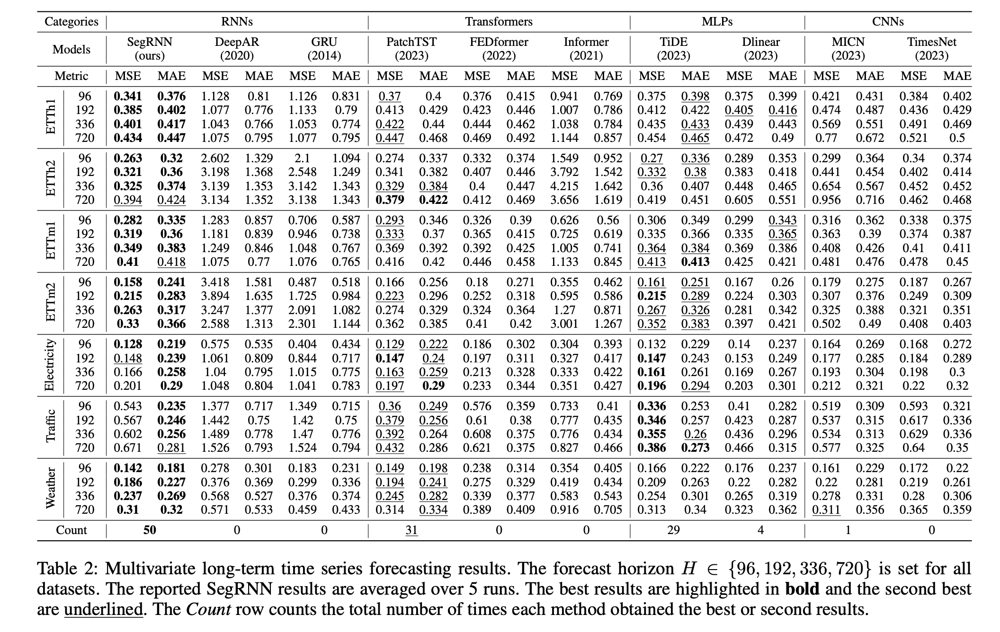

# 4月

## 2025-04-15 Tuesday 

TSB 给了 docker 运行，但是忘了 docker 怎么用，（我这该死的记性，一点都不记得了，亏我上个月还研究了一个星期。

- docker run

- docker build

- docker image

想设计实验了，论文看得人头大

- [x] DLinear(代码还没看) 

## 2025-04-14 Monday 

- [ ] iTransformer 
- [x] WITRAN(太有功力了，公式)(代码没看完)
- [ ] PatchTST
- [ ] TimesNet

灵光乍现，关于召回率为什么可以是 1 的直观解释，如果 100 个样本，99 个正例，1 个负例，但是预测的时候把所有的样本的都预测为正例，正确率 99%，召回率=1。用例子清晰明了。

## 2025-04-02 Wednesday 

加油。

裂开，不知道干啥

我该怎么做，从哪儿开始。

首先，我已经对 Electricity 数据集进行了 聚类，聚成四类，效果比较好，同时用主成分分对数据集进行了降维可视化。长序列时间序列预测，也要测试原论文的结果，所以我应该复现出论文的结果。现在 SegRNN 的代码看明白了，我已经跑了很多 SegRNN 的代码，现在看，复现出来的论文结果，然后再 SegRNN 的基础上改。

==问题 1：SegRNN 的作者都做了哪些实验？用了什么数据集？用了什么对比模型？==

table1，数据集概述：

表2：本文做的所有对比实验：

  

我现在，需要复现原论文的结果。

## 2025-04-04 Friday 

### 文献阅读

Long time series forecasting aims to utilize historical information to forecast future states over extended horizons. Traditional RNN-based series forecasting methods struggle to effectively address long-term dependencies and gradient issues in long time series problems. Recently, SegRNN has emerged as a leading RNN-based model tailored for long-term series forecasting, demonstrating state-of-the-art performance while maintaining a streamlined architecture through innovative segmentation and parallel decoding techniques. Nevertheless, SegRNN has several limitations: its fixed segmentation disrupts data continuity and fails to effectively leverage information across different segments, the segmentation strategy employed by SegRNN does not fundamentally address the issue of information loss within the recurrent structure. To address these issues, we propose the ISMRNN method with three key enhancements: we introduce an implicit segmentation structure to decompose the time series and map it to segmented hidden states, resulting in denser information exchange during the segmentation phase. Additionally, we incorporate residual structures in the encoding layer to mitigate information loss within the recurrent structure. To extract information more effectively, we further integrate the Mamba architecture to enhance time series information extraction. Experiments on several real-world long time series forecasting datasets demonstrate that our model surpasses the performance of current state-of-the-art models.

长期时间序列预测旨在利用历史信息来预测未来在较长时间范围内的状态。传统的基于RNN的时间序列预测方法在处理长期时间序列问题时，难以有效解决长期依赖性和梯度问题。最近，SegRNN作为一种针对长期序列预测的领先RNN模型出现，通过创新的分段和并行解码技术，以精简的架构实现了最先进的性能。然而，SegRNN存在几个局限性：其固定的分段方式破坏了数据的连续性，无法有效利用不同分段之间的信息，SegRNN采用的分段策略也未能从根本上解决循环结构中的信息丢失问题。为了解决这些问题，我们提出了ISMRNN方法，包含三个关键增强点：我们引入了一种隐式分段结构，将时间序列分解并映射到分段隐藏状态，在分段阶段实现了更密集的信息交换。此外，我们在编码层中引入残差结构，以减轻循环结构中的信息丢失。为了更有效地提取信息，我们进一步整合了Mamba架构来增强时间序列信息提取。在几个真实世界长期时间序列预测数据集上的实验表明，我们的模型超越了当前最先进的模型性能。

In this work, we propose a novel model named ISMRNN to address the issues associated with SegRNN. Specifically, ISMRNN introduces an implicit segmentation structure that decomposes and maps the time series into encoded vectors through two linear transformations. This method facilitates more continuous processing during segmentation and enhances the utilization of information between different segments. Additionally, ISMRNN incorporates a residual structure with a linear layer, allowing some information to bypass the recurrent encoding structure, thus reducing information loss within the recurrent framework. Furthermore, we employ the Mamba structure[Gu and Dao, 2023] for preprocessing the time series, which aids in capturing long-term dependencies more effectively. The main contributions of ISMRNN can be summarized as follows:  

• Utilizing implicit segmentation for denser information exchange during the segmentation phase. 

 • Incorporating the Mamba structure to improve information preprocessing.  

• The residual structure reduces information loss within the recurrent structure.

在这项工作中，我们提出了一种名为 ISMRNN 的新型模型，以解决与 SegRNN 相关的问题。具体来说，ISMRNN 引入了一种隐式分段结构，通过两次线性变换将时间序列分解并映射为编码向量。这种方法在分段过程中实现了更连续的处理，并增强了不同分段之间信息的利用。此外，ISMRNN 在编码结构中引入了带有线性层的残差结构，使得部分信息能够绕过循环编码结构，从而减少循环框架内的信息丢失。此外，我们还采用 Mamba 结构 [Gu and Dao, 2023] 对时间序列进行预处理，这有助于更有效地捕捉长期依赖性。ISMRNN 的主要贡献可以总结如下：
- 利用隐式分段，在分段阶段实现更密集的信息交换。
- 引入 Mamba 结构以改进信息预处理。
- 残差结构减少了循环结构内的信息丢失。


==输入：==

x.shape=torch.Size([16, 720, 321])  batchSize SequenceLength FeatureDim

==reshape== 

x.reshape(-1, self.seg_num_x, self.seg_len) → [16×321=5136, 15,48]

==self.valueEmbedding== 

```python
# build model
self.valueEmbedding = nn.Sequential(
    nn.Linear(self.seg_len, self.d_model),
    nn.ReLU()
)

Sequential(
  (0): Linear(in_features=48, out_features=512, bias=True)
  (1): ReLU()
)
```

→ [5136, 15,512]

## 2025-04-05 Saturday 

time Unet forward 接收 x，输入 x 的形状是(32,720,7)，

`x = self.revin_layer(x, 'norm')` 进行可逆实例归一化 ，形状不变(32,720,7)

`x1 = x.permute(0,2,1)` 接下来交换维度，形状由(32,720,7)变为(32,7,720)

```python
i = 0
for down_block in self.down_blocks:
    e_out.append(down_block(x1))
    x1 = self.Maxpools[i](x1)
    i = i+1
```

==self.down_blocks== 

```
ModuleList(
  (0): block_model(
    (Linear_channel): ModuleList(
      (0-6): 7 x Linear(in_features=720, out_features=720, bias=True)
    )
    (ln): LayerNorm((720,), eps=1e-05, elementwise_affine=True)
    (relu): ReLU(inplace=True)
  )
  (1): block_model(
    (Linear_channel): ModuleList(
      (0-6): 7 x Linear(in_features=359, out_features=359, bias=True)
    )
    (ln): LayerNorm((359,), eps=1e-05, elementwise_affine=True)
    (relu): ReLU(inplace=True)
  )
  (2): block_model(
    (Linear_channel): ModuleList(
      (0-6): 7 x Linear(in_features=179, out_features=179, bias=True)
    )
    (ln): LayerNorm((179,), eps=1e-05, elementwise_affine=True)
    (relu): ReLU(inplace=True)
  )
  (3): block_model(
    (Linear_channel): ModuleList(
      (0-6): 7 x Linear(in_features=89, out_features=89, bias=True)
    )
    (ln): LayerNorm((89,), eps=1e-05, elementwise_affine=True)
    (relu): ReLU(inplace=True)
  )
)
```

==self.Maxpools== 

```python
ModuleList(
  (0-3): 4 x AvgPool1d(kernel_size=(3,), stride=(2,), padding=(0,))
)
```

==第1次循环== 

输入 x1 形状: [32, 7, 720]

`down_block(x1)` 输出形状: [32, 7, 720]

`Maxpools[0](x1)` 输出形状: [32, 7, 359]

池化参数: kernel_size=3, stride=2, padding=0

计算: `(720 + 2*0 - 3)/2 + 1 = 359`

==第2次循环==

输入 x1 形状: [32, 7, 359]

down_block(x1) 输出形状: [32, 7, 359]

`Maxpools[1](x1)` 输出形状: [32, 7, 179]
计算: `(359 + 2*0 - 3)/2 + 1 = 179`

==第3次循环== 

输入 x1 形状: [32, 7, 179]

`down_block(x1)` 输出形状: [32, 7, 179]

`Maxpools[2](x1)` 输出形状: [32, 7, 89]

计算: `(179 + 2*0 - 3)/2 + 1 = 89`

==第4次循环== 

输入 x1 形状: [32, 7, 89]

down_block(x1) 输出形状: [32, 7, 89]
`Maxpools[3](x1)`输出形状: [32, 7, 44]

计算: (89 + 2*0 - 3)/2 + 1 = 44

---

循环结束后，`e_out` 列表包含`4`个张量，对应`4`个尺度的特征：

e_out[0]: [32, 7, 720] (原始尺度)

e_out[1]: [32, 7, 359] (第一次下采样)

e_out[2]: [32, 7, 179] (第二次下采样)

e_out[3]: [32, 7, 89] (第三次下采样)

- 随着层次加深，时间维度逐渐减小，每层捕获不同时间尺度的特征
- `down_block` 操作不改变通道维度和批次维度，只在时间维度上进行映射
- 每次池化操作会使时间维度大约减半 (取决于精确的池化参数)

(cv中，通过卷积通道数翻倍，尺度不变；池化成通道数不变，尺度减半)

---

`e_last = e_out[self.stage_num - 1]` 其中 `self.stage_num=4`，获取第三次下采样层输出[32, 7, 89] ，也就是 `e_last.shape = [32, 7, 89]` 

<details>
<summary>怎么从论文中扒模块？</summary>
<p>
	（1）找到原论文，提出的模块，给出的代码
    （2）准备自己的测试文件
    分析，原模块的 init、forward 分别需要什么参数，形状的含义
    分析，自己为什么需要这个模块。自己的数据是什么形状的，将自己的数据维度拿出来，分析和原模块的维度对齐。测试对象是自己所需要的数据。测试成功。
</p>
</details>

```python
e_last = e_out[self.stage_num - 1]
for i in range(self.stage_num - 1):
    e_last = torch.cat((e_out[self.stage_num - i - 2], e_last), dim=2)
    e_last = self.up_blocks[i](e_last)
e_last = e_last.permute(0,2,1)
e_last = self.revin_layer(e_last, 'denorm')
return e_last
```

初始条件：

- stage_num = 4 (默认设置)
- e_out 包含4个不同尺度的特征图:
  * e_out[0]: [32, 7, 720]
  * e_out[1]: [32, 7, 359]
  * e_out[2]: [32, 7, 179]
  * e_out[3]: [32, 7, 89]

==第1次循环 (i=0)== 

e_last 初始值为 e_out[3]: [32, 7, 89]

`e_last = torch.cat((e_out[self.stage_num - i -2], e_last), dim=2)`

计算 `self.stage_num - i - 2 = 4 - 0 - 2 = 2`

<details>
<summary>
说明：拼接 e_out[2] 和 e_last: [32, 7, 179] 和 [32, 7, 89] 
</summary>
<p>
来，读， [32, 7, 179] ，32 个 7，7 个 179，现在拼接沿着 dim=2，现在是 32 个 7，7 个 179+89
</p>
</details>

沿 dim=2 (时间维度) 拼接，得到 [32, 7, 179+89] = [32, 7, 268]

通过 up_blocks[0] 映射，输出形状变为 [32, 7, 179]

<details>
<summary>说明：self.up_blocks</summary>
<p>
```python
    ModuleList(
      (0): block_model(
        (Linear_channel): ModuleList(
          (0-6): 7 x Linear(in_features=268, out_features=179, bias=True)
        )
        (ln): LayerNorm((179,), eps=1e-05, elementwise_affine=True)
        (relu): ReLU(inplace=True)
      )
      (1): block_model(
        (Linear_channel): ModuleList(
          (0-6): 7 x Linear(in_features=538, out_features=359, bias=True)
        )
        (ln): LayerNorm((359,), eps=1e-05, elementwise_affine=True)
        (relu): ReLU(inplace=True)
      )
      (2): block_model(
        (Linear_channel): ModuleList(
          (0-6): 7 x Linear(in_features=1079, out_features=720, bias=True)
        )
        (ln): LayerNorm((720,), eps=1e-05, elementwise_affine=True)
        (relu): ReLU(inplace=True)
      )
    )
```
</p>
</details>

==第2次循环 (i=1)==

e_last 当前值: [32, 7, 179]  

`e_last = torch.cat((e_out[self.stage_num - i -2], e_last), dim=2)`

计算 `self.stage_num - i - 2 = 4 - 1 - 2 = 1`

拼接 `e_out[1]` 和 `e_last`: [32, 7, 359] 和 [32, 7, 179]

沿 dim=2 拼接，得到 [32, 7, 359+179] = [32, 7, 538]

通过 up_blocks[1] 映射，输出形状变为 [32, 7, 359]

==第3次循环 (i=2)==

e_last 当前值: [32, 7, 359]

计算 self.stage_num - i - 2 = 4 - 2 - 2 = 0

拼接 e_out[0] 和 e_last: [32, 7, 720] 和 [32, 7, 359]

沿 dim=2 拼接，得到 [32, 7, 720+359] = [32, 7, 1079]

通过 up_blocks[2] 映射，输出形状变为 [32, 7, 720]

---

 `e_last = e_last.permute(0,2,1)`

调整维度: e_last.permute(0,2,1) 将 [32, 7, 720] 变为 [32, 720, 7]

应用逆归一化: `revin_layer(e_last, 'denorm')` 形状不变，仍为 `[32, 720, 7]`

返回最终输出: 形状为 `[32, 720, 7]`

---

输入 BSC，

可逆实例归一化 BSC

permute BCS

1.1 `聚合信息`

maxPool BC $\frac{S}{2}$

AvgPool BC $\frac{S}{2}$

Add(MaxPool + AvgPool)  BC  $\frac{S}{2}$

保存Pool 后的 BC  $\frac{S}{2}$

Linear  BC  $\frac{S}{2}$

🟢 1.2 `Seg`  细粒度提取信息，残差连接

直接对输入 BCS 分成 2 段，形状为 BC×2× $\frac{S}{2}$

经过 GRU 提取最后一层隐含层状态 ，形状为 1×BC× $\frac{S}{2}$  （1表示 num\_layers  单层 GRU）

🟢 融合信息


---


## 2025-04-07 Monday 

解码阶段：

`decoder_input_4 = x_AddNorm4.permute(0, 2, 1)`  

输入形状 [B,S/8,d_model] 经过 permute [B,d_model,S/8]

第一阶段：使用1/8分辨率特征预测总预测长度的前1/8部分

首先拿到最后一个历史时间点  `last_state_4 = decoder_input_4[:, :, -1]`

维度 `[B,d_model]`

接下来预测，投影（在想会不会用 GRU 效果更好一些）

`pred_4 = *self*.predictor_4(last_state_4) `

直接从 `[B,d_model]`  投影到 `[B,pred_len/4*enc_in]`

接下来 reshape 成正常的形状：`[B,enc_in,pred_len/4]`

下面开始向上融合，使用 `x_fused3`  融合了 `seq_len/8`  和 `seq_len/4` 的信息

形状是 `[B,S/4,d_model]`

permute 维度转换为 `[B,d_model,S/4]`

==接下来进行渐进式的解码结构，融合上一层的解码，创建渐进式 自回归的解码结构==

拿到 `x_fused3` 形状 `[B,S/4,d_model]`

`permute`  形状变为 `[B,d_model,S/4]`

融合上一层解码 `pred_len/8` 的输出  `pred_4` 形状 `[B,enc_in,pred_len_4]`

为了可以融合，首先维度要对齐，所以对   `pred_4`  的 `enc_in` 维度进行投影，投影到 `d_model` 维度 形状变为   `[B,d_model,pred_len_4]`

接下来，就可以 concat 了， `[B,d_model,S/4]` concat     `[B,d_model,pred_len/4]`变成   `[B,d_model,S/4]` 

其实这里是两个不对齐，预测的长度和维度都不对齐。

可还是想设计一个渐进解码，渐进解码不好弄，因为维度和长度都不对齐。

自底向上的融合和解码。

---

## 2025-04-13 Sunday 

- [x] TimeMixer（线性系模型）
- [x] Pyraformer （有证明）
- [x] Fedformer（设计频域的都有点考验数学功底，小波变换确实不明白）

