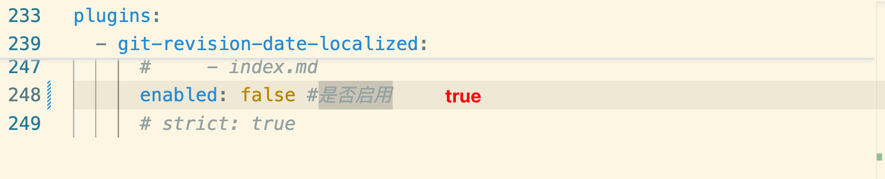
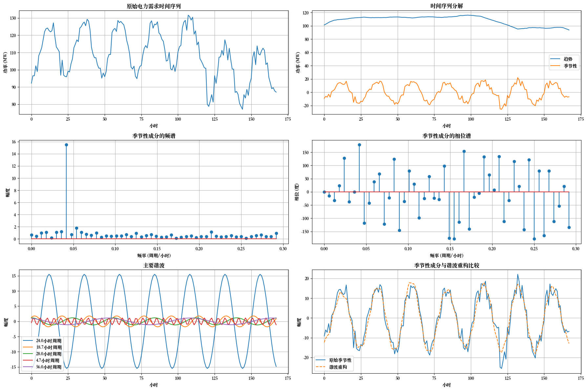

# 乐观 & 坚强

## 2025年 3 月 27 日

好奇，无敌好奇，是怎么做到渲染这么快的，7 秒渲染不出来，黄花菜都凉了。以后再看吧，干活。是太好看了

[https://wcowin.work/about/geren/](https://wcowin.work/about/geren/)

[https://wcowin.work/Mkdocs-Wcowin/](https://wcowin.work/Mkdocs-Wcowin/)

忽然在想，可以 down 下来源码一点点学。

没时间了，这个时间戳网页渲染是真慢啊




## 2025 年 3 月 26 日

一些碎碎念

- 模长-幅角形式
- 傅里叶级数的三角函数形式、辅助角形式、复指数形式

傅里叶变换学了几天，不记得了。但是现在看明白的东西，够把 Autoformer 中的傅里叶变换看明白了（大概。）

 

今天还学会了怎么把 jupyter notebook 嵌入到 mkdocs 中。嘿嘿，有点进步嗷。明天需要把傅里叶变换的实际应用中的双边谱、单边谱的对照，与上面那个图中 python 程序再好好看看。

很有帮助的链接，老师讲得很成系统，比较面向应用：[数字信号处理](https://www.bilibili.com/video/BV1714y1g7GT?spm_id_from=333.788.videopod.sections&vd_source=ddd7d236ab3e9b123c4086c415f4939e) 


## 2025 年 3 月 25 日

好像一个捡垃圾的，这捡点知识，那儿捡点知识，然后整合

越亲近的人，负面情绪反而更多，老话说，距离产生美

还是，我还是太狭隘了。

## 2025 年 3 月 24 日

傅里叶级数七七八八了。

- [ ] 傅里叶变换
- [ ] DFT & FFT

## 2025年 3 月 22 日 大阴天

**傅里叶变换，要不你带我走吧，九敏了，一个头两个大。**

一起唱，好运来，我们好运来🎵

终于，完成了 Autoformer 的 Decoder 部分，细节挺多的

两次注意力+一次前馈网

DecoderLayer 内部流动的是季节成分，趋势成分保留，然后相加，并且在 DecoderLayer 内部完成维度转换，用 kernel size=3，对序列进行平滑。

而在所有的 DecoderLayer 执行完以后，进行季节成分的维度转化还原为原始维度，用的是nn.Linear，保留尖锐部分。低频成分和高频成分在不同的位置进行维度还原，因为季节成分高频，所以在 Decoder 的过程中全部保持高维表示，但是 趋势成分就不需要了

每次注意力，前馈网的操作以后，紧跟着就是残差连接。

Autoformer 的创新在于，每次注意力和前馈网之后，都进行了序列分解，在 Encoder 中丢弃趋势分量，在 Decoder 中保存趋势分量逐层累加。

还有循环填充。还有双向跳转的锚点设置。

```markdown
[](#跳到)<a id="返回"></a>

[](#返回)<a id="跳到"></a>
```


- [ ] 接下来开始看注意力机制是怎么实现的，新开一个文档。

- [ ] 并且把文档划分划分标题把（笑）

我知道我哪里别扭了，是因为没有更好的选择，所以是我。只是一种没有安全感的关系。算了，琐碎，不管，除了现在的自己，都是虚无

## 2025年 3 月 19 日

好了好了，干活了，看 Autoformer

- [x] mkdocs 页面嵌入 pdf
- [x] mkdocs & mermaid

mkdocs  yml 配置文件，今天修改了配置文件，页面嵌入本地 pdf

这个相当于备份。

这里的配置缩进，非常容易报错，AI 自动给错输出的全文本内容会有删减，细心点吧。

```yaml
site_name: My Docs
site_name: 溶err
site_url: https://mydomain.org/mysite
# edit_uri: edit/main/docs/
# - 建站：241114 

edit_uri: https://github.com/dearRongerr/Rongerr.github.io/edit/main/docs
nav:
# 为了将页面链接到某个部分，
# 请在相应的文件夹中创建一个名为 index.md 的新文档，
# 并将其添加到导航部分的开头
  - 便签:   
    - sticks/mkdocs_learn.md
    - sticks/markdwon_learn.md
    - sticks/latex.md
    - sticks/GitHub.md
    - sticks/MacOS.md
    - sticks/shell.md
    - sticks/linux.md
    - sticks/screen.md
    - sticks/docker.md  
    - sticks/writting.md
    - sticks/1_github_v1.md
    - sticks/2_python.md
    - sticks/3_vscode.md
  - 面试:
    - 题目:
      - bagu/questions/1_questions.md
    - 力扣:
      - bagu/leetcode/index.md
      - bagu/leetcode/1.md
      - bagu/leetcode/2.md
    - 深度学习: 
      - bagu/deeplearning/index.md
      - bagu/deeplearning/transformer.md
      - bagu/deeplearning/former1.md
      - bagu/deeplearning/former2.md 
      - bagu/deeplearning/pytorch_shape_function.md
      - bagu/deeplearning/1.md
    - 机器学习: 
      - bagu/machinelearning/kmeans.md
      - bagu/machinelearning/2.md
  - 捉个虫:
    - Error/github.md
    - Error/latex.md 
    - Error/python.md 
    - Error/macos.md
    - Error/docker.md      
  - 笔记:
    - learning/3_ViT.md
    - learning/1_clip.md
    - learning/2_MOCO.md
    - learning/2.md
    - learning/1.md
    - learning/vit.md
    - learning/swintransformer.md
    - learning/pe.md
    - learning/convs.md
    - learning/3.md
    - learning/4_GAN.md
    - learning/5_Bert.md
    - learning/6_Diffusion.md
    - learning/6_Diffusion1.md
    - learning/7_Clip.md
    - learning/8_WeightNorm.md
    - learning/9_cGAN.md 
    - learning/10_ResNet.md
    - learning/11_excelcsvtensor.md 
    - learning/12_KLdivergence.md
    - learning/13_RNN.md
    - learning/14_LSTM.md
    - learning/15_ContrastiveLearning.md
    - learning/16_YOLO.md
    - learning/17_DETR.md
    - learning/18_DINO.md
    - learning/19_GPT.md  
    - learning/20_distill.md
    - learning/21_FastRCNN.md
    - learning/22_DilatedConv.md    
  - 文献:
    - literature/index.md
    - 时间序列预测: 
      - literature/TSP/index.md
      - literature/TSP/0_note.md
      - literature/TSP/1_SegRNN.md  
      - literature/TSP/2_DLinear.md
      - literature/TSP/3_TimesNet.md
      - literature/TSP/4_Informer.md
      - literature/TSP/5_Autoformer.md
    - 目标计数:
        - literature/ObejectCounting/index.md
        - literature/ObejectCounting/rank1 CountGD.md
        - literature/ObejectCounting/rank2 GeCo.md
        - literature/ObejectCounting/rank3 DAVE.md
        - literature/ObejectCounting/rank4 CACViT.md
        - literature/ObejectCounting/rank5 SSD.md
        - literature/ObejectCounting/rank6 LOCA.md
        - literature/ObejectCounting/rank7 SemAug_CountTR.md
        - literature/ObejectCounting/rank8 CounTR.md
        - literature/ObejectCounting/rank9 SemAug_SAFECount.md
        - literature/ObejectCounting/rank10 SPDCN.md
        - literature/ObejectCounting/rank11 GCA_SUN.md
        - literature/ObejectCounting/rank12 SAFECount.md
        - literature/ObejectCounting/rank13 BMNet.md
        - literature/ObejectCounting/rank14 LaoNet.md
        - literature/ObejectCounting/rank15 CounTX.md
        - literature/ObejectCounting/rank16 Counting_DETR.md
        - literature/ObejectCounting/rank17 RCC.md
        - literature/ObejectCounting/rank18 Omnicount.md
        - literature/ObejectCounting/rank19 FamNet.md
    - 复现&代码: 
      - literature/Reproduction/index.md
      - literature/Reproduction/DAVE.md     
      - literature/Reproduction/1.md
      - literature/Reproduction/2.md
      - literature/Reproduction/3.md
      - literature/Reproduction/4.md
      - literature/Reproduction/5_SegRNN_index.md
      - literature/Reproduction/5_SegRNN_v1.md
      - literature/Reproduction/5_SegRNN_v2.md
      - literature/Reproduction/6_AutoFormer.md
    - 目标检测:
      - literature/ObjectDetection/2.md
      - literature/ObjectDetection/index.md
      - literature/ObjectDetection/1.md
      - literature/ObjectDetection/3.md
      - literature/ObjectDetection/4.md
      
    - 多模态:
      - literature/MultiModal/index.md
      - literature/MultiModal/1.md
  - 杂:
    - logs/index.md     
    - logs/diary.md      

theme:
  name: material
  features:
    - toc.follow
    # 给每个 Tab 添加一个 index.md，且在点击 Tab 时打开
    # https://squidfunk.github.io/mkdocs-material/setup/setting-up-navigation/#section-index-pages-with-section-index-pages
    # - navigation.indexes  
    # 返回顶部的按钮，在上滑时出现
    # https://squidfunk.github.io/mkdocs-material/setup/setting-up-navigation/#back-to-top-button
    - navigation.top  
    # 搜索输入一些字母时推荐补全整个单词
    # https://squidfunk.github.io/mkdocs-material/setup/setting-up-site-search/#search-suggestions
    - search.suggest
    # 搜索的关键词文章加入高亮
    # https://squidfunk.github.io/mkdocs-material/setup/setting-up-site-search/#search-highlighting
    - search.highlight
    # 可以通过按钮复制代码
    # https://squidfunk.github.io/mkdocs-material/reference/code-blocks/#code-copy-button
    - content.code.copy
    # [点击按钮跳转至 GitHub 修改 Markdown 源文件]
    # https://squidfunk.github.io/mkdocs-material/setup/adding-a-git-repository/#code-actions
    # - content.action.edit # 不要，改了会有不同步的问题
    # - navigation.footer # 页脚可以包含指向当前页面的上一页和下一页的链接
    - navigation.tabs  # 设置导航
    - navigation.tabs.sticky # 粘性导航
    - navigation.sections # 不知道是啥 加上试一下  
    # 功能标志 navigation.tabs 和 navigation.sections 可以相互组合。
    # 如果启用了两个功能标志，则会为级别 2 导航项呈现部分。
    - navigation.expand  # 下拉的导航默认展开
    - navigation.indexes # 索引页
  palette: 
    # Palette toggle for light mode 设置白天模式
    - scheme: default
      primary: light blue  # 设置横幅颜色
      accent: light blue  # 设置鼠标悬停颜色
      toggle:
        icon: material/brightness-7 
        name: Switch to dark mode

    # Palette toggle for dark mode  设置夜间模式
    - scheme: slate
      toggle:
        icon: material/brightness-4
        name: Switch to light mode
# repo_url: https://github.com/squidfunk/mkdocs-material # 添加github仓库，跟theme是同一个级别
# repo_url: https://github.com/dearRongerr
# repo_name: squidfunk/mkdocs-material # 设置存储库的名称  就会出现了 mkdocs-material这个仓库，并自动读取一些开源仓库的基本信息
# repo_name: dearRongerr's github
# copyright: dearRongerr | 24.11.14 


markdown_extensions:
  - pymdownx.pathconverter:
    base_path: 'docs/pdf_files' # 设置基础路径为你的 PDF 文件所在目录
    absolute: false # 将路径转换为绝对路径
    tags: 'a script img link object embed' # 需要转换路径的 HTML 标签
  - abbr
  - pymdownx.tasklist:
      custom_checkbox: true
  - admonition
  - attr_list
  - def_list
  - footnotes
  - md_in_html
  - toc:
      permalink: true
  - pymdownx.arithmatex:
      generic: true
  - pymdownx.betterem:
      smart_enable: all
  - pymdownx.caret
  - pymdownx.details
  # - pymdownx.emoji:
  #     emoji_generator: !!python/name:material.extensions.emoji.to_svg
  #     emoji_index: !!python/name:material.extensions.emoji.twemoji
  - pymdownx.highlight:
      anchor_linenums: true
      line_spans: __span
      pygments_lang_class: true
  - pymdownx.inlinehilite
  - pymdownx.keys
  - pymdownx.caret
  - pymdownx.mark
  - pymdownx.tilde
  # [数学公式支持]
  # https://squidfunk.github.io/mkdocs-material/reference/math/#katex
  - pymdownx.arithmatex:
      generic: true
  # [图片功能支持]
  # https://squidfunk.github.io/mkdocs-material/reference/images/
  # 给 Markdown 图片语法后面添加 `{width="300"}` 设置大小
  - attr_list
  - md_in_html
  # [给标题添加链接]
  # https://squidfunk.github.io/mkdocs-material/setup/extensions/python-markdown/#+toc.permalink
  - toc:
      permalink: true # 固定标题位置为当前位置
  # [代码语法高亮]
  # https://squidfunk.github.io/mkdocs-material/reference/code-blocks/#code-blocks
  # https://squidfunk.github.io/mkdocs-material/setup/extensions/python-markdown-extensions/#highlight
  - pymdownx.highlight:
      # 显示行号
      linenums: true
      # # 显示编程语言名称
      # auto_title: true
      # https://squidfunk.github.io/mkdocs-material/setup/extensions/python-markdown-extensions/#+pymdownx.highlight.line_spans
      line_spans: __span
      # https://squidfunk.github.io/mkdocs-material/setup/extensions/python-markdown-extensions/#+pymdownx.highlight.pygments_lang_class
      pygments_lang_class: true
  - pymdownx.inlinehilite
  - pymdownx.snippets
  - pymdownx.superfences
  # [Markdown 提示]
  # https://squidfunk.github.io/mkdocs-material/reference/admonitions/
  - admonition
  - pymdownx.details
  # [Markdown footnote 语法支持]
  # https://squidfunk.github.io/mkdocs-material/reference/footnotes/
  - footnotes
  
extra_javascript:
  # [数学公式支持]
  # https://squidfunk.github.io/mkdocs-material/reference/math/#katex
  - mkdocs/javascripts/katex.js
  - https://cdnjs.cloudflare.com/ajax/libs/KaTeX/0.16.7/katex.min.js
  - https://cdnjs.cloudflare.com/ajax/libs/KaTeX/0.16.7/contrib/auto-render.min.js
extra_css:
  # [数学公式支持]
  # https://squidfunk.github.io/mkdocs-material/reference/math/#katex
  - https://cdnjs.cloudflare.com/ajax/libs/KaTeX/0.16.7/katex.min.css
  # [自定义 css]
  # 不使用底部的翻页
  - mkdocs/css/no-footer.css
  # 无序列表符号自定义
  - mkdocs/css/unordered-list-symbols.css
  # 标题自动编号
extra:
  generator: false

plugins:
  - search
  # 显示创建日期、修改日期
  # https://squidfunk.github.io/mkdocs-material/setup/adding-a-git-repository/#code-actions
  - git-revision-date-localized:
      enable_creation_date: true
      type: timeago #时间类型
      # type: date #日期类型
      custom_format: "%d. %B %Y"  # 时间格式
      fallback_to_build_date: false #许回退到git 不可用时mkdocs build执行的时间
      locale: zh #首选语言
      # exclude:  #排除的页面
      #     - index.md
      enabled: true #是否启用
      # strict: true      
```


## 2025 年 3 月 14 日

真好啊，真好啊，SegRNN 的代码看完了，下面还有一些细节部分，模型的损失什么的，主体部分都看好了。下面一步，就是完全跑完论文，看看实验结果，包括消融实验的部分。顺着实验：


把这边的几个模型都跑通，总而言之，就是收尾工作，复现论文中的所有结果。

把这个项目完全看好了，后面也都好说，因为时间序列的代码确实很多一样的。

今天忽然意识到，没必要特别关注类在哪个文件中定义的，知道调用的哪个类和类实现的功能更重要。

时间序列中残差连接。

完全弄明白一个代码也挺难的，还有很多小点不明白。

## 2025年 3 月 13 日

我想我会一直坚强，就像我爷爷一样。我会一直一直想念这个倔强不服输的老头儿。爸爸妈妈教会的我的是慈悲，永远温和。那么我爷爷身体力行的是 倔强。okay，加油。

## 2025 年 3 月 7 日

(1) 改这个什么指纹的错误。原因：没有退出 debug 直接断网，就会报错 `git remote -v `，删了 github 本地仓库

（2）git push 忘了明明是啥了 `git push -u origin main`

更新：

谁的代码又报错啦？耶，是我


---

更新：

刚刚又因为断网，导致错误了。就是说还是正常的吧断开连接和退出吧，已经吃过两次亏了，也许是因为这次把重定向删除了，所以没有报进程的错误，只是报了端口被监听的错误

```
| tee
```


```
>
```


---

留存正确的 shell 调用 python 脚本：

```
model_name=SegRNN

root_path_name=./dataset/
data_path_name=national_illness.csv
model_id_name=illness
data_name=custom


seq_len=60
for pred_len in 24 36 48 60
do
    python -m debugpy --listen 5998 --wait-for-client run_longExp.py \
      --is_training 1 \
      --root_path $root_path_name \
      --data_path $data_path_name \
      --model_id $model_id_name'_'$seq_len'_'$pred_len \
      --model $model_name \
      --data $data_name \
      --features M \
      --seq_len $seq_len \
      --pred_len $pred_len \
      --seg_len 12 \
      --enc_in 7 \
      --d_model 512 \
      --dropout 0 \
      --train_epochs 30 \
      --patience 10 \
      --rnn_type gru \
      --dec_way pmf \
      --channel_id 1 \
      --revin 1 \
      --itr 1 --batch_size 16 --learning_rate 0.001 | tee logs/LongForecasting/$model_name'_'$model_id_name'_'$seq_len'_'$pred_len.log
done
```

以及 launch.json的配置：

```
{
    // 使用 IntelliSense 了解相关属性。 
    // 悬停以查看现有属性的描述。
    // 欲了解更多信息，请访问: https://go.microsoft.com/fwlink/?linkid=830387
    "version": "0.2.0",
    "configurations": [
        {
            "name": "[这里更换为任意名称]",
            "type": "python",
            "request": "attach",
            "connect": {
                "host": "localhost",
                "port": 5998
            }
        },
        {
            "type": "bashdb",
            "request": "launch",
            "name": "Bash-Debug (type in script name)",
            "cwd": "${workspaceFolder}",
            "program": "${command:AskForScriptName}",
            "args": []
        },
        {
            "type": "bashdb",
            "request": "launch",
            "name": "Bash-Debug (select script from list of sh files)",
            "cwd": "${workspaceFolder}",
            "program": "${command:SelectScriptName}",
            "args": []
        },
        {
            "type": "bashdb",
            "request": "launch",
            "name": "Bash-Debug (hardcoded script name)",
            "cwd": "${workspaceFolder}",
            "program": "${workspaceFolder}/path/to/script.sh",
            "args": []
        },
        {
            "type": "bashdb",
            "request": "launch",
            "name": "Bash-Debug (simplest configuration)",
            "program": "${file}"
        }
    ]
}
```

以及最后别忘了正常打断点

---

## 2025 年 3 月 6 日

人麻了，谢谢，调代码都懂得一张图：程序能跑就别动，可惜我打了那么多超级用心的记录点，不说了，重新调代码了。算了，也有收获的

看明白的地方都变成记录点，有收获的

感谢自己是个老冗余的人了，全部复制保存了一份，还有救。今天学习参数 `--wait-for-client` 和 `--itr 1 --batch_size 16 --learning_rate 0.001 | tee logs/LongForecasting/$model_name'_'$model_id_name'_'$seq_len'_'$pred_len.log`

 `| tee`参数

崩溃的时候，只恨自己没搞个版本库回退状态了。算了，不会，再说。

应该是中断再加上重定向的问题。

```
model_name=SegRNN

root_path_name=./dataset/
data_path_name=national_illness.csv
model_id_name=illness
data_name=custom


seq_len=60
for pred_len in 24 36 48 60
do
    python -m debugpy --listen 5998 --wait-for-client run_longExp.py \
      --is_training 1 \
      --root_path $root_path_name \
      --data_path $data_path_name \
      --model_id $model_id_name'_'$seq_len'_'$pred_len \
      --model $model_name \
      --data $data_name \
      --features M \
      --seq_len $seq_len \
      --pred_len $pred_len \
      --seg_len 12 \
      --enc_in 7 \
      --d_model 512 \
      --dropout 0 \
      --train_epochs 30 \
      --patience 10 \
      --rnn_type gru \
      --dec_way pmf \
      --channel_id 1 \
      --revin 1 \
      --itr 1 --batch_size 16 --learning_rate 0.001 | tee logs/LongForecasting/$model_name'_'$model_id_name'_'$seq_len'_'$pred_len.log
done
```

## 2025年 3 月 5 日

大概就是存一些活着的痕迹；我能每天说 100 句丧气话，然后第二天依旧活力满满。因为是自己的选择，为自己的选择绝对的负责。做不下去换就是了。Okay，Done。

----

## 2025 年 3 月 1 日

3 月，加油加油

新技能：vscode 中，shell 调用 python 文件，怎么调试，属实巧合，心平气和的分析，问题提出来就是能解决

yepyep


----

## 2025 年 2 月 28 日

寄了，跑不动，换换吧

复习复习，命令总也不用 该忘了


---

## 2025 年 2 月 27 日

关于 docker脑子里大概有一整套流程了

打算使用 docker 封装代码，增加可移植性，好心的同门愿意帮我跑，具体地做法：

- docker pull拉取一个官方的镜像
- docker ps 查看镜像
- docker tag 重命名，镜像名:标签
- docker 压缩成 tar 文件，命令忘了，docker save 
- 上传 tar 文件到服务器
- docker -i 路径 load 加载镜像
- docker ps查看
- 有了的话，docker run，启动一个容器，因为我主要想把自己的项目文件封装到容器中，再打包成tar文件也好，再分享到社区也好
- 大概需要目录挂载，把本地的文件挂载到容器内的某个文件，而不是卷映射，因为要以外部的文件为准
- 可能会遇到的错误，库不够，那就 pip 安装。

----

## 2025年 2 月 26 日

最近这几天把 git 的相关内容，最简单的系统的过了一遍，本地仓库和远程仓库是两个概念，知识的理解确实更加深刻了，git remote -v查看本地仓库连接的远程仓库的地址和别名，本地仓库的修改，git staus查看本地仓库的状态，然后一套组合拳，git add.，git commit -m"提交信息"，git push 推送到远程仓库，第一次在命令行执行，没有从 vscode 中傻瓜式操作了🫣也许这个世界不缺知道的人，缺掌握的人。okay，继续学习


 

---

💕🌈🐾 但行好事，不问前程

🪐💫 捡垃圾的人不会嫉妒开宝马车的人，但会嫉妒垃圾比它捡得多的人

🌺🐋✨ 面朝大海，春暖花开

## 241219

<u>（241219）一整个大摆烂，你努力吧，我开心就好了。生命之树即将枯萎，灵魂马上窒息，我装不去下了</u>

- 241115 小红书上发了个贴，群起嘲之：别骂了别骂了，我错了
- 241117 来了
- 241118 来咯
  - [x] 文献阅读笔记
  - [x] 好消息：文章时间戳改对了
- 241119 开工，慢慢来也挺好的，是的
- 241125 干活
- 241126 来了
- 241127 来了
- 241128 星期四 来了 晴天
- 241129 星期五 来了 阴天

----

⭐️ Week 1

## 2024年12月1日 星期日 休

## **2024年12月2日 星期一 来了 晴天**

- [x] 查：[归一化](https://dearrongerr.github.io/Rongerr.github.io/learning/1/)
- [x] 改：归一化、文献阅读 COUNTGD、COUNTR
- [x] 增：GAN

8h9min

## **2024年12月3日 星期二 来了 晴天**

- [x] 改：GAN

6h34min

## **2024年12月4日 星期三 来了 晴天**

- [x] 改：GAN（DONE）
- [x] 改：ViT（DONE）
- [x] 增：Bert
- [x] 增：vision transformer代码（DONE）
- [x] 增：clip

10h45min

## **2024年12月5日 星期四 晴天 来了**

- [x] 改：WeightNorm

2h21min

2024年12月6日 星期五 教资面试

2024年12月7日 星期六 教资面试

## **2024年12月8日 星期日 阴天 来了**

- [x] 改：WeightNorm
- [x] 增：GAN的变体：最小二乘GAN

3h45min

----

⭐Week2

## **2024年12月9日 星期一 阴天 来了**

- [x] 改：GAN变体：cGAN（DONE）
- [x] 增：pytorch读取csv、excel文件转换成tensor
- [x] 增：ResNet项目实战
- [x] 改：Diffusion models

8h59min

## **2024年12月10日 星期二 下雪 来了**

- [x] 查：GAN变体
- [x] 改：DDPM
- [x] 增：KL散度（DONE）

6h44min

## **2024年12月11日 星期三 阴天 来了 冲！**

- [x] 改：DDPM推导

## **2024年12月12日 星期四 阴天 来了** 

- [x] 增：latex捉虫

## **2024年12月13日 星期五 晴天 来了**

- [x] 改：latex捉虫

----

⭐Week3

## **2024年12月19日 星期四 阴天 来了**

- [x] 改：扩散模型推导

## **2024年12月20日 星期五 早上好**

- [x] 改：VAE推导
- [x] 增：RNN

## **2024 年 12 月 21 日 星期六 上午好**

- [x] 增：小讲堂（ViT、CLIP）、YOLO、DETR、DINO、对比学习、GPT
- [x] 查：RNN（DONE）

> 近期默念：**「永远摆脱受害者叙事」**
>
> 停止向世界描述我的监狱
>
> 更重要的是：停止向自己描述
>
> 更重要的是：现在从监狱里站起身，走出去
>
> 因为监狱没有上锁，也没有门
>
> 最后，根本没有监狱
>
> 永远不要试图将自己打造成一个受害者来获得别人的理解和爱，不要觉得世界对你不公，不要觉得谁对不起你
>
> 把自己当成受害者，就永远要找凶手；
>
> 把自己当成前进者，就永远在找助手

## **2024 年 12 月 22 日 星期日  上午好 晴天**

- [x] 查：LSTM
- [x] 改：MOCO

---

⭐Week4

## **2024 年 12 月 23 日 星期一  中午好 阴天** 

- [x] 查：LSTM

## **2025 年 1 月 21 日 星期二 22:16**

此时此刻我终于是回到了家，若是掐指一算，也是过去一个月了。

## **2025 年 2 月 20 日 星期四 21.00**

今天心情不错，我这个电脑的快捷键设计的太舒服了

option+1 typora

option2 edge 浏览器

option3 vscode

option5 网易云

option7 safari

command7 google

option9 wps

^1 桌面

桌面 1 ssh vscode

桌面 2 vscode 代码学习

option `截图，optionT 贴图

...很顺滑

今天在跑代码


option0 设置

command0 访达