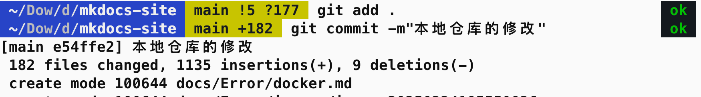

# 乐观 & 坚强

----

2025 年 3 月 1 日

3 月，加油加油

新技能：vscode 中，shell 调用 python 文件，怎么调试，属实巧合，心平气和的分析，问题提出来就是能解决

yepyep

----

2025 年 2 月 28 日

寄了，跑不动，换换吧

复习复习，命令总也不用 该忘了

---

2025 年 2 月 27 日

关于 docker脑子里大概有一整套流程了

打算使用 docker 封装代码，增加可移植性，好心的同门愿意帮我跑，具体地做法：

- docker pull拉取一个官方的镜像
- docker ps 查看镜像
- docker tag 重命名，镜像名:标签
- docker 压缩成 tar 文件，命令忘了，docker save 
- 上传 tar 文件到服务器
- docker -i 路径 load 加载镜像
- docker ps查看
- 有了的话，docker run，启动一个容器，因为我主要想把自己的项目文件封装到容器中，再打包成tar文件也好，再分享到社区也好
- 大概需要目录挂载，把本地的文件挂载到容器内的某个文件，而不是卷映射，因为要以外部的文件为准
- 可能会遇到的错误，库不够，那就 pip 安装。

----

2025年 2 月 26 日

最近这几天把 git 的相关内容，最简单的系统的过了一遍，本地仓库和远程仓库是两个概念，知识的理解确实更加深刻了，git remote -v查看本地仓库连接的远程仓库的地址和别名，本地仓库的修改，git staus查看本地仓库的状态，然后一套组合拳，git add.，git commit -m"提交信息"，git push 推送到远程仓库，第一次在命令行执行，没有从 vscode 中傻瓜式操作了🫣也许这个世界不缺知道的人，缺掌握的人。okay，继续学习

 

---

💕🌈🐾 但行好事，不问前程

🪐💫 捡垃圾的人不会嫉妒开宝马车的人，但会嫉妒垃圾比它捡得多的人

🌺🐋✨ 面朝大海，春暖花开

<u>（241219）一整个大摆烂，你努力吧，我开心就好了。生命之树即将枯萎，灵魂马上窒息，我装不去下了</u>

- 241115 小红书上发了个贴，群起嘲之：别骂了别骂了，我错了
- 241117 来了
- 241118 来咯
  - [x] 文献阅读笔记
  - [x] 好消息：文章时间戳改对了
- 241119 开工，慢慢来也挺好的，是的
- 241125 干活
- 241126 来了
- 241127 来了
- 241128 星期四 来了 晴天
- 241129 星期五 来了 阴天

----

⭐️ Week 1

2024年12月1日 星期日 休

**2024年12月2日 星期一 来了 晴天**

- [x] 查：[归一化](https://dearrongerr.github.io/Rongerr.github.io/learning/1/)
- [x] 改：归一化、文献阅读 COUNTGD、COUNTR
- [x] 增：GAN

8h9min

**2024年12月3日 星期二 来了 晴天**

- [x] 改：GAN

6h34min

**2024年12月4日 星期三 来了 晴天**

- [x] 改：GAN（DONE）
- [x] 改：ViT（DONE）
- [x] 增：Bert
- [x] 增：vision transformer代码（DONE）
- [x] 增：clip

10h45min

**2024年12月5日 星期四 晴天 来了**

- [x] 改：WeightNorm

2h21min

2024年12月6日 星期五 教资面试

2024年12月7日 星期六 教资面试

**2024年12月8日 星期日 阴天 来了**

- [x] 改：WeightNorm
- [x] 增：GAN的变体：最小二乘GAN

3h45min

----

⭐Week2

**2024年12月9日 星期一 阴天 来了**

- [x] 改：GAN变体：cGAN（DONE）
- [x] 增：pytorch读取csv、excel文件转换成tensor
- [x] 增：ResNet项目实战
- [x] 改：Diffusion models

8h59min

**2024年12月10日 星期二 下雪 来了**

- [x] 查：GAN变体
- [x] 改：DDPM
- [x] 增：KL散度（DONE）

6h44min

**2024年12月11日 星期三 阴天 来了 冲！**

- [x] 改：DDPM推导

**2024年12月12日 星期四 阴天 来了** 

- [x] 增：latex捉虫

**2024年12月13日 星期五 晴天 来了**

- [x] 改：latex捉虫

----

⭐Week3

**2024年12月19日 星期四 阴天 来了**

- [x] 改：扩散模型推导

**2024年12月20日 星期五 早上好**

- [x] 改：VAE推导
- [x] 增：RNN

**2024 年 12 月 21 日 星期六 上午好**

- [x] 增：小讲堂（ViT、CLIP）、YOLO、DETR、DINO、对比学习、GPT
- [x] 查：RNN（DONE）

> 近期默念：**「永远摆脱受害者叙事」**
>
> 停止向世界描述我的监狱
>
> 更重要的是：停止向自己描述
>
> 更重要的是：现在从监狱里站起身，走出去
>
> 因为监狱没有上锁，也没有门
>
> 最后，根本没有监狱
>
> 永远不要试图将自己打造成一个受害者来获得别人的理解和爱，不要觉得世界对你不公，不要觉得谁对不起你
>
> 把自己当成受害者，就永远要找凶手；
>
> 把自己当成前进者，就永远在找助手

**2024 年 12 月 22 日 星期日  上午好 晴天**

- [x] 查：LSTM
- [x] 改：MOCO

---

⭐Week4

**2024 年 12 月 23 日 星期一  中午好 阴天** 

- [x] 查：LSTM

**2025 年 1 月 21 日 星期二 22:16**

此时此刻我终于是回到了家，若是掐指一算，也是过去一个月了。

**2025 年 2 月 20 日 星期四 21.00**

今天心情不错，我这个电脑的快捷键设计的太舒服了

option+1 typora

option2 edge 浏览器

option3 vscode

option5 网易云

option7 safari

command7 google

option9 wps

^1 桌面

桌面 1 ssh vscode

桌面 2 vscode 代码学习

option `截图，optionT 贴图

...很顺滑

今天在跑代码

option0 设置

command0 访达