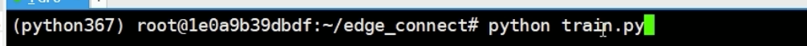
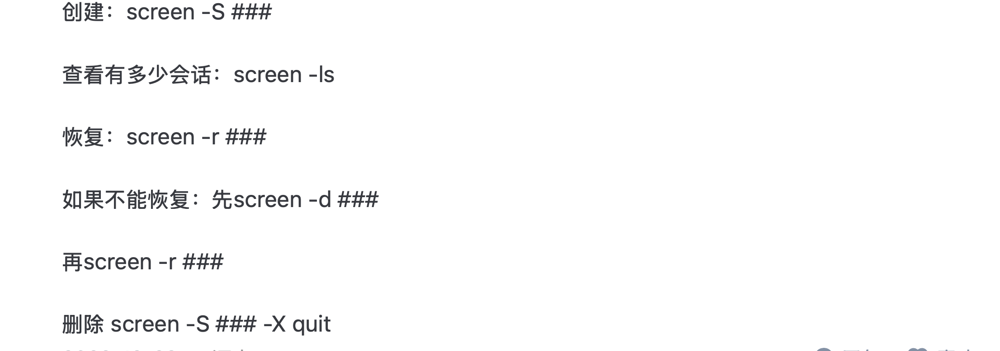

# screen 后台跑代码

[link1](https://www.bilibili.com/video/BV1GK4y1j7YV/?spm_id_from=333.999.top_right_bar_window_history.content.click&vd_source=ddd7d236ab3e9b123c4086c415f4939e)

[link2](https://zhuanlan.zhihu.com/p/595025594)

从终端开始：

- 新建窗口

```cmd
screen -S screenName_runcode
```

- 配置好自己 Python 环境

进入要运行的项目文件，激活自己的虚拟环境



开始运行自己的项目

当自己的 python 文件开始训练


- 怎么样退出窗口，但是代码依然可以在后台运行？

按住键盘 ctrl+a+d 退出窗口（mac：command？）

然后就可以 终端输出 `exit` 退出 ssh 连接，或者 `×` 掉窗口


- 忙完了自己的事，怎么再次重新进入窗口，查看程序？

(1) 终端输入

```cmd
screen -ls
```


(2) 查看当前的窗口

之前命名为 `code` 的窗口，对应 `3600.code`


(3)终端输入 `screen -r 3600` 然后回车

```cmd
screen -r 3600
```

可以看到进入窗口了，并且仍然在训练

以上保证了在训练过程中，电脑可以关机，休眠，断开ssh

