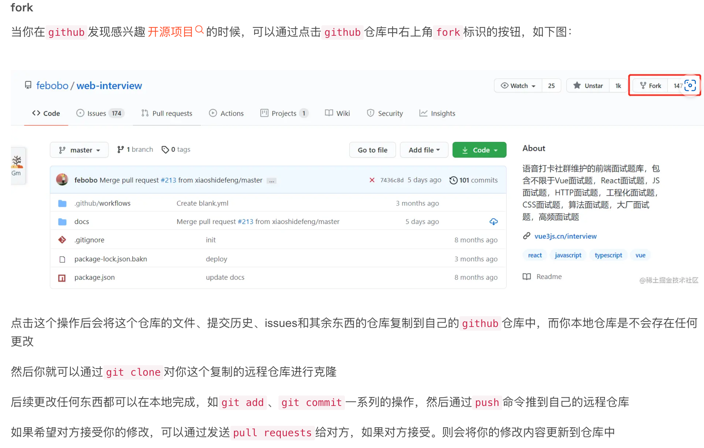

# Git(clone以后)


## fork & clone




[link](https://blog.csdn.net/pfourfire/article/details/127052154)

[【Git版本控制】GitHub上fork项目和clone项目的区别](https://www.cnblogs.com/leiblog/p/10898745.html)

## SSH clone

```bash
git clone git@github.com:原作者/原仓库.git
```

之后：

```bash
# 进入项目目录
cd 原仓库

# 查看当前远程仓库
git remote -v
# 显示结果通常为：
# origin   git@github.com:原作者/原仓库.git (fetch)
# origin   git@github.com:原作者/原仓库.git (push)

# 移除原始的远程仓库引用
git remote rm origin

# 添加你自己的仓库作为新的 origin (可以使用SSH或HTTPS)
git remote add origin git@github.com:你的用户名/你的仓库.git
# 或
git remote add origin https://github.com/你的用户名/你的仓库.git

# 添加原作者的仓库作为 upstream (方便日后同步更新)
git remote add upstream git@github.com:原作者/原仓库.git
```

提交配置个人信息：

```bash
cd 你的项目
# 共享服务器上工作，本地配置，避免影响其他项目
git config user.name "dearRongerr"
git config user.email "1939472345@qq.com"
# 个人实验，全局配置
git config --global user.name "dearRongerr"
git config --global user.email "1939472345@qq.com"
```

