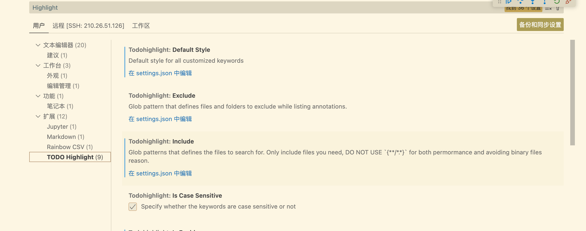
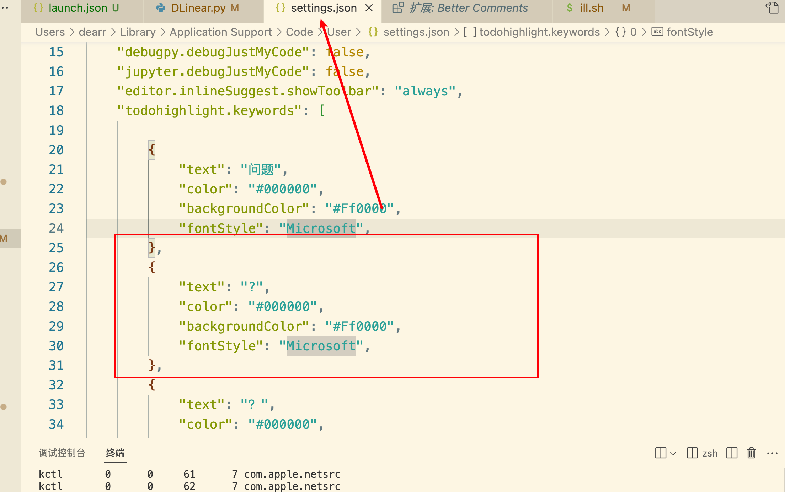
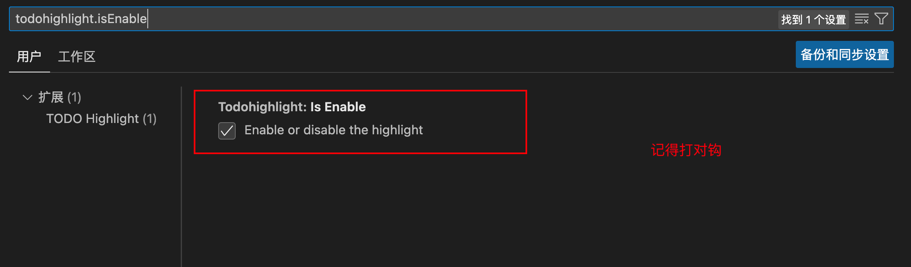
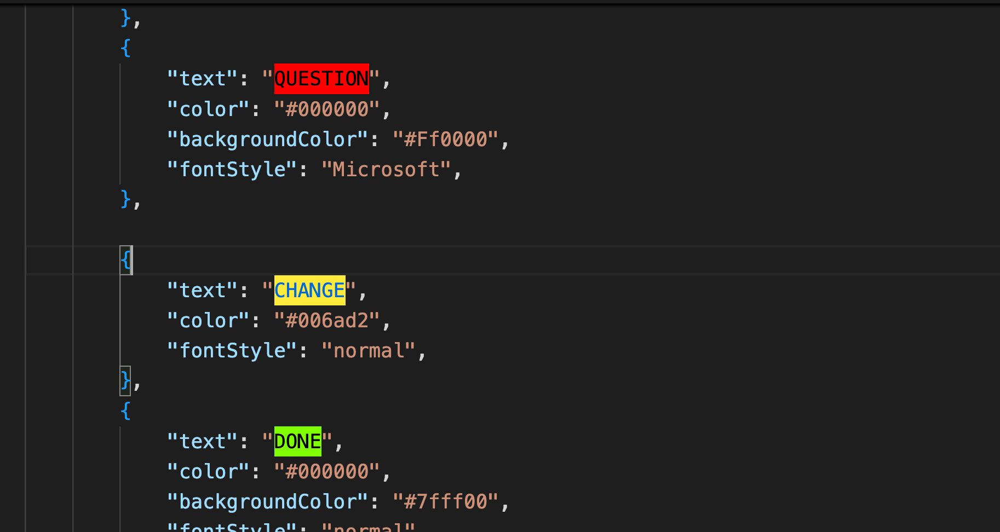
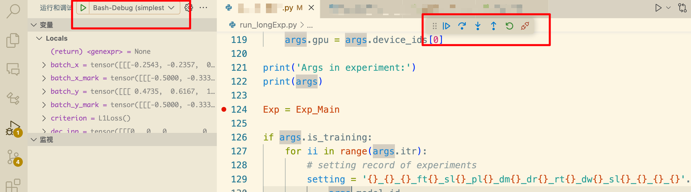
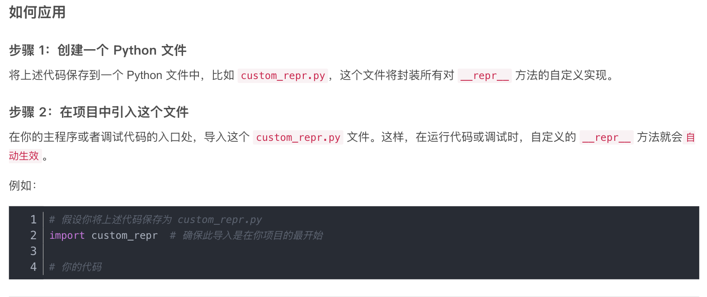

# VSCode

## vscode 注释关键字高亮

- 【参看】

[vscode设置关键字高亮](https://www.cnblogs.com/penuel/p/17442855.html)



`command+shift+p`打开命令窗口，搜索`Highlight Toggle Current`命令，此命令可高亮选中的单词

```
Highlight Toggle Current
```

即可设置：





效果：



- command + ， 搜索 highlight代码编辑器位置，一样打开

## vscode 调试 shell 调用的 python 文件

[vscode 中如何Debug用Bash脚本运行的Python代码](https://blog.csdn.net/m0_52394190/article/details/136913701)

[使用VSCode对一个用Shell脚本启动的Python程序进行Debug](https://www.cnblogs.com/mactor/p/18476063)

[使用VSCode调试带参数的Python脚本](https://www.bilibili.com/opus/686045842139774999)

（1）激活python 运行相应的虚拟环境

（2）安装 `debugpy` 库

```
pip install debugpy
```

（3）查看可用端口：

```
for port in {5000..6000}; do
    (echo > /dev/tcp/localhost/$port) >/dev/null 2>&1 || echo "$port is free"
done
```

查看5000-6000之间的可用端口，用的 `5999`

（4）launch.json 配置

在VSCode按`Command+Shift+P`, 输入`Debug: Add Configuration` 新建一个launch.json（或者直接打开launch.json)编辑以下内容并保存

```
{
	"version": "0.2.0",
	"configurations": [
		{
			"name": "[这里更换为任意名称]",
			"type": "python",
			"request": "attach",
			"connect": {
				"host": "localhost",
				"port": 5999
			}
		}
	]
}
```

（5）Shell
使用Shell 启动Python，对原来的Shell进行编辑，
例如原来的Shell是：

```
python [NAME].py --arg1 "arg" --arg2 "123" 
```

只需要在`python`和`[NAME].py`之间加入 `-m debugpy --listen [端口号]`

即：

```
python -m debugpy --listen 5999 [NAME].py --arg1 "arg" --arg2 "123" 
```

（6）运行

在运行的 python 的文件中，打上相应的断点，然后运行 shell 文件

```
sh your_shell_path/shell_name.sh
```

即可激活 vscode 的相应调试



==一些不太懂的设置：==

- 应用市场扩展：Bash Debug

- `launch.json`的配置：点击 `添加配置`，新增 3 个：

（1）Bash-Debug (type in script name)

（2）Bash-Debug (hardcoded script name)

（3）Bash-Debug (simplest configuration)


```
{
    // 使用 IntelliSense 了解相关属性。 
    // 悬停以查看现有属性的描述。
    // 欲了解更多信息，请访问: https://go.microsoft.com/fwlink/?linkid=830387
    "version": "0.2.0",
    "configurations": [
        {
			"name": "[这里更换为任意名称]",
			"type": "python",
			"request": "attach",
			"connect": {
				"host": "localhost",
				"port": 5999
            }
        },
        {
            "type": "bashdb",
            "request": "launch",
            "name": "Bash-Debug (type in script name)",
            "cwd": "${workspaceFolder}",
            "program": "${command:AskForScriptName}",
            "args": []
        },
        {
            "type": "bashdb",
            "request": "launch",
            "name": "Bash-Debug (select script from list of sh files)",
            "cwd": "${workspaceFolder}",
            "program": "${command:SelectScriptName}",
            "args": []
        },
        {
            "type": "bashdb",
            "request": "launch",
            "name": "Bash-Debug (hardcoded script name)",
            "cwd": "${workspaceFolder}",
            "program": "${workspaceFolder}/path/to/script.sh",
            "args": []
        },
        {
            "type": "bashdb",
            "request": "launch",
            "name": "Bash-Debug (simplest configuration)",
            "program": "${file}"
        }
    ]
}
```


## 调试不显示张量形状问题

【参看】[在 VS Code 中调试 Tensor 形状不显示的问题及解决方案](https://blog.csdn.net/weixin_51524504/article/details/143101401?spm=1001.2101.3001.6650.5&utm_medium=distribute.pc_relevant.none-task-blog-2%7Edefault%7ECTRLIST%7ECtr-5-143101401-blog-139059249.235%5Ev43%5Epc_blog_bottom_relevance_base4&depth_1-utm_source=distribute.pc_relevant.none-task-blog-2%7Edefault%7ECTRLIST%7ECtr-5-143101401-blog-139059249.235%5Ev43%5Epc_blog_bottom_relevance_base4&utm_relevant_index=10)




```
import torch
import pandas as pd

# -------------------- 自定义包装类 --------------------

class CustomBool:
    def __init__(self, value):
        self.value = bool(value)

    def __repr__(self):
        return f'{{bool}} {self.value}'

class CustomInt:
    def __init__(self, value):
        self.value = int(value)

    def __repr__(self):
        return f'{{int}} {self.value}'

class CustomStr:
    def __init__(self, value):
        self.value = str(value)

    def __repr__(self):
        return f'{{str}} {self.value}'

# 自定义 list 和 dict 子类
class CustomList(list):
    def __repr__(self):
        return f'{{list: {len(self)}}} {super().__repr__()}'

class CustomDict(dict):
    def __repr__(self):
        return f'{{dict: {len(self)}}} {super().__repr__()}'

# 自定义 Tensor 的 __repr__ (Torch)
original_tensor_repr = torch.Tensor.__repr__
def custom_tensor_repr(self):
    return f'{{Tensor: {tuple(self.shape)}}} {original_tensor_repr(self)}'
torch.Tensor.__repr__ = custom_tensor_repr

# 自定义 DataFrame 的 __repr__ (Pandas)
original_dataframe_repr = pd.DataFrame.__repr__
def custom_dataframe_repr(self):
    return f'{{DataFrame: {self.shape}}} {original_dataframe_repr(self)}'
pd.DataFrame.__repr__ = custom_dataframe_repr

# 自定义 DataLoader 的类
class DataLoader:
    def __init__(self, data_size):
        self.data_size = data_size

    def __len__(self):
        return self.data_size

    def __repr__(self):
        return f'{{DataLoader: {len(self)}}} DataLoader object'

# -------------------- __main__ 函数 --------------------
def main():
    # 使用自定义类型代替原生类型
    my_list = CustomList([1, 2, 3, 4, 5, 6])
    my_dict = CustomDict({'a': 1, 'b': 2, 'c': 3})
    my_bool = CustomBool(True)
    my_int = CustomInt(42)
    my_str = CustomStr("hello")

    # 测试 Tensor
    my_tensor = torch.randn(100, 512)

    # 测试 DataFrame
    my_dataframe = pd.DataFrame({'A': [1, 2, 3], 'B': [4, 5, 6], 'C': [7, 8, 9]})

    # 测试 DataLoader
    my_dataloader = DataLoader(220)

    # 输出内容
    print(my_list)        # {list: 6} [1, 2, 3, 4, 5, 6]
    print(my_dict)        # {dict: 3} {'a': 1, 'b': 2, 'c': 3}
    print(my_bool)        # {bool} True
    print(my_int)         # {int} 42
    print(my_str)         # {str} 'hello'
    print(my_tensor)      # {Tensor: (100, 512)} tensor([...])
    print(my_dataframe)   # {DataFrame: (3, 3)}    A  B  C
    print(my_dataloader)  # {DataLoader: 220} DataLoader object

# 如果是直接运行文件，则调用 main 函数
if __name__ == "__main__":
    main()

```


## Debug: Add Configuration

launch.json 配置

> 在VSCode按`Command+Shift+P`, 输入`Debug: Add Configuration` 新建一个launch.json（或者直接打开launch.json)编辑以下内容并保存

- [x] 想解决的问题，还是 vscode 调试带参数的 python 文件。

另外一种方法，你把自己的 shell 脚本给 gpt，让它给你写一个 配置，然后加到`launch.json`中就行了 （有点内个虽然，算了，能干活就行）：

```
       {
            "name": "Python: run_longExp.py",
            "type": "python",
            "request": "launch",
            "program": "${workspaceFolder}/run_longExp.py",
            "args": [
                "--model_id", "illness_60_24",
                "--is_training", "1" 
                "--model", "SegRNN", 
                "--data", "custom",
                "--root_path", "./dataset/",
                "--data_path", "national_illness.csv",
                "--features", "M",
                "--seq_len", "60",
                "--pred_len", "24",
                "--d_model", "512",
                "--dropout", "0.0",
                "--rnn_type", "gru",
                "--dec_way", "pmf",
                "--seg_len", "12",
                "--loss", "mae",
                "--des", "test",
                "--itr", "1",
                "--train_epochs", "2",
                "--num_workers", "0"
            ],
            "console": "integratedTerminal",
            "justMyCode": true,
            "cwd": "${workspaceFolder}"
        },
```

 关于这个有几点想说的：

- 使用启动模式而不是附加模式
- 这种调试叫做 以启动模式 调试，而不是附加模式调试，区别在 `"request": "launch"`，`"request": "launch"` 

这种的好处：

最简单的调试方法是使用"启动"模式，按照以下步骤：

1. 使用方案一中的配置替换或添加到`launch.json`文件中
2. 在VS Code左侧的`"运行和调试"`面板中==选择==刚刚创建的`"Python: run_longExp.py"`配置
3. 设置断点并点击绿色的运行按钮开始调试

🟢 不需要手动启动调试服务器

- 一些参数解释：

```
{
    "name": "Python: run_longExp.py",  // 调试配置的名称，会显示在VSCode调试下拉菜单中
    "type": "python",                  // 指定调试器类型为Python
    "request": "launch",               // 使用"启动"模式而非"附加"模式
    "program": "${workspaceFolder}/run_longExp.py", // 要运行的Python脚本路径
    "args": [                          // 传递给脚本的命令行参数
        "--model_id", "illness_60_24", // 模型ID参数
        "--is_training", "1"           // 训练模式标志
        "--model", "SegRNN",           // 使用的模型
        // ...更多参数
    ],
    "console": "integratedTerminal",   // 使用VSCode内置终端显示输出
    "justMyCode": true,                // 只调试您的代码，跳过库代码
    "cwd": "${workspaceFolder}"        // 设置工作目录为项目根目录
}
```

