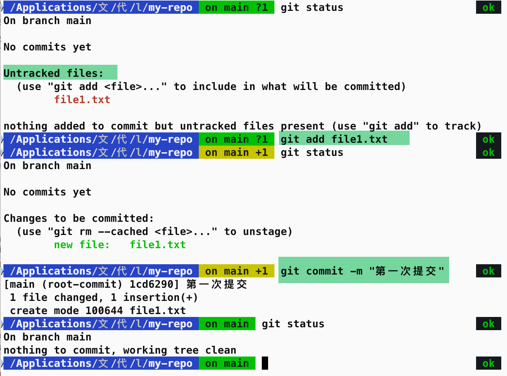
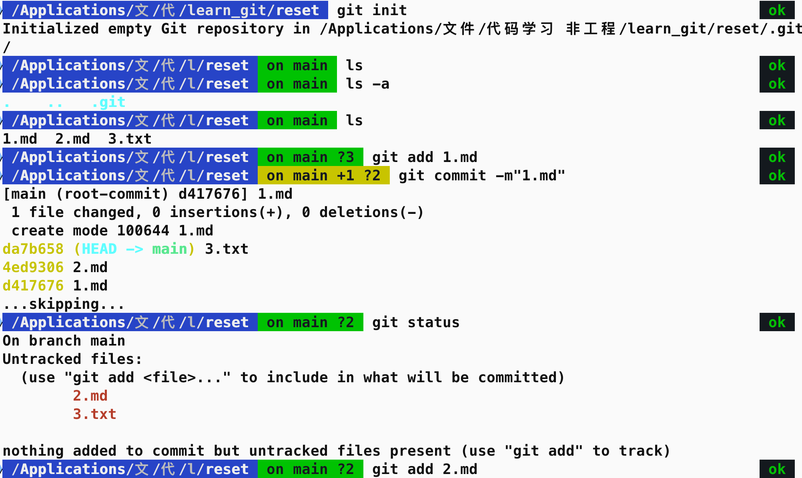
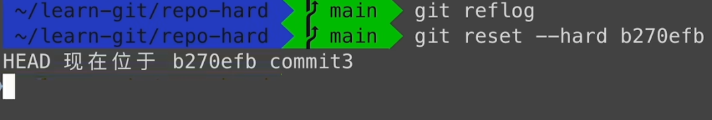
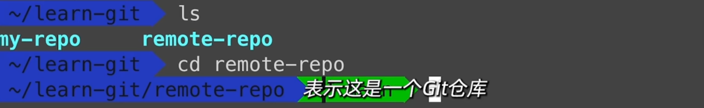
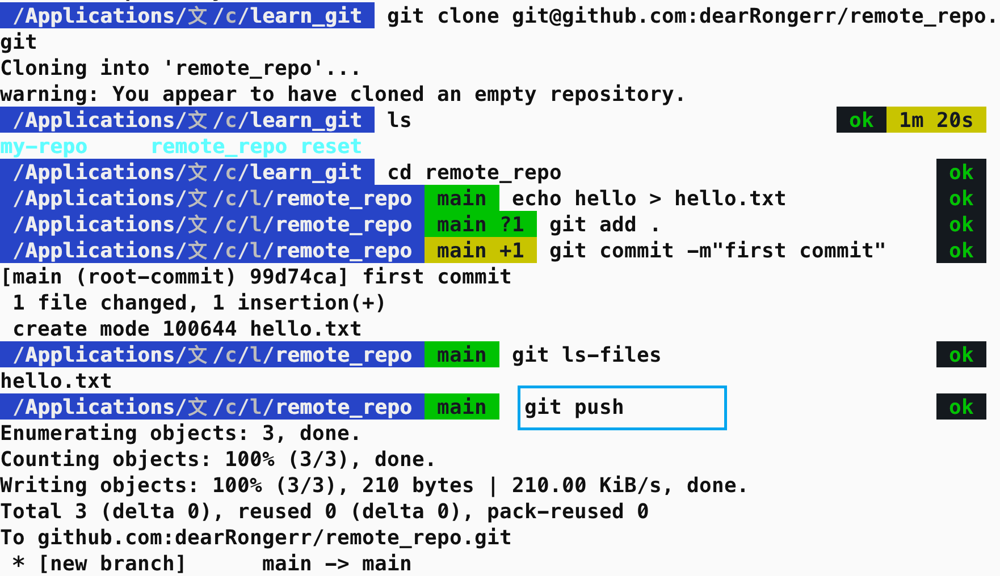

# GitHub

新建仓库：

```python
echo "# Rongerr.github.io" >> README.md
git init
git add README.md
git commit -m "first commit"
git branch -M main
git remote add origin https://github.com/dearRongerr/Rongerr.github.io.git
git push -u origin main
```

向已有仓库推送

```python
git remote add origin https://github.com/dearRongerr/Rongerr.github.io.git
git branch -M main
git push -u origin main
```

## 新建仓库

1、查看 git 版本


2、初始化仓库（新建仓库）


3、删除了 `.git` 也就是删除了仓库


4、git init 指定参数，表示在哪儿初始化一个新的仓库


注意看绿色的分支（怎么那么丑，算了，无所谓）

5 `git clone` 新建仓库


有 `.git` 文件，就是一个远程仓库

## 工作区域和文件状态


> [link](https://www.bilibili.com/video/BV1HM411377j?spm_id_from=333.788.player.switch&vd_source=ddd7d236ab3e9b123c4086c415f4939e&p=4)
>
> 


## 添加和提交文件




- git 支持使用通配符，将文件添加到暂存区


- `git add .`  提交当前文件夹下的所有文件


## 查看提交记录

> git log：查看复杂的提交记录
>
> git log --oneline ：查看简洁的提交记录


每次提交都有一个 `id` 号

> 第三个提交时，直接输入的 `git commit`，会进入 `vim` 提示输入提交信息
>
> 按键盘 `i`  进入编辑模式
>
> 编辑完以后，按键盘 `esc`，回到命令行模式，
>
> 然后输入`:wq` 保存编辑的内容

## 配置作者信息

- Author 的信息，包括 username 和邮箱是通过 `git config` 配置的：


这里，因为用户名中间有空格，所以使用双引号括起来

配置完用户名可以配置邮箱：


因为邮箱中间没有空格 ，所以可以省略掉双引号


## git reset

回退版本


工作区 》》暂存区》》本地仓库（真正提交保存起来）

示例：


查看工作区的内容：`ls`

查看暂存区的内容：`git ls-files`

三个文件，三次提交




- git reset --soft  ##回退的版本 id##

×：


√


git log --oneline:


头指针的位置也变了

- git reset --hard HEAD^ (hard reset 回退到上一个版本)


hard 模式，工作区文件被删了，暂存区文件也被删了，提交历史也只剩下一个了


当使用 hard 参数回退到上一个版本的时候，工作区和暂存区的内容都会被清空

- 默认 mixed 模式


git add 到暂存区

git commit 到仓库

git reset --soft 撤销 git commit 操作（回到暂存区）

git reset --hard 删除工作区和暂存区（工作区也没了）

git reset --mixed 保存工作区，删除暂存区（回到工作区）

## 误操作 git reflog

git 保存所有操作，==使用 git reflog 查看所有操作对应的版本号==


回到对应的版本：



==git log --oneline查看当前所处的版本==


## git diff

查看差异

## git rm

删除文件

（1）查看本地仓库中的内容


（2）删除文件 1


（3）查看仓库状态，显示文件 1 已经被删除了


（4）这里涉及到一个问题，本地工作区的文件已经被删除了，但是暂存区的文件还没有删除

- 这里也是提示，需要更新暂存区


- git ls-files 查看暂存区的内容


- 因此执行 git add 操作，告诉 git，我们已经删除了文件 1

可以执行 `git add .`  或者执行 `git add file1.txt`

再次查看暂存区的内容


- 总结：这种从本地删除文件，再告诉暂存区已经删除了文件的做法十分复杂，因此 git rm 命令

- 删除文件 2，查看暂存区，工作区，git status


总结，只需要执行一次 git rm 命令，git 就能把文件从工作区和暂存区同时删除

- 最后执行提交，从版本库中也删除掉


- 总结：


## .gitignore

告诉 git 不应该添加到版本库中的文件

工作区》》暂存区》》版本库


- 现有两个日志文件，access.log  、 other_access.log

将access.log添加到 .gitignore文件


- git status 查看状态


已经看不到 access.log 文件了，接下来执行，添加到暂存区，提交到版本库，


- `.gitignore`中写 `"*.log"`，通配符忽略掉所有 .log文件
- 需要注意的一点是，`.gitignore`忽略掉的文件是 还没有被添加到版本库中的文件，那此时，如果想把已经上传到版本库中的 log 文件，从版本库中删除，却不从本地删除应该怎么办呢？

（1）使用 `git rm --cached other.log`，将想要忽略的日志文件从暂存区删除


（2）查看工作区文件，日志文件还在，此时再提交到远程仓库，再修改 `other.log`文件，此时 `git status` 查看仓库状态，仓库也是没有任何变化的。

- git不会追踪空文件夹


- 在空文件夹下新建一个文件，git status 查看文件状态，显示文件被追踪到了


- linux命令


- `vi .gitignore` 文件，将 `temp/`文件夹添加到`.gitignore`中，git 会忽略掉整个文件夹


- git status -s 查看仓库状态，简略显示


显示 gitignore 文件被修改过

- git commit -am


> （1）文件**a.txt处于已跟踪**，但未暂存状态。这时，如果使用**git commit -m是无法提交最新版本的a.txt的**，**提交的只是最开始空内容的旧版本a.txt**
>
> （2）要提交**新版本a.txt**，即内容为**'a'的a.txt**，则需要使用**git add a.txt**，**将新版本的a.txt放到staged暂存区**，然后才能使用git commit -m进行提交
>
> （3）而如果使用**git commit -am**，则可以省略**git add a.txt**这一步，因为**git commit -am可以提交跟踪过的文件**，而a.txt一开始已经被跟踪过了

## SSH配置和克隆仓库

- 新建远程仓库


- 添写仓库名称


可选：项目描述、是否添加 gitignore 文件，readme文件

（1）如果本地没有仓库，执行如下命令，在本地创建仓库并和远程仓库关联起来


（2）如果本地有仓库


- 远程地址的两种方式：


（1）HTTPS，在把本地仓库的代码 push 到远程仓库的时候，需要验证用户名和密码

（2）SSH，git 开头的是 SSH 协议，这种方式在推送的时候，不需要验证用户名和密码，但是需要在 github 上添加SSH公钥的配置（推荐）

- 配置 SSH秘钥

==（1）本地  使用 SHH 克隆 远程仓库==

```bash
git clone git@github.com:dearRongerr/remote_repo.git
```


报错是因为没有配置 SSH 秘钥导致的，使用 SSH 的方式必须配置 SSH 的秘钥

==（2）回到根目录，进入 .ssh目录==


==（3）使用 ssh key generate 生成秘钥，-t 表示指定协议为RSA，-b 指定生成大小为 4096== 

```bat
ssh-keygen -t rsa -b 4096
```


==（4）会提示输入秘钥名称== 


🟢 如果是第一次生成秘钥，那么直接回车，就会生成一个 `id_rsa` 密钥文件

🟢 如果之前已经生成过了，需要重新命名一个文件，否则会覆盖掉之前的密钥文件，并且操作不可逆

这里重新命名了一个名为 test 的文件名，回车确定输入，后面输入密码，生成秘钥

🟢 如果不设置密码，就直接回车不输入密码即可


（4）查看本地目录


一个 test，私钥文件，谁要也不给

一个 test.pub，公钥文件，上传到github

(5) 打开公钥文件，复制公钥文件的内容


 


vi打开公钥文件，复制内容

==（6）回到 github-->setting-->SSH and GPG keys -->New SSH key-->粘贴公钥内容到输入框中，标题输入任意名字即可-->Add SSH Key== 


（7）

- 如果在生成秘钥文件的时候，使用的是默认名称，那么秘钥配置就已经结束了
- 由于演示中生成密钥文件时，命名了 test密钥文件，所以需要再次配置：

创建 congifg文件，并把下面的 5 行添加到 config 文件中`tail -5 config` ，确保在访问github.com 的时候，指定使用SSH 下的 test 秘钥

```bash
tail -5 config
```


🔴 我那奇奇怪怪的错误

> 问题描述：
>
> 生成密钥时，想生成 test.pub 的密码，执行 `tail -5 config` 去找 test.pub秘钥，结果出现了我不认识的代码
>
> 想着，也许是因为我从来没有生成过秘钥，所以执行生成密钥文档时，直接一路回车。
>
> 🟢 使用默认秘钥配置成功了。
>
> 
>
> 使用默认秘钥，不需要执行 `tail -5 config`


(8) 以上配置完成，回到本地仓库，执行 git clone 命令，会提示输入密码，也就是生成 ssh 秘钥时，输入的密码，如果没有输入密码，直接回车即可


（9）ls 查看本地，发现多了 `remote-repo`，表明将这个仓库克隆到了本地


（10）进入目录里面，多了 main 分支，表示这是一个仓库




（11）本地与远程仓库交互演示：


本地仓库和远程仓库的交互需要使用 push 和 pull 操作

- 使用 push 命令把本地仓库的修改内容推送给远程仓库，刷新远程仓库，显示新建的 hello.txt 推送到远程仓库。




## 关联本地仓库和远程仓库

将本地仓库，放到远程仓库

（1）github 上创建新仓库


（2）将本地 `my-repo`仓库和远程 `first-repo`仓库关联起来，复制 `first-repo`中的提示命令即可


📢 需要进入本地 `my-repo` 仓库，执行 `git remote` 操作。


（3）`git remote -v` 查看当前仓库所对应的远程仓库的别名和地址

 

显示为 （远程仓库的别名）origin 和地址


（4） 第二行，`git branch -M main`  指定==（本地）==分支的名称为 main，这里默认的==（本地分支）==名称就是 main，因此可以省略执行这行命令 


（5）第三行，`git push -u origin main` 将本地的 main 分支和远程 origin仓库的main 分支关联起来

> 关于 `git push -u origin main`命令
>
> 命令全称：`git push -u origin main:main`
>
> 将本地仓库和别名为 origin 的远程仓库关联起来
>
> main:main 本地仓库的 main 分支推送给远程仓库的 main 分支，因为本地分支的名称和远程分支的名称相同，因此可以省略只使用一个 main

执行完 git push 操作，显示本地仓库的内容推送到了远程仓库


## 拉取远程仓库的修改合并到本地仓库

（1）远程仓库修改，添加 readme 文件-->点击add a readme-->编辑内容-->点击提交按钮-->刷新页面-->看到文件添加到远程仓库里面了


（2）问题描述：

> 远程仓库有了一个新的文件，但是本地还没有这个文件

使用 pull 拉取远程仓库中修改的内容


命令解释：远程仓库（origin）的 main 分支，拉取到本地。

🟢 省略远程仓库名和分支名，直接使用 `git pull` 命令，那么将默认拉取仓库别名为 `origin`的 `main` 分支，作用就是将远程仓库的指定分支拉取到本地再进行合并；ls 参看本地仓库文件，readme 文件拉取过来了。


暂存区的文件： `git ls-files`


git pull，ls查看文件列表


readme 拉取下来。

2025 年 2 月 26 日，[告一段落，感谢](https://www.bilibili.com/video/BV1HM411377j?spm_id_from=333.788.videopod.sections&vd_source=ddd7d236ab3e9b123c4086c415f4939e&p=16)。分支没学。用到了再说。

summary：本地仓库和远程仓库、连接
