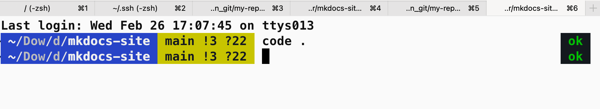

# MacOS

## 终端命令

-  `cd ..`  返回上级文件
- `ls`  显示当前目录文件
- `ls -a` 显示当前目录的所有文件，包括隐藏文件

**macOS 终端命令**

- 显示文件树

  - 打开mac终端

    - 输入 brew install tree

    - 使用：

      `tree` 显示文件树

      `tree -a` 显示所有文件树，包含隐藏文件

- vim？

都是终端

- bash 和 zsh？

## 配置终端

效果展示：

[【教程】安装 iterm2 打造漂亮且高性能的 mac 终端](https://blog.csdn.net/u013801484/article/details/145442285)

工具：Iterm2 + oh my zsh + powerlevel10k

[Oh My Zsh 和 Powerlevel10k：天作之合 | Linux 中国](https://zhuanlan.zhihu.com/p/598042205)

[iTerm2安装配置使用指南——保姆级](https://zhuanlan.zhihu.com/p/550022490)

[ZSH主题agnoster配置保姆级流程教学](https://www.bilibili.com/opus/399613352184668726)

安装Mac神器 brew【？】：网址 https://brew.sh

