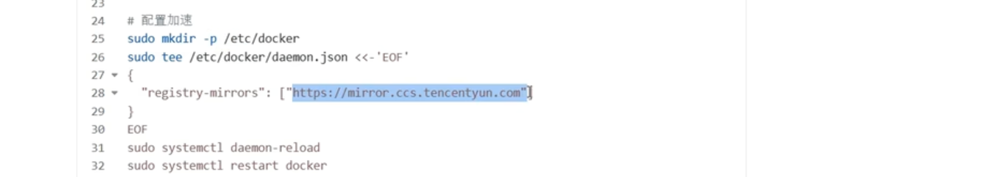
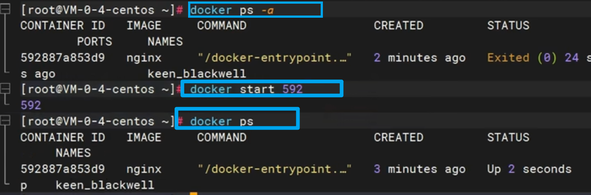
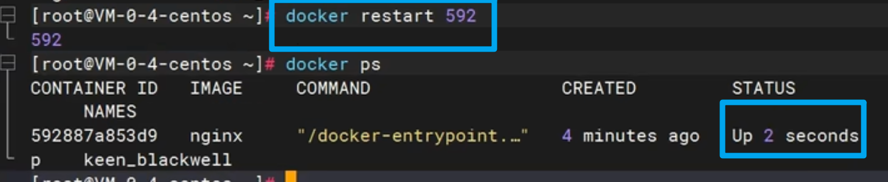

# Docker

占位：[docker hub](https://hub.docker.com/_/python)

 

[小白入门：如何在docker中运行python程序](https://blog.csdn.net/A24kk42__/article/details/131970979)

[如何通过 Docker 部署深度学习项目环境？](https://www.zhihu.com/question/486938264/answer/2665791940)

## 使用容器跑代码

1️⃣ 创建一个本地Ubuntu系统和docker容器共享的文件夹

```bash
sudo mkdir /loacal_data
```

2️⃣ 将代码文件复制到Ubuntu系统的`/loacal_data`目录下，这样该目录就和容器内部的`/container_data`目录连通了

```bash
sudo docker run -v /local_data:/container_data -itd image_name:v1 bash
```

3️⃣ 查看此时正在运行的容器

```bash
sudo docker ps 
```

该容器就是我们刚刚所创建的用于本地测试代码的容器

4️⃣ 用`docker attach`进入容器

```bash
sudo docker attach 500ad76de1cf
```

5️⃣ 之后的步骤就是与在本地系统命令行的操作一样，进入代码的文件夹，用`python`命令执行代码

## 本地拉取镜像上传服务器

[步骤](https://blog.csdn.net/weixin_43474841/article/details/144285723)

🟢 第一步：拉取远程镜像，[docker pull](https://hub.docker.com/r/pytorch/pytorch/tags)

```bash
docker pull pytorch/pytorch:2.6.0-cuda11.8-cudnn9-devel
```

  


🟢 第二步，标记镜像，为 pull 下来的镜像，打标签，推送到==服务器上的名称:版本号==

```bash
docker tag 8d8f916f1de0 geco_image:v1
```


🟢 第三步：将本地的 docker 镜像保存为 tar 文件，就用刚刚 tag 的别名:标签，这样到服务商就是对应的名称和标签

```bash
docker save -o 镜像tar文件名称.tar geco_image:v1
```


🟢 第四步：传输镜像，将保存的tar文件传输到远程服务上，FileZilla 即可


 🟢 第五步：在远程服务上加载镜像

```bash
docker load -i 镜像tar文件名称.tar
```


- 在服务器端启动 docker

`docker run -it #####image_id#####`


## docker 配置加速[阿里云镜像](https://cr.console.aliyun.com/cn-hangzhou/instances/mirrors)源


## 一些命令

- docker images

- 查看已经有的 docker

- docker pull  ###

- docker pull asappinc/python-38-cuda118

- 拉取远程 docker

- 删除本地拉取过来的 docker：

- docker 安装成功没   docker help

### docker tag

```bash
docker tag SOURCE[本地]_IMAGE[:TAG] TARGET_IMAGE[服务器][:TAG]
```

> tag的作用：
>
> - `SOURCE_IMAGE[:TAG]`：源镜像的名称和可选的标签。如果未指定标签，默认为 `latest`。
> - `TARGET_IMAGE[:TAG]`：目标镜像的名称和可选的标签。
> - 假设你有一个名为 `my-image` 的镜像，并且你想为它创建一个新的标签 `v1.0`，可以使用以下命令：`docker tag my-image my-image:v1.0`
> - 这将为 `my-image` 镜像创建一个新的标签 `v1.0`。你可以使用 `docker images` 命令查看镜像和标签：`docker images`
> - 输出示例：
>
> REPOSITORY          TAG                 IMAGE ID            CREATED             SIZE
> my-image            latest              d1e3f1e4f1e4        2 days ago          500MB
> my-image            v1.0                d1e3f1e4f1e4        2 days ago          500MB
>
> - 值得注意的是：
>
> 两个镜像的 ID 一样是因为它们实际上是同一个镜像，只是被打上了不同的标签。这意味着你可以通过任意一个标签来引用这个镜像，并且删除其中一个标签不会影响镜像的实际数据。
>
> 当你删除一个镜像标签时，实际上只是删除了这个标签，而镜像本身仍然存在，直到所有引用它的标签都被删除。

### 	docker load

`docker load -i 镜像tar文件名称.tar` 

- 加载完成后，使用 `docker images` 即可查看 加载到的镜像

- 该命令用于从一个 tar 文件中加载 Docker 镜像：

```bash
docker load -i 镜像tar文件名称.tar
```

- `docker load`：这是 Docker 的一个命令，用于从一个 tar 文件中加载镜像。
- `-i`：这是 `--input` 的缩写，指定输入文件。
- `镜像tar文件名称.tar`：这是包含 Docker 镜像的 tar 文件的名称。


## dockerfile


查看官方源，以[python](https://hub.docker.com/_/python)为例


## 系统学习docker

### 安装docker

- docker的安装命令：参照[docker官网访问docker.com](https://www.docker.com/)
- [点击：开发者-->文档-->manuals手册(包含how to install、如何安装)-->docker引擎 docker engine -->  install安装-->选择我们系统的版本（如 CentOS）--> 参照步骤， 直接复制命令](https://docs.docker.com/engine/install/centos/)
- 第一步，移除系统里边的旧版本


- 第二步：配置docker的下载源

安装 yum-utils 工具类，用这个工具类配置docker的下载地址源
因为这里的docker下载地址是连接docker官网的，下载起来比较慢


参照如下：


把docker的下载源配置成阿里云的地址


- 第三步，安装docker引擎：


包含

（1）docker-ce：docker引擎

（2）docker-ce-cli：docker引擎的命令行程序，命令行可以给docker的demon后台进程去发送命令

（3）container.io：docker的运行时容器环境

（4）以及docker用来构建镜像的插件工具

（5）还有docker compose：做批量


输入Y确认下载安装

- 第四步：启动docker


输入system control start docker
sudo 表示 使用超级管理员权限，使用的是root的话，可以直接粘贴命令回车，完成 docker启动


运行docker命令，`docker ps`，查看正在运行中的应用

注意：这个命令启动docker只是当前启动，如果关机，下次还得用这个命令启动docker， 所以额外加一个叫system control enable docker


让docker开机也启动，至此docker安装完成

==补充配置：== 




docker已经启动安装完成以后，可以配置docker的加速

因为docker去下载镜像， 默认从docker hub官网下载，而连接国外比较慢，所以一般配置国内镜像源地址

命令行示例如下：


配置好加速源地址以后，重启docker的后台进程以及重启docker

注意这里的配置原理，是docker后台进程的配置文件，在etc/docker/demon.json中，给这个json中配置了一个选项：registry - mirrors指向国内镜像源，相当于修改了docker的配置文件

全部配置成功以后再次验证，如果docker ps 等 docker 命令可以运行证明没有问题


### docker 命令


==问题描述：== 


用docker启动一个nginx应用，并且将nginx的默认首页改成自己的页面，这样别人来访问这个nginx，就能看到你自己的页面，并且将改好的应用发布出去，发布到应用市场，让所有人都能从市场里边下载这个应用，直接运行

==步骤如下：==


- 第一步去应用市场下载NGINX软件镜像
- 然后docker使用这个镜像启动一个应用容器
- 接下来修改容器里的默认页面，把它改成自己的页面
- 最后把修改的整个软件，保存一个新的镜像，把这个镜像发布到应用市场里边，让别人可以下载


第一步，下载镜像：


跟镜像相关的命令
- 检索，使用docker search先找一下有没有这个镜像
- 再利用docker pull把这个镜像下载过来
- 使用docker images，查看已经下载来的所有镜像列表
- 使用docker rmi，remove image的缩写，删除某一个镜像

🟢 先来用docker search来搜一下有没有nginx镜像


- 打印一个列表
- name：镜像的名字
- description：对这个镜像的描述
- stars：这个镜像有多少的star
- official：这个镜像是不是官方发布的镜像，如果OK代表这是官方镜像，否则就是第三方制作的镜像


- 显示 有一个NGINX，直接进行下载 

- 使用docker pull命令直接写镜像名回车，镜像进入下载流程，下载完成以后，使用docker images检查一下


- 显示 系统里现在有一个镜像
- 打印的列表：

1️⃣ repository：代表镜像的名字

2️⃣ TAG 是镜像的标签，一般代表镜像的版本，latest代表最新版本

3️⃣ image id代表镜像的唯一id

4️⃣ created ：镜像是多少天前创建出来的

5️⃣ size： 镜像的大小

📢 这里演示下载的镜像NGINX，是最新版的， 那如果要下载指定版本的呢？


- 镜像的完整名，其实是镜像名冒号加标签


- 所以docker pull 下载nginx，其实等于docker put nginx加上它的标签，也就是版本latest，下载最新版本


- 如果要下载指定版本，那此时就不推荐docker search搜索镜像，而是去[docker hub网站](https://hub.docker.com/explore)自己来搜索镜像，在这个网站里有完整的版本列表，看上哪个去下载哪个


搜索想要的镜像，输入NGINX回车，有NGINX镜像
注意加了这两个标志的都是官方镜像


点进来，每一个镜像都有说明，包括这个镜像如何启动，也提供了docker run命令


参考每一个镜像的说明，如果想要下载其他版本的nginx，点击 TAGS 里


- 每一个tag都是一种版本，比如1.26


下载它，直接复制命令到我们的命令行，重新下载docker pull，冒号指定了镜像版本


下载完以后，使用`docker images`，完整写法是image ls，列出所有的镜像列表


看到有nginx1.26.0镜像 ，还有nginx lastest 镜像
🟢 如果想要删除某一个镜像，可以使用docker rmi，就是remove image，写镜像的名加上完整标签


- 比如要删latest，就写latest `docker rmi nginx：latest`

- 或者，每一个镜像有它的唯一id也可以用它的唯一id ，来进行删除
- 镜像就被删除了
- 再来检查docker images，列表里边只有NGINX1.2.6.0


### 启动容器


第一步，下载nginx镜像
第二步，启动容器，每一个容器都代表一个运行中的应用

🟢 跟容器相关的命令  

- 运行使用docker run  

- 查看正在运行的容器 docker ps  

- 停止stop   


- 启动start  


- 重启restart  


- 查看容器的状态，比如CPU内存占用，使用docker states  


- 查看容器的日志，也就是应用运行过程中产生的日志，使用docker logs  


- 进入容器内部进行修改，使用docker exec  


- 删除一个容器，使用docker rm  

📢 其中docker run和docker exec 这两个命令，比较复杂  

==首先第一个docker run==

当已经有了一个nginx镜像以后，想要启动这个应用

第一步是docker run，启动一个应用


- docker run --help 查看这个命令怎么用


用法usage是docker run `options`，options就是参数项

启动一个容器能加的参数项：


- image代表镜像

- 中括号代表 可选参数
- 后边[command] [ARG...] 翻译过来是 ：==命令和参数==。表示如果启动这个镜像，要使用什么样的启动命令，可以自己定义，但一般镜像后边的命令和参数，不用写，因为每一个镜像有它自己的启动命令和参数，这是镜像里边默认带好的，除非我们要改变镜像的默认启动行为，否则都不用管
- 使用就是：

1️⃣ 直接使用docker run加上 镜像名，就可以用这个镜像启动一个应用

2️⃣ 如果要加入一些参数设置，那就给run和image中间加上参数设置项

现在直接使用`docker run nginx`

但如果不写镜像的版本号，就会使用最新镜像，如果第一次启动没有这个镜像，会自动下载，启动阻塞了控制台，此时不可以退出控制台，一停，应用跟着也就停了

复制一个视图，在这个会话中用第二个命令：docker ps，可以查看运行中的应用


看到有一个nginx在运行

完整打印参数解释：

- container id 代表正在运行的应用的唯一id
- image 使用哪个镜像运行的，没带tag标签，说明是使用最新镜像
- command 代表这个容器自己的启动命令，不用管
- create代表 是多长时间之前启动的
- status 启动状态，up 代表上线成功了
- ports 代表这个应用占用的端口是 80 端口

- names代表应用容器的名字，会给一个随机名字

▶️ 此时把这个应用控制台 CTRL C 中断掉，会发现这个应用停了

- 再使用docker ps 来检查，就没有运行中的这个应用了


注意docker ps  查看所有运行中的容器

- 停了的，可以使用`docker ps -a` 就可以查看所有的容器，包括停止了的


可以看到这个容器之前是运行的，现在`status`状态是`exist`已经退出了

▶️ 退出的容器如果再想启动怎么做呢？

- 使用 docker start，相当于把这个容器重新启动

- docker start 写容器的名字、容器的id、id也可以只写三位，能跟其他人区分就行




以上，代表把它启动起来了

docker ps 查看，这个应用`up`，表示启动起来了

▶️ 启动的应用如果想停掉，可以使用docker stop命令，把这个应用停掉，可以使用它的应用名


docker ps查看运行中的应用就没有了

想要看到它就ps -a


看到七秒前退出

▶️ docker restart

无论这个容器是运行中还是停止了，使用restart重启一下



docker ps ，看一下，又重新up上线了

▶️ docker states

查看这个应用CPU内存等占用情况


打印592容器，CPU内存包括网络IO整个情况，而且是每秒变化的，这一块没有变化的原因是因为这个容器现在没有处理任何请求，所以整个资源的占用没有变化

▶️ `docker logs 592`


容器在运行过程中会产生大量日志，有时要用日志排错等

就可以使用docker logs查看容器日志

除
06:13 我还是输入592回车
06:16 但注意你想要删除一个容器
06:19 你必须把它先stop停了才能删除
06:22 但人家说你也可以使用false remove强制删除
06:26 强制删除的写法就是RM杠F回车
06:31 这样运行中的容器也能删除
06:33 我们再来确认运行中的没有
06:36 包括docker PS杠A
06:38 所有无论是运行中的还是不运行的
06:41 都没有在这一块呢
06:43 我们给大家大概演示了这一堆的命令
06:46 后来的ESEC我们后来说
06:48 但是呢还有一个问题
06:49 docker run我们之前写的特别简单
06:53 如果直接这么写
06:54 我们说这个是控制台阻死行为
06:57 你把CTRLC停了
06:59 它就完全停了
07:00 你还得重新自己start启动
07:03 我们希望整个应用能后台启动
07:06 直接在后台提供服务
07:08 怎么做呢
07:09 包括我们现在启动的这个应用
07:12 我就算启动了docker PS
07:14 我来重新给它start
07:16 是这个8B7
07:18 注意应用一旦一重启以后还不是重启
07:22 就是用这个镜像
07:23 如果你重新启动一个容器以后
07:25 你的容器id肯定会发生变化
07:28 那我先把这个8B7再启动起来
07:31 但是大家要注意的一点是
07:33 虽然我这个容器占用的是八零端口
07:36 此时你想要通过浏览器去来访问我们这个NG4
07:41 你是访问不到的
07:42 给大家看一下
07:43 我直接把我的这个服务器的IP地址拿过来
07:48 我去来访问他的八零端口
07:50 回车这块是不能访问的
07:54 那怎么把它做成能访问的
07:57 以及让他在后台默默启动等等
08:00 这一系列设置下
08:01 我们下一节课就来仔细来说这个docker round
08:04 使用办法
