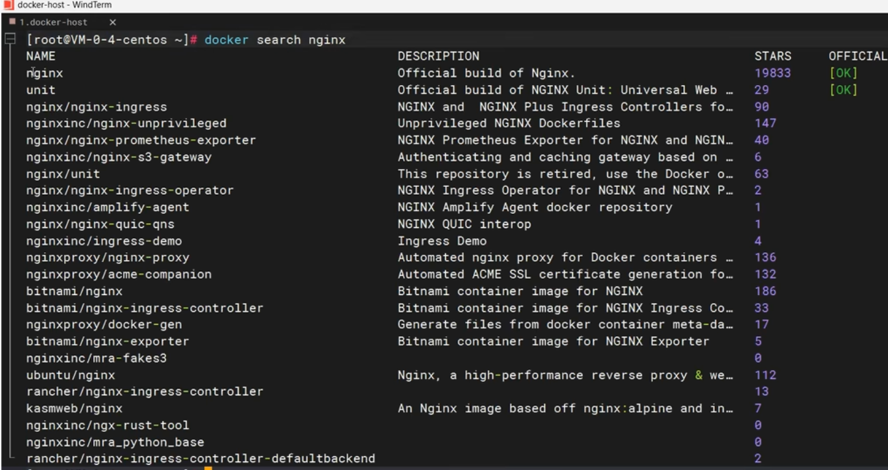
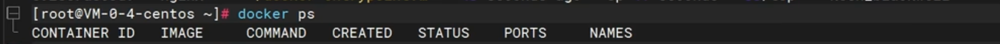
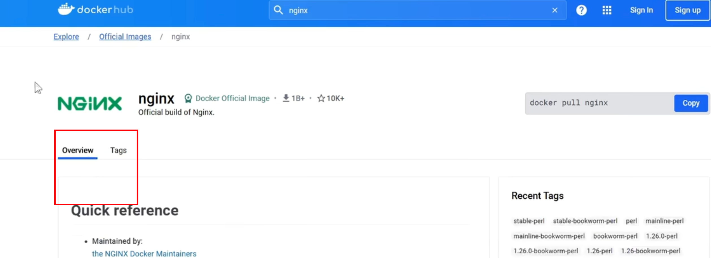
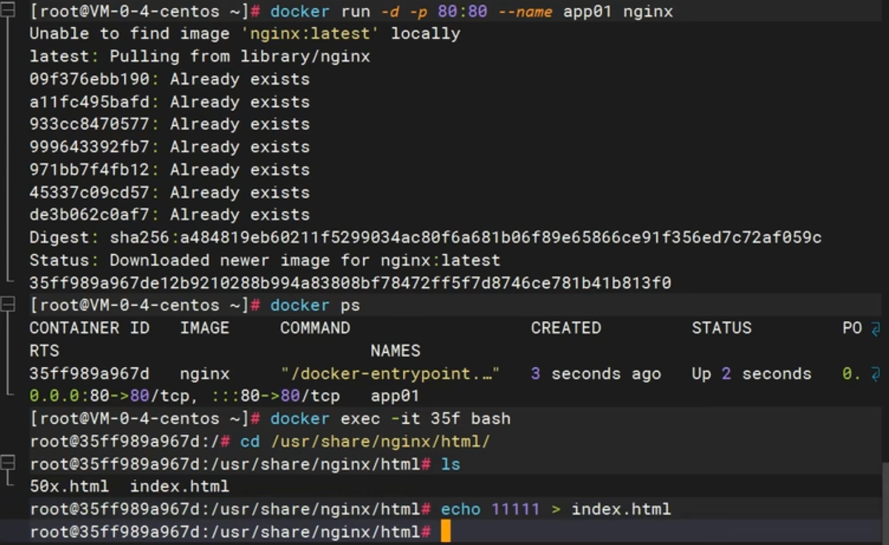

# Docker

占位：[docker hub](https://hub.docker.com/_/python)

 

[小白入门：如何在docker中运行python程序](https://blog.csdn.net/A24kk42__/article/details/131970979)

[如何通过 Docker 部署深度学习项目环境？](https://www.zhihu.com/question/486938264/answer/2665791940)

## 使用容器跑代码

1️⃣ 创建一个本地Ubuntu系统和docker容器共享的文件夹

```bash
sudo mkdir /loacal_data
```

2️⃣ 将代码文件复制到Ubuntu系统的`/loacal_data`目录下，这样该目录就和容器内部的`/container_data`目录连通了

```bash
sudo docker run -v /local_data:/container_data -itd image_name:v1 bash
```

3️⃣ 查看此时正在运行的容器

```bash
sudo docker ps 
```

该容器就是我们刚刚所创建的用于本地测试代码的容器

4️⃣ 用`docker attach`进入容器

```bash
sudo docker attach 500ad76de1cf
```

5️⃣ 之后的步骤就是与在本地系统命令行的操作一样，进入代码的文件夹，用`python`命令执行代码

## 本地拉取镜像上传服务器

[步骤](https://blog.csdn.net/weixin_43474841/article/details/144285723)

🟢 第一步：拉取远程镜像，[docker pull](https://hub.docker.com/r/pytorch/pytorch/tags)

```bash
docker pull pytorch/pytorch:2.6.0-cuda11.8-cudnn9-devel
```

  


🟢 第二步，标记镜像，为 pull 下来的镜像，打标签，推送到==服务器上的名称:版本号==

```bash
docker tag 8d8f916f1de0 geco_image:v1
```


🟢 第三步：将本地的 docker 镜像保存为 tar 文件，就用刚刚 tag 的别名:标签，这样到服务商就是对应的名称和标签

```bash
docker save -o 镜像tar文件名称.tar geco_image:v1
```


🟢 第四步：传输镜像，将保存的tar文件传输到远程服务上，FileZilla 即可


 🟢 第五步：在远程服务上加载镜像

```bash
docker load -i 镜像tar文件名称.tar
```


- 在服务器端启动 docker

`docker run -it #####image_id#####`


docker run -it 镜像，run起来就是容器（或者叫应用），是可以修改的。

## docker 配置加速[阿里云镜像](https://cr.console.aliyun.com/cn-hangzhou/instances/mirrors)源


## 一些命令

- docker images

- 查看已经有的 docker

- docker pull  ###

- docker pull asappinc/python-38-cuda118

- 拉取远程 docker

- 删除本地拉取过来的 docker：

- docker 安装成功没   docker help

### docker tag

```bash
docker tag SOURCE[本地]_IMAGE[:TAG] TARGET_IMAGE[服务器][:TAG]
```

> tag的作用：
>
> - `SOURCE_IMAGE[:TAG]`：源镜像的名称和可选的标签。如果未指定标签，默认为 `latest`。
> - `TARGET_IMAGE[:TAG]`：目标镜像的名称和可选的标签。
> - 假设你有一个名为 `my-image` 的镜像，并且你想为它创建一个新的标签 `v1.0`，可以使用以下命令：`docker tag my-image my-image:v1.0`
> - 这将为 `my-image` 镜像创建一个新的标签 `v1.0`。你可以使用 `docker images` 命令查看镜像和标签：`docker images`
> - 输出示例：
>
> REPOSITORY          TAG                 IMAGE ID            CREATED             SIZE
> my-image            latest              d1e3f1e4f1e4        2 days ago          500MB
> my-image            v1.0                d1e3f1e4f1e4        2 days ago          500MB
>
> - 值得注意的是：
>
> 两个镜像的 ID 一样是因为它们实际上是同一个镜像，只是被打上了不同的标签。这意味着你可以通过任意一个标签来引用这个镜像，并且删除其中一个标签不会影响镜像的实际数据。
>
> 当你删除一个镜像标签时，实际上只是删除了这个标签，而镜像本身仍然存在，直到所有引用它的标签都被删除。

### 	docker load

`docker load -i 镜像tar文件名称.tar` 

- 加载完成后，使用 `docker images` 即可查看 加载到的镜像

- 该命令用于从一个 tar 文件中加载 Docker 镜像：

```bash
docker load -i 镜像tar文件名称.tar
```

- `docker load`：这是 Docker 的一个命令，用于从一个 tar 文件中加载镜像。
- `-i`：这是 `--input` 的缩写，指定输入文件。
- `镜像tar文件名称.tar`：这是包含 Docker 镜像的 tar 文件的名称。


## dockerfile


查看官方源，以[python](https://hub.docker.com/_/python)为例


## 系统学习docker

### 安装docker

- docker的安装命令：参照[docker官网访问docker.com](https://www.docker.com/)
- [点击：开发者-->文档-->manuals手册(包含how to install、如何安装)-->docker引擎 docker engine -->  install安装-->选择我们系统的版本（如 CentOS）--> 参照步骤， 直接复制命令](https://docs.docker.com/engine/install/centos/)
- 第一步，移除系统里边的旧版本


- 第二步：配置docker的下载源

安装 yum-utils 工具类，用这个工具类配置docker的下载地址源
因为这里的docker下载地址是连接docker官网的，下载起来比较慢


参照如下：


把docker的下载源配置成阿里云的地址


- 第三步，安装docker引擎：


包含

（1）docker-ce：docker引擎

（2）docker-ce-cli：docker引擎的命令行程序，命令行可以给docker的demon后台进程去发送命令

（3）container.io：docker的运行时容器环境

（4）以及docker用来构建镜像的插件工具

（5）还有docker compose：做批量


输入Y确认下载安装

- 第四步：启动docker


输入system control start docker
sudo 表示 使用超级管理员权限，使用的是root的话，可以直接粘贴命令回车，完成 docker启动


运行docker命令，`docker ps`，查看正在运行中的应用

注意：这个命令启动docker只是当前启动，如果关机，下次还得用这个命令启动docker， 所以额外加一个叫system control enable docker


让docker开机也启动，至此docker安装完成

==补充配置：== 


docker已经启动安装完成以后，可以配置docker的加速

因为docker去下载镜像， 默认从docker hub官网下载，而连接国外比较慢，所以一般配置国内镜像源地址

命令行示例如下：


配置好加速源地址以后，重启docker的后台进程以及重启docker

注意这里的配置原理，是docker后台进程的配置文件，在etc/docker/demon.json中，给这个json中配置了一个选项：registry - mirrors指向国内镜像源，相当于修改了docker的配置文件

全部配置成功以后再次验证，如果docker ps 等 docker 命令可以运行证明没有问题


### docker 命令


==问题描述：== 


用docker启动一个nginx应用，并且将nginx的默认首页改成自己的页面，这样别人来访问这个nginx，就能看到你自己的页面，并且将改好的应用发布出去，发布到应用市场，让所有人都能从市场里边下载这个应用，直接运行

==步骤如下：==


- 第一步去应用市场下载NGINX软件镜像
- 然后docker使用这个镜像启动一个应用容器
- 接下来修改容器里的默认页面，把它改成自己的页面
- 最后把修改的整个软件，保存一个新的镜像，把这个镜像发布到应用市场里边，让别人可以下载


第一步，下载镜像：


跟镜像相关的命令
- 检索，使用docker search先找一下有没有这个镜像
- 再利用docker pull把这个镜像下载过来
- 使用docker images，查看已经下载来的所有镜像列表
- 使用docker rmi，remove image的缩写，删除某一个镜像

🟢 先来用docker search来搜一下有没有nginx镜像




- 打印一个列表
- name：镜像的名字
- description：对这个镜像的描述
- stars：这个镜像有多少的star
- official：这个镜像是不是官方发布的镜像，如果OK代表这是官方镜像，否则就是第三方制作的镜像


- 显示 有一个NGINX，直接进行下载 

- 使用docker pull命令直接写镜像名回车，镜像进入下载流程，下载完成以后，使用docker images检查一下


- 显示 系统里现在有一个镜像
- 打印的列表：

1️⃣ repository：代表镜像的名字

2️⃣ TAG 是镜像的标签，一般代表镜像的版本，latest代表最新版本

3️⃣ image id代表镜像的唯一id

4️⃣ created ：镜像是多少天前创建出来的

5️⃣ size： 镜像的大小

📢 这里演示下载的镜像NGINX，是最新版的， 那如果要下载指定版本的呢？


- 镜像的完整名，其实是镜像名冒号加标签


- 所以docker pull 下载nginx，其实等于docker put nginx加上它的标签，也就是版本latest，下载最新版本


- 如果要下载指定版本，那此时就不推荐docker search搜索镜像，而是去[docker hub网站](https://hub.docker.com/explore)自己来搜索镜像，在这个网站里有完整的版本列表，看上哪个去下载哪个


搜索想要的镜像，输入NGINX回车，有NGINX镜像
注意加了这两个标志的都是官方镜像


点进来，每一个镜像都有说明，包括这个镜像如何启动，也提供了docker run命令


参考每一个镜像的说明，如果想要下载其他版本的nginx，点击 TAGS 里


- 每一个tag都是一种版本，比如1.26


下载它，直接复制命令到我们的命令行，重新下载docker pull，冒号指定了镜像版本


下载完以后，使用`docker images`，完整写法是image ls，列出所有的镜像列表


看到有nginx1.26.0镜像 ，还有nginx lastest 镜像
🟢 如果想要删除某一个镜像，可以使用docker rmi，就是remove image，写镜像的名加上完整标签


- 比如要删latest，就写latest `docker rmi nginx：latest`

- 或者，每一个镜像有它的唯一id也可以用它的唯一id ，来进行删除
- 镜像就被删除了
- 再来检查docker images，列表里边只有NGINX1.2.6.0


### 启动容器


第一步，下载nginx镜像
第二步，启动容器，每一个容器都代表一个运行中的应用

🟢 跟容器相关的命令  

- 运行使用docker run  

- 查看正在运行的容器 docker ps  

- 停止stop   


- 启动start  


- 重启restart  


- 查看容器的状态，比如CPU内存占用，使用docker states  


- 查看容器的日志，也就是应用运行过程中产生的日志，使用docker logs  


- 进入容器内部进行修改，使用docker exec  


- 删除一个容器，使用docker rm  

📢 其中docker run和docker exec 这两个命令，比较复杂  

==首先第一个docker run==

当已经有了一个nginx镜像以后，想要启动这个应用

第一步是docker run，启动一个应用


- docker run --help 查看这个命令怎么用


用法usage是docker run `options`，options就是参数项

启动一个容器能加的参数项：


 

- image代表镜像

- 中括号代表 可选参数
- 后边[command] [ARG...] 翻译过来是 ：==命令和参数==。表示如果启动这个镜像，要使用什么样的启动命令，可以自己定义，但一般镜像后边的命令和参数，不用写，因为每一个镜像有它自己的启动命令和参数，这是镜像里边默认带好的，除非我们要改变镜像的默认启动行为，否则都不用管
- 使用就是：

1️⃣ 直接使用docker run加上 镜像名，就可以用这个镜像启动一个应用

2️⃣ 如果要加入一些参数设置，那就给run和image中间加上参数设置项

现在直接使用`docker run nginx`

但如果不写镜像的版本号，就会使用最新镜像，如果第一次启动没有这个镜像，会自动下载，启动阻塞了控制台，此时不可以退出控制台，一停，应用跟着也就停了


复制一个视图，在这个会话中用第二个命令：docker ps，可以查看运行中的应用


看到有一个nginx在运行

完整打印参数解释：

- container id 代表正在运行的应用的唯一id
- image 使用哪个镜像运行的，==没带tag标签，说明是使用最新镜像==
- command 代表这个容器自己的启动命令，不用管
- create代表 是多长时间之前启动的
- status 启动状态，up 代表上线成功了
- ports 代表这个应用占用的端口是 80 端口

- names代表应用容器的名字，会给一个随机名字

▶️ 此时把这个应用控制台 CTRL C 中断掉，会发现这个应用停了

- 再使用docker ps 来检查，就没有运行中的这个应用了



注意docker ps  查看所有运行中的容器

- 停了的，可以使用`docker ps -a` 就可以查看所有的容器，包括停止了的


可以看到这个容器之前是运行的，现在`status`状态是`exist`已经退出了

▶️ 退出的容器如果再想启动怎么做呢？

- 使用 docker start，相当于把这个容器重新启动

- docker start 写容器的名字、容器的id、id也可以只写三位，能跟其他人区分就行


以上，代表把它启动起来了

docker ps 查看，这个应用`up`，表示启动起来了

▶️ 启动的应用如果想停掉，可以使用`docker stop`命令，把这个应用停掉，可以使用它的应用名


docker ps查看运行中的应用就没有了

想要看到它就ps -a


看到七秒前退出

▶️ docker restart

无论这个容器是运行中还是停止了，都可以使用restart重启一下


docker ps ，看一下，又重新`up`上线了

▶️ `docker states` 

查看这个应用CPU内存等占用情况


打印592容器，CPU内存包括网络IO整个情况，而且是每秒变化的，这一块没有变化的原因是因为这个容器现在没有处理任何请求，所以整个资源的占用没有变化

▶️ `docker logs 592`


容器在运行过程中会产生大量日志，有时要用日志排错等

就可以使用docker logs查看容器日志


🟢 删除容器

run 起来的镜像 叫做 容器。想要删除一个容器，必须先stop停了，才能删除；也可以使用false remove强制删除


🟢 强制删除的写法：


这样运行中的容器也能删除

🟢检查：docker ps；docker ps -a


都没有


## docker run 后台启动

> 问题描述：直接使用 `docker run image`会将控制台阻死，并且不能访问端口，想要后台启动，并且设置可以访问的端口

🟢 docker rm -f container_id/name 强制删除启动的容器（run 起来的 image）

🟢docker rmi image:tag 删除镜像

🟢 最简单的 docker run image（默认启动最新的 image，docker ps 查看该镜像的容器 id）

🟢docker run -d（后台启动） --name my_image_container(给启动的镜像起一个容器名，如果不给名字，会起一个随机名字)  image


（1）这样启动以后，容器状态是 UP，并且名字是指定的名字

（2）并且启动是后台启动，返回的是容器的完整 id

> 问题描述：此时依然不能访问端口

原因分析：

> 原因在于启动的这个容器，是运行在自己的环境内
>
> 具体解释：
>
> 当docker run启动一个容器，首先是本地的主机安装了docker，每一个容器其实在自己的环境内运行，是隔离的；每一个容器它都拥有自己完整的文件系统、名称空间、CPU内存进程等这些操作；如果docker run启动了一个nginx，其实nginx就安装到了这个容器中，也就是小型LINUX系统里边跑的一个软件，而这个nginx占用的是80端口，也就是如果你想要访问nginx，除非是来到这个小LINUX系统里边，访问小系统的80 端口，就可以访问到nginx
>
> 但是现在想要访问的是外部主机的一个端口，就去访问到nginx，比如想要访问外部主机的88 端口，最终访问到nginx，那么就可以来做一个操作叫端口映射
>
> 
>
> 使用 `-p` 这个参数写一个`外部端口:内部端口`就代表访问主机外部的88端口就等于访问容器内部的`80` 端口，这个操作叫端口映射，`p`就是`port`的简写

🟢 端口映射 

`docker run -d 后台启动 --name 容器名 -p 本地 80 端口:容器内 80 端口 镜像名 nginx`


此时，docker ps，查看容器状态


跟之前的打印有所区别：在PORTS端口这一块，`0.0.0.0:80` 代表任何`IP`访问`80`端口就是容器内部的`80`端口

此时，浏览器上重新刷新


nginx的默认页面就展示出来了。
03:19 所以非常重要的一个点
03:21 就是如果我们使用docker启动一个容器
03:24 想要让外边随时能访问
03:26 一定要为这个容器暴露端口
03:29 也就是来做端口映射

> 问题描述：`本机 88 端口`映射到`容器 80 端口`，两个端口，`本机 88 端口`可以重复吗？`容器 80 端口`可以重复吗？
>
> 复述问题：如果启动一个新的容器，新的容器内部也用`80 端口`，外部端口映射到 `88 端口`可以吗？

🟢 答：`本机 88 端口`不可以重复，`容器内部80端口`可以重复，也就是同一个镜像，启动的容器 A 可以是 `80 端口`，容器 B 也可以是 `80 端口`

> 理由：
> 因为88 端口是占到我们自己主机上的同一台机器，同一个端口只能开一个
> 而80 端口可以重复的，因为这个80是容器的80 端口，容器 A 可以是 `80 端口`，容器 B 也可以是 `80 端口`，因为 容器之间是隔离的，只是在做端口映射的时候，注意防止冲突即可。每一个容器都可以认为是一个独立的LINUX服务器。

## 修改容器

> 问题描述：
>
> 
>
> 
>
> 默认是nginx欢迎页，想要把它改成自己的欢迎页面。怎么修改呢？

🟢 需要用到的命令：dockr exec 命令

使用dockr exec命令，进入到装了ngnix的这个容器里边，在这个容器里边有一个文件路径叫user/share/nginx/html，ngnix的默认页在这存着。

> 问题描述：怎么知道修改的文档在哪里？


> 怎么知道修改的文档在哪里？

阅读官方文档，docker hub，下载 ngnix 镜像的时候，镜像的介绍页 Overview，会说明 静态页面位置在哪。




> 回到我们的问题：如果我们想要修改ngnix默认页，因为ngnix是装到容器里边的，所以我们需要进入到这个容器里边的ngnix存页面的位置进行修改

具体步骤：

（1）打开终端，进入容器，使用`docker exec -it mynginx /bin/bash`

```bash
docker exec -it mynginx /bin/bash
```

`it` 表示以交互模式，相当于进行交互，进行命令的发送，以交互模式进入到哪里呢？就写容器名，容器名叫`mynginx`（或者写 id 也是可以的）

后边再加上，因为要进行交互，那么使用哪种方式进行交互？使用控制台交互，所以后面接 `/bin/bash` 


🟢（2）观察区别。原来是 ==root@VM......== 变成 ==root@2d83bd....==  表示现在已经进行到了 ngnix 容器内部

```bash
ls /
```

`ls /` 列出目录结构


控制台输出也是一个 LINUX系统的目录结构，也就是说容器有自己的文件系统，带了nginx完整的运行环境

而nginx页面的位置在`usr/share/nginx/html/` ，进入该文件

 

`ls` 可以看到有一个index页面，可以修改


`vi index.html` 回车


容器为了保持轻量级，内部的这个LINUX系统没有 `vi` 命令，如果想要修改页面使用 `echo` 方式。如图所示即可。

再次来访问，刷新浏览器，展示新的页面


> 问题描述：每次想要修改容器内部的东西，还要使用docker exec进入到内部再进行修改，有点麻烦，比较简单的方式？

🟢 使用`docker` 的存储把内部的一个文件夹，直接映射到外部主机的一个位置以后， 在主机位置改，内部也会发生变化（具体方式，蹲一个）

（3）修改完成以后，exit 退出容器，重新回到本地机器的主控制界面


以上整个过程实现了，本地主机访问 80 端口可以访问到已经修改好的页面。

## 保存镜像

> 🔴 问题描述 ：把制作好的这个软件，能默认首页返回hello docker的软件，发布到应用市场，让别人下载这个软件，默认访问也能展示hello docker

 


第四步，保存镜像。

之前启动了容器内部的页面，也修改了，现在希望把这个运行中的软件，打包成一个镜像保存起来，最终可以分享到社区

需要用到的命令如下：


- 提交：docker commit
- 保存：docker save
- 加载：docker load

### 	docker commit

查看 docker commit 的功能：

```bash
docker commit --help
```

查看文档描述：


docker commit可以创建一个new image新镜像，从一个容器的改变里边。

> 也就是利用commit命令，可以把整个容器以及它的所有变化，打包成一个新的镜像

参数说明：

- `-a` 指定作者

- `-c`  有哪些改变的列表

- `-m` 此次提交了的信息

- `-p`  打包期间加上 `-p` 可以暂停容器的运行

用法：

```bash
Usage:  docker commit [OPTIONS] CONTAINER [REPOSITORY[:TAG]]
```

docker commit + 那一堆可选参数 + 容器   +  镜像 : 标签 

演示：

```bash
docker commit -m"update index.html" mynginx mynginx:v1.0
```


运行成功，检查docker images，所有镜像列表


### docker save

打包文件

```bash
docker save --help
```

查看帮助文档 & 命令功能：


具体使用实例：


docker save，加上镜像，先来写`docker save`，要保存的镜像是`myngnix`，标签 `v1.0`

镜像中间可以加一些参数，即 `save`跟`image`中间加 `options`

`option`里边可以指定 `-o` 就是将这个镜像输出成一个 `.tar` 压缩文件，这个压缩包文件，可以随便起名，这里也叫 `myngnix.tar`


这个包，可以放到U盘传输给别人，别人就能使用了

🔴 问题描述：别人怎么使用？

### docker load

补充 同时删除多个镜像命令：

```bash
docker rmi imageID1 imageID2 imageID3
```

删除容器：

```bash
docker rm -f container_id
```

🔵 场景描述：别人拷贝了 `mynginx.tar` ，那么对方怎么启动一模一样的应用呢？（如何把从别人那里拷贝来的镜像，运行出一样的容器（应用）？）

安装 docker 的机器上，根目录只有  `mynginx.tar`


此时使用，docker load，具体怎么使用，先查帮助文档


参数解读：

- `-i` 指定压缩包位置，会自动将压缩包读取进来


`docker images` 检查


🟢 有了镜像（only read）以后，使用docker run命令启动容器（实例化的镜像），

docker run myngnix:v1.0  (镜像名:版本号)

中间加可读参数：

`-d` 后台启动；`--name` 容器名称；`-p 80:80` 端口映射


返回完整的容器名。

`docker ps` 查看正在运行的容器；刷新浏览器，访问本地 80 端口，就是改过的页面，运行了一模一样的应用。


总结：

- docker commit：容器提交为镜像
- docker save：镜像打包成可移植的 tar 文件
- docker load：加载镜像文件
- docker run：启动镜像，实例化镜像，启动应用，实例化成一个容器
- [TODO] 还得补，怎么本地修改和镜像修改...

🔵 场景描述：把镜像保存成一个文件的方式，方便利用文件传输的手段进行传输，另外一种方式，把镜像推送给社区，直接使用docker pull 进行下载

## docker push

分享社区


最后一步，分享社区，把镜像 `mynginx:v1.0`  分享到官方的docker hub 仓库

需要用到的 3 个命令：

- docker login：首先登录到 docker hub
- docker tag：docker hub 要求给镜像重新起一个名字
- docker push：最后将镜像推送上去

🟢 docker login

- 查看用户名


🟢 `docker login`，按照提示 输入`用户名`和`密码`


如果想要推送到网页端，在网页端登录以后，客户端（也就是终端）也需要登录，直接输入 `docker login`，按照提示输入 `用户名`和`密码`即可。


🟢 登录成功以后，想要推送 `mynginx` 镜像，接下来，使用 `docker tag` 对这个镜像进行改名

> 理由：因为docker hub为了区分这些镜像，每一个镜像的名字都是它的用户名后边再加镜像，相当于我们本地的这个镜像缺少了用户名

具体的 docker tag 怎么处理？

```bash
docker tag --help
```

Usage 显示，docker tag 你原来的镜像和target新的目标镜像

🟢 

```bash
docker tag mynginx:v1.0 leifengyang/mynginx:v1.0
```


执行完改名操作以后，`docker images` 检查


拥有了一个新镜像 `leifengyang/mynginx:v1.0` ，虽然镜像名跟标签跟上一个不一样

但是都是同一个镜像，所以镜像id是一样的，有了这个新镜像以后，使用`docker push`把它推送上去

🟢 docker push

📢 需要注意的是 此时的推送不能使用 image ID，因为这两个镜像id都一样，没法区分，直接写镜像加标签回车，进行镜像推送，连向的是docker hub，会比较慢一点

```bash
docker push leifengyang/mynginx:v1.0
```


整个推送完以后，这一块出现打印，来到个人主页，刷新 Repositories，就是个人的镜像仓库，而且是一个public镜像，所有人都可以访问。


点进这个镜像，也能看到这个镜像，推了一个标签叫v1.0


可以为这个镜像去来编写一个说明书


点击 `Add overview` ，支持markdown语法


镜像特性：修改了NGINX默认页，返回hello docker

启动命令：来告诉别人怎么用这个镜像

docker run -d 以后台方式启动 -p端口 暴露外部的80访问容器的80 --name mynginx

然后使用这个镜像，全称+标签 `leifengyang/mynginx:v1.0`

点击更新，就为这个镜像写了一个说明书

有了这个说明书以后呢，别人去docker hub去来搜你的这个镜像，然后根据描述启动镜像。


📢 推荐将镜像分享到社区时，除了上传指定版本的，还上传一个最新版本的，方便直接 docker pull

🟢 具体的操作，使用 docker tag 改名即可

```bash
docker tag mynginx:v1.0 leifengyang/mynginx:latest
```

🟢 docker images检查，发现有了 `leifengyang/mynginx:latest` 的最新镜像，这个 3 个镜像的 id 都是一样

🟢 使用 docker push 推送最新镜像，这样别人拉取镜像即使不写版本号也不会报错。

```bash
docker push leifengyang/mynginx:latest
```


 整个推送完成，刷新自己的仓库，有最新发布的版本还有指定的版本

## 总结 docker 的常用命令

尤其是 docker run 运行一个容器


## 补充端口映射


🔵 情况描述：现在已经有了一个运行中的 docker 容器，占用的 80 端口，现在在启动一个 docker 容器，镜像仍然是 mynginx:v1.0，这次占用外部主机的 88 端口，相当于容器内部的 80 端口

需要注意的是，docker run -d 后台启动，-p 端口映射本地 88 端口到容器内 80 端口，--name app02此时 容器名绝对不可以跟之前的容器名重复，启动的镜像还是 mynginx:v1.0

🟢 启动一个容器，-d 后台启动，-p 本地 88 端口映射容器内部 80 端口，名字叫做 app02，从镜像 mynginx 中启动，标签名为 v1.0

```bash
docker run -d -p 88:80 --name app02 mynginx:v1.0
```


## docker 存储


🔴 问题描述：

> （1）如果想要修改nginx的默认页面，需要知道在容器内部/usr/share/nginx/html这个位置下存了 nginx 的默认页，想要修改这个页面，需要使用docker exec，进入到容器内部进行修改
>
> （2）因为容器有自己的文件系统运行在自己的进程内，那数据自然也存到自己的容器内部，某一天假如这个容器炸了或者误删除，再重新启动一个，就相当于启动了一个新容器，原来容器里边的数据也会丢失
>
> 以上描述了两种情况 ① 修改不容易 ② 容易丢失
>
> 

📢  补充批量删除的所有容器的技巧

- 删除一个容器： `docker rm containerID`
- 🟢 第一步 ：拿到所有容器 ID

```bash
docker ps -aq
```


> `docker ps -a` 拿到所有容器
>
> `docker ps --help` 
>
> 
>
> -a  显示所有容器
>
> -q 显示所有容器 ID

- 🟢 第二步，批量删除所有容器  `-f` 表示强制删除

```bash
docker rm -f $(docker ps -aq)
```


==现在演示在不挂在目录的情况下怎么修改默认页面== 

🟢 第一步启动容器，如果没有镜像，那么 docker 会自动下载最新的镜像并启动容器：

```bash
docker run -d -p 80:80 --name app01 nginx
```

🟢 第二步，查看正在运行的容器

```bash
docker ps
```

🟢 第三步，终端进入容器内部  `-it` 以交互模式启动 `bash` 终端

```docker
docker exec -it 35f bash
```

🟢 第四步，进入到想要修改的容器内部的文件，阅读官方镜像文档，找到目标目录

```bash
cd /usr/share/nginx/html/
```

🟢 第五步，打印该目录下的文件

```bash
ls
```

🟢 第六步，修改目标文件，刷新页面，完成修改

```bash
echo 11111 > index.html
```



这样修改的步骤已经很繁琐了，而且如果想要编辑一个文件，docker 内部都不支持编辑命令 


🔴以上情况都说明了容器内部的所有数据管理起来是非常不容易的

演示另一种情况，不小心误删除容器，如果以相同的命令再次启动容器，此时容器变成了一个新的容器，刚刚的修改也不作数了

具体操作：

🟢 第一步 删除容器

```bash
docker rm -f 35f
```

🟢 第二步，以相同的命令重新启动一个容器

```bash
docker run -d -p 80:80 --name app01 nginx
```

此时，刷新页面，又变回了默认页面


说明：容器只要一启动，相当于启动一个自己的空间、文件系统和进程。容器一旦销毁它的所有的文件、系统内容全部销毁，这样就产生了数据丢失问题

总之目录挂载可以解决的两个问题

① 容器内部的文件修改不容易

② 数据丢失问题

### 目录挂载


==什么是目录挂载？==

> （1）docker允许在自己的机器中专门开辟一个目录，比如上图中演示的 `/app/nghtml`，然后告诉docker，这个目录对应容器内部的目录 `/usr/share/nginx/html`  
>
> （2）本地目录和容器的目录 相当于形成了关联关系
>
> （3）在外部的目录进行所有的内容修改，内部也看得见；内部发生了任何变化，外边也看得见，因为两个目录是一个挂载
>
> 类比现实，就是电脑上插个 U 盘，（容器内的）这个目录其实就是一个U盘，把U盘插入电脑，那么电脑上的某一个位置，就会显示U盘里边的内容，U盘里边改了，电脑里边看得见，电脑里边给U盘里边也可以写东西，电脑里边改了，U盘里边也改了
>
> 以上就是 挂载的理解 

==怎么使用挂载？==

```bash
docker run -d -p 80:80 -v /app/nghtml:/usr/share/nginx/html --name app01 nginx
```

依然是 docker run，加一个 -v 参数 本地目录:容器内目录

docker run -d后台启动，-p端口映射，本地 80 端口映射容器内 80 端口，-v 本地 /app/nghtml挂载到 /usr/share/nginx/html目录。如果名--name app01，启动的镜像 nginx

※ docker run 


关于目录挂载的说明

```bash 
docker run -d -p 80:80 -v /app/nghtml:/usr/share/nginx/html --name app01 nginx
```


（1）目录挂载启动一个容器以后，docker ps 查看容器状态，启动成功没问题，staus是up的；

（2）而且外部一开始并没有创建这个目录，docker还会自动创建

（3）`ls` 访问LINUX主机的app下边有没有东西，确实有一个 `nginx` 目录


对于宿主机来说，它是新建的一个空目录， 此时再来访问这个nginx，来到浏览器刷新


显示，nginx 返回403拒绝访问，因为现在nginx的默认页，要==以外边的文件夹为准==

而我们宿主机文件夹没有默认页，所以内部也认为没有数据。

（4）此时如果想要访问内容，就在外部准备一个页面


现在在宿主机文件夹内新建一个 index.html，并且添加 2222

```bash
echo 22222>index.html
```

在宿主机 nginx 里面放了一个 index.html，相当于在容器内部放了一个一样的，此时再刷新页面，看到默认页改变了。

好处：

> 修改数据会非常容易，不用担心数据丢失，如果 docker ps 误删除了容器，外部的这个文件夹还在，而如果启动的时候用相同的命令，依然访问 80 端口，内容一模一样。
>
> 🟢 误删除了容器
>
> 
>
> 🟢 外部的文件夹还在 `pwd` print working directory 打印当前正在工作的目录
>
> ```bash
> pwd
> ```
>
> 
>
> 🟢 启动的时候用相同的命令，还是让外部的这个 `/app/nghtml` 文件夹挂载到内部 `/usr/share/nginx/html` 
>
> ```bash
> docker run -d -p 80:80 -v /app/nghtml:/usr/share/nginx/html --name app01 nginx
> ```
>
> 
>
> 此时，启动的nginx容器内部的内容就会跟外边保持一致，回车，启动的新容器docker ps 依然访问80端口，刷新内容一模一样
>
> 
>
> 如果进到容器内部，在内部进行文件修改，外部也是看得见的
>
>  **演示过程：**
>
> 🟢 进入到 `9d1`  `bash` 控制台
>
> ```bash
> docker exec -it 9d1 bash
> ```
>
> 🟢 cd到 内部目录
>
> ```bash
> cd /usr/share/nginx/html
> ```
>
> 🟢 ls 查看目录中的文件列表
>
> ```bash
> ls
> ```
>
> 🟢 查看文件内容
>
> ```bash
> cat index.html
> ```
>
> 🟢 追加 3333 到 index.html
>
> ```bash
> echo 333333 >> index.html
> ```
>
> 🟢 查看 index.html 中的更改是否有效
>
> ```bash
> cat index.html
> ```
>
> 🟢  退出 容器，控制台输入  `exit`
>
> 🟢 docker ps 查看该容器正在运行，但是我们把容器内容改了，现在看容器外部的内容是不是和容器内部的保持一致
>
> 
>
> 现在看容器外部的内容是不是和容器内部的保持一致
>
> 具体操作为
>
> 🟢 打印当前工作目录 `pwd`
>
> 🟢  查看目录中的文件  `ls`
>
> 🟢 查看文件中的内容  `cat index.html`
>
> 
>
> 内容和容器内的文件保持一致，外部的目录挂载到容器内部的一个位置

总结，目录挂载，使用 -v 的方式，将外部的文件挂载到容器内的文件


## 目录挂载&卷映射

[参考](https://blog.csdn.net/m0_74606902/article/details/145067567)

目录挂载会把 容器内相应的文件清空，然后将宿主机or主机or 本机的文件，复制到容器内对应的位置，如果宿主机文件夹内部是空的，那么容器内也是空的

🔵 如果是容器启动的必要 config 配置文件挂载了，那么容器就会启动失败，因为目录挂载会清空 容器内目录，解决办法就是：

🟢 卷映射


## 卷映射

🔴 问题描述：

 之前启动的nginx容器，想修改它的配置文件，它的配置文件在容器内部的位置叫`etc/nginx/` 也就是 `nginx.conf`


具体来说，

（1）首先 docker exec -it 以交互模式启动容器 9d1的 bash 控制台

（2）在容器内部，进入 etc/nginx文件夹

（3）ls 看到文件 nginx.conf

🔴 也就是说在容器内部，有nginx的配置文件，如果想要修改这个配置文件，按照目录挂载的方式就是，在外部的位置 `/app/ngconf` 挂载内部目录 `/etc/nginx`，希望实现的效果是 ：在外部进行的修改，内部也发生变化

那这样做可不可以呢？

🟢  退出这个容器，重新启动，进行测试，同时挂载两个目录，写两个 -v

```bash
docker run -d -p 88:80 -v /app/nghtml:/usr/share/nginx/html -v /app/ngconf:/etc/nginx --name app02 nginx
```

后台启动，端口映射，之前 80 端口已经占用了，所以本机 88 端口映射容器内部 80 端口，先挂则页面目录 `-v /app/nghtml:/usr/share/nginx/html` ，再挂载配置文件目录  `-v /app/ngconf:/etc/nginx`  ，名字叫 app02 ，启动的镜像是 nginx

🟢 docker ps 查看文件状态，发现运行中的容器并没有app02，docker ps -a查看所有容器，显示 app02 是退出状态：


那退出的原因是什么呢，检查 app02 的日志：

```bash
docker logs app02
```


最后一行显示，/etc/nginx/nginx.conf 没有这样的文件

> 解释：因为如果使用目录挂载的话，会默认先在容器外边创建一个空文件夹，叫做 `ngconfig`，而这个空文件夹里边什么都没有，那再来挂载到容器内部的`/etc/nginx/`下，相当于容器内部目录内什么都没有，但是容器启动，又要使用默认的 `/etc/nginx/` 下的配置文件，所以容器报错导致没有启动
>
> 也就是挂载配置文件是不可以的，除非提前把配置文件放到本机挂载的目录下，因为默认以外边的挂载目录为准，而容器刚启动本机挂载目录是空目录，那容器内部就是空目录


🔴 有没有一种方式能让容器启动的时候，虽然在本机目录来挂载容器内部目录，但是容器内部目录有什么内容，能让本机挂载的目录跟容器内部目录的内容保持一致 ，外部目录初始化就有容器内部的内容？

==解决方式 ： 卷映射==

🔴 怎么使用卷映射？


卷映射的写法：-v

case1：如果是目录挂载，需要写主机要挂载的目录位置

case2：而如果是卷映射，写的是称为`卷名` ，所谓的卷其实指的就是一个存储，按照卷形式的写法，只需要起一个卷名

卷名跟路径的区别，就是不以点杠（`./`）或者杠(`/`)这些路径开始，就是一个卷

这个卷docker会自动给卷创建一个存储位置，去把容器内部的这里面内容，即使在容器初始启动的时候就跟内部的这个内容保持完全一致

演示：

🟢 启动第三个容器：

```bash
docker run -d -p 99:80 -v /app/nghtml:/usr/share/nginx/html -v ngconf:/etc/nginx --name app03 nginx
```


重新启动一个容器，还是用之前的命令，来稍加修改，容器名 app03，88 端口被 app02 占用了，所以这里端口映射本机端口写 99 ，还有 -v 的时候，直接叫 ngconf 
（叫做卷名）我启动一个app


docker ps 查看状态，app03 成功启动了。 

这个 docker run 即使用了目录挂载，又使用了卷映射，

🔴 问题：如果想修改配置文件，那怎么在本机去找文件存储位置？

🟢 答：卷的位置 ，docker统一放在了这个目录下：

`/var/lib/docker/volumes/<volume-nanme>`


实操：

（1）进入本机 volumes 文件夹下。可以看到 ngconf 卷


（2）cd 进入卷 

```bash
cd ngconf/
```


① `ls` 查看目录内容，只有一个 `-data` 文件夹

② `cd _data`

③ `ls` 查看 目录内容


也就是说明 原来容器内部  `/etc/nginx` 中的所有内容 都被完全的放到了 `卷`下面

（1）本机修改 nginx.conf 文件

（2）进入容器内部

（3）cd 进文件夹

（4）ls 显示目录内容

（5）cat 显示文件内容，刚刚本机修改的内容，容器内部也被修改了


总结：以上演示了卷映射存储的两种方式

> - 一种目录挂载
> - 一种是卷映射
> - 目录挂载，初始启动外边的目录是空的，里边也是空的， 
> - 卷映射，初始启动，容器外边（也就是本机目录）的目录要以内部的为准，启动起来了以后，容器里外随便修改，容器内外都能看到

关于 docker 的卷命令：

🟢 `docker volume ls` 列出本机所有卷，可以看到 `ngconf`，刚刚创建的卷

补充 `cd ~` 表示进入根目录；pwd  `print working ddirectory`

```bash
docker volume ls
```


🟢 创建一个新的卷：docker create + 卷名

```bash
docker create haha
```


- 最终所有的卷中的内容都会放到 `/var/lib/docker/vlolumes/你起的卷名`的 `_data`文件夹下，关于这个路径也可以不用记：

🟢 查看卷属性：

```bash
docker volume inspect ngconf
```


docker会打印这个卷真正所在的位置是在哪，以及它的创建时间等等

📢  另外注意的一点，如果删除容器，卷和挂载的本地目录不会被删除

下次再启动容器，使用相同的卷或者相同的目录，它们的数据依然都是在的


如图，删除app03，

```bash
docker rm -f app03
docker volume ls
```

`ngconf`依然在

如果下次再启动容器，依然是使用卷映射的方式，相当于以前`nginx`的所有配置都被保留

[够用了，感谢](https://www.bilibili.com/video/BV1BE6PYUESb?spm_id_from=333.788.videopod.episodes&vd_source=ddd7d236ab3e9b123c4086c415f4939e&p=14)

