# linux

[参考](https://www.bilibili.com/video/BV1cq421w72c?spm_id_from=333.788.videopod.sections&vd_source=ddd7d236ab3e9b123c4086c415f4939e)

## 安装和配置 Linux 系统 


### 虚拟机安装


mac 推荐：

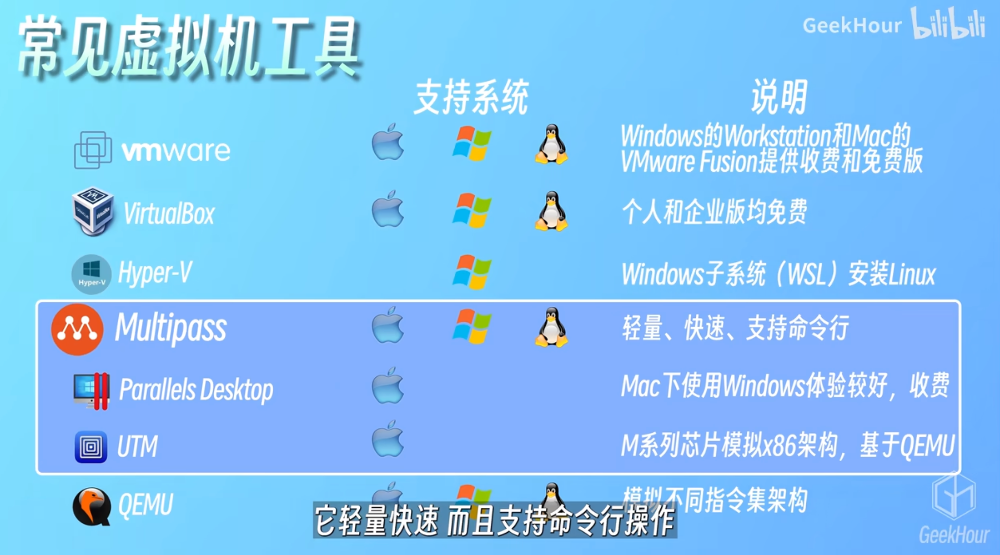


### docker 安装

基于 Alpine Linux 镜像


```bash
docker pull alpine
```


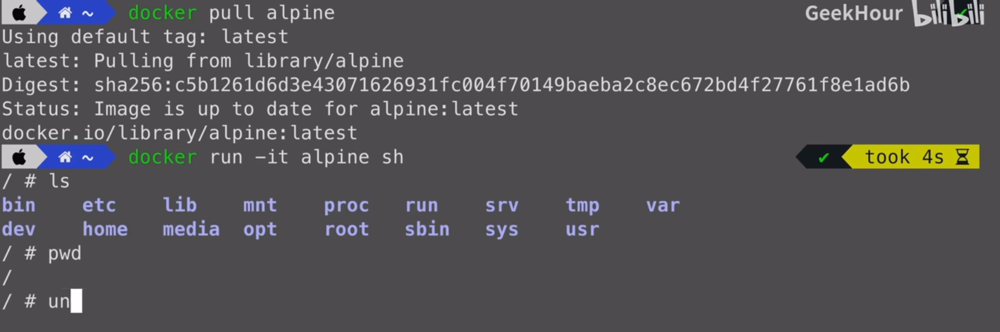


交互模式启动镜像，sh？

-it：Interactive；Terminal

sh：容器启动后是一个是 shell 模式的额交互

```bash
docker run -it alpine sh
```


### 云服务器

收费


### mac上使用multipass 安装虚拟机系统

🟢 官网下载镜像，然后按提示点即可

[multipass官方](https://canonical.com/multipass)


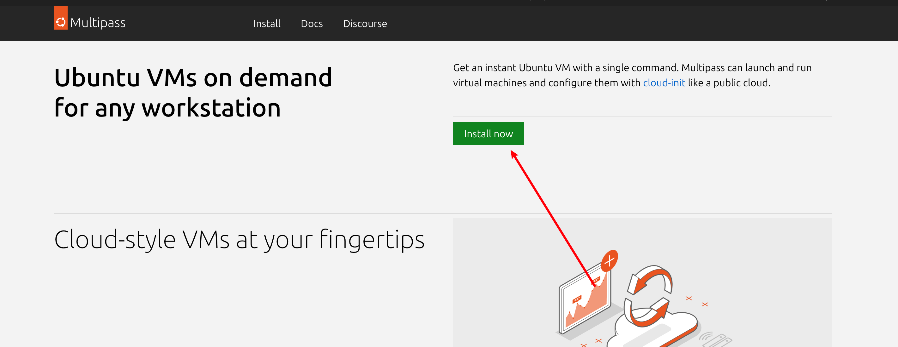


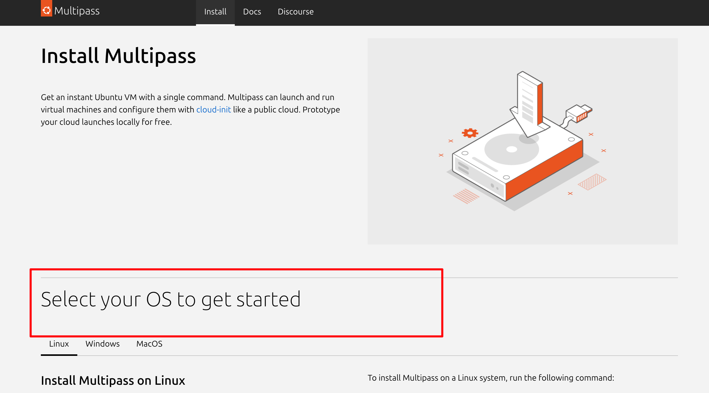


- [x] 报错：

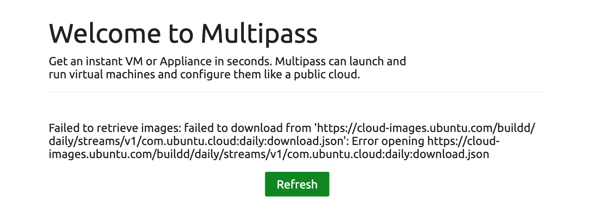

解决：退出 docker desk

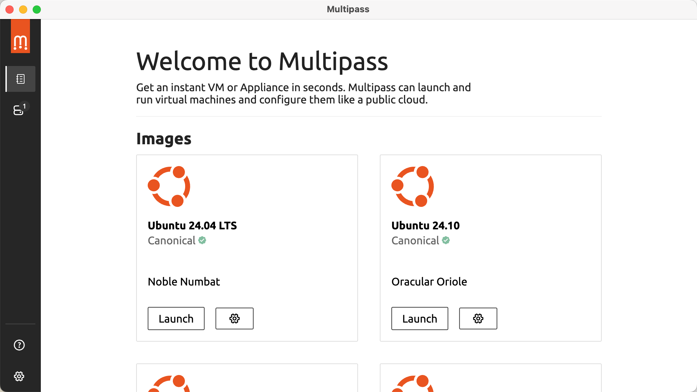


安装完成之后，打开命令行终端，执行一个`multipass launch` 命令，安装 `ubuntu`

`name`表示虚拟机的名字，参数分别表示分配给虚拟机的CPU核心数、内存、磁盘的大小

回车之后就会开始下载 `ubuntu` 的镜像文件，耐心等待

下载完成之后，使用 `multipass list` 命令，查看一下当前的虚拟机列表，可以看刚刚创建的虚拟机，已经在列表中了

接下来，使用`multipass shell ubuntu`进入到这个虚拟机中，`ubuntu`是这个虚拟机的名字，在这个虚拟机中，可以安装和配置自己需要的环境。


🟢 命令行执行，安装命令

```
multipass launch --name ubuntu --cpus 4 --memory 8G --disk 10G
```

①


② 展示系统内安装的虚拟机列表

```
multipass list
```


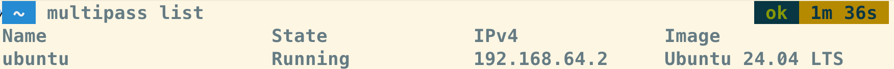

③ 启动虚拟机，名称为 ubuntu，shell 方式启动

```
multipass shell ubuntu
```


 ④ 退出

```
exit
```


### multipass 常用命令


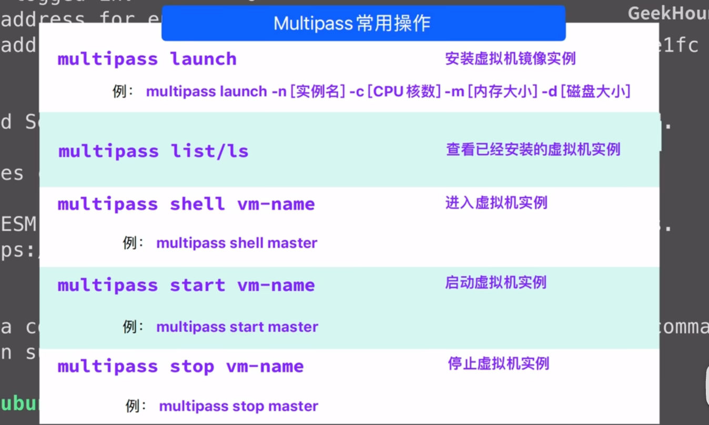


## vi 、vim

vim ：vi 的 improve 版

启动 vi：连接到 linux 系统以后，命令行输入 vi --> esc --> :q 退出

可以看到 vim 的版本号和帮助信息

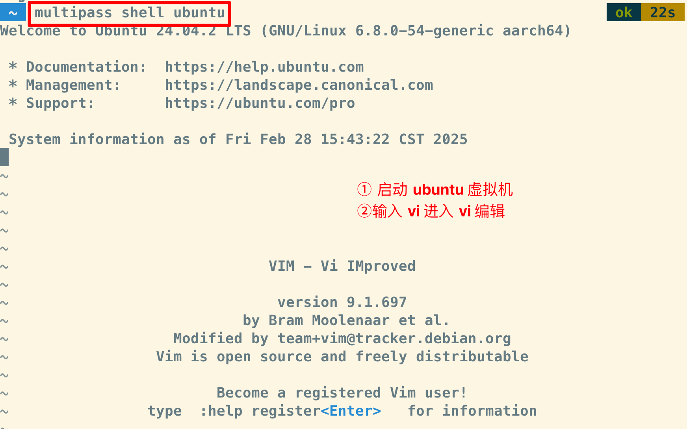

### vim 的三种模式


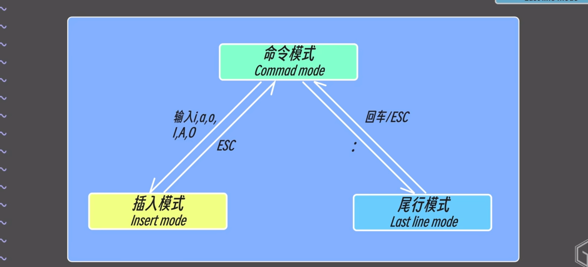

`i` 插入模式

`:wq`  保存并退出

`esc` 回到命令模式

## linux 常用命令

长列表、逆序、按修改时间显示

print working directory

change mod修改权限（+ 加权限 - 减权限）

```bash
ls

ls -ltr

ll

ls-a

cd

cd..

cd ../..

cat hello.txt

echo "命令行会显示的内容"

echo "文件中添加内容"> hello.txt

pwd

rm hello.txt

clear

chmod +x hello.sh

chmod +rw hello.txt

chmod -x hello.txt

chmod ug+x hello.sh

cd /

mkdir folder

mkdir -p folder1/folder2/folder3

du
```


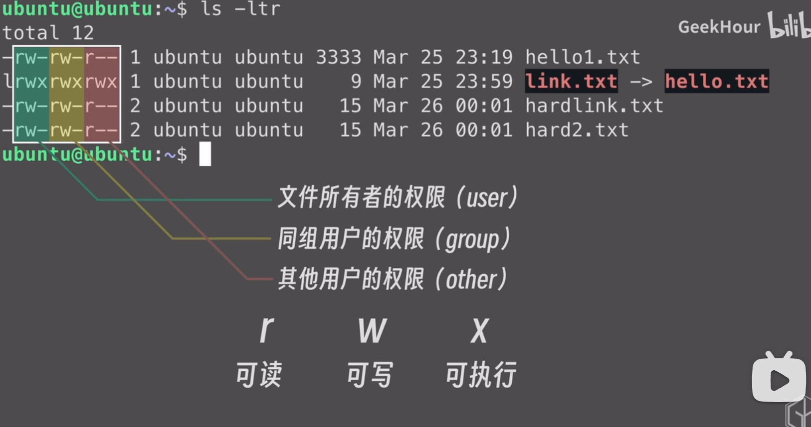

查看目录结构：`du` 、 `tree`

🟢 `du` 命令

把当前目录下的所有文件和目录的大小都列出来，看到目录的结构

左边的数字表示的是文件或者目录的大小

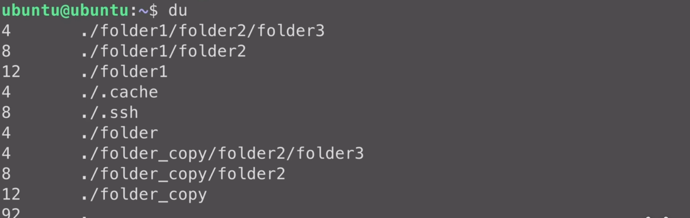

🟢 包管理器安装 tree

```
sudo apt install tree

tree
```


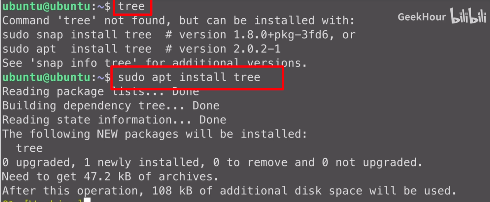

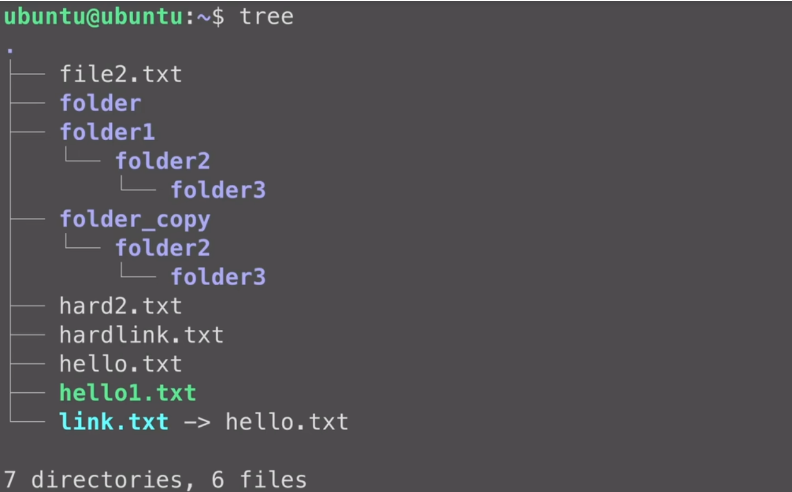
