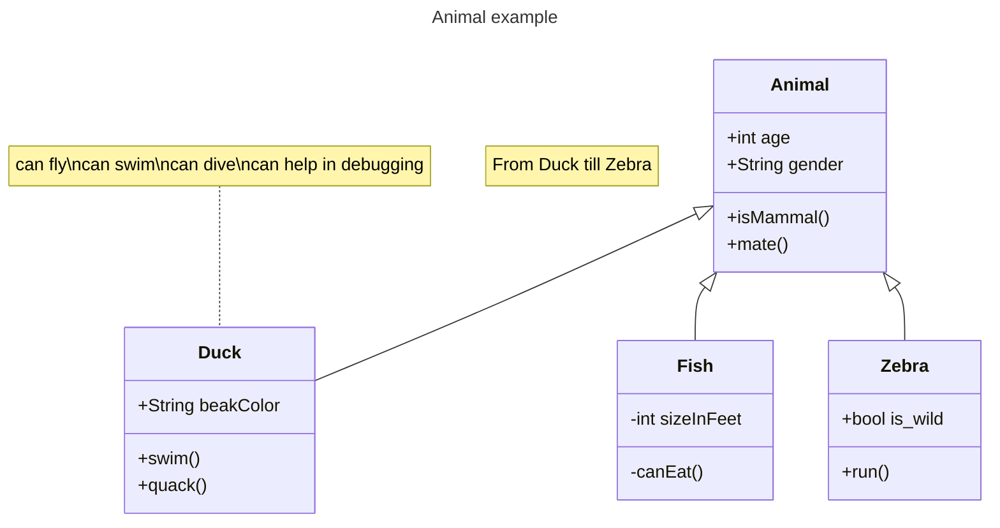
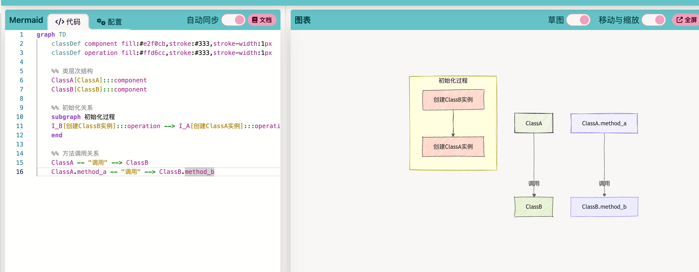
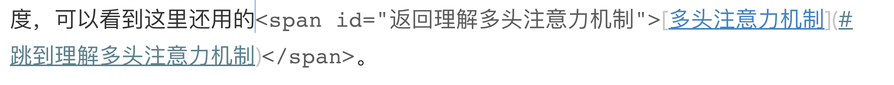
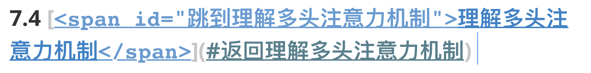

# markdown

## 画图 [mermaid](https://mermaid.js.org/intro/)

[mermaid 官网](https://mermaid.js.org/intro/) 




[mermaid在线预览工具](https://mermaid-live.nodejs.cn/edit#pako:eNqFks9v0zAUx_-V6E27pZUXJ03jA1JLLxw4wYkFTW7sLBFJHCWO2Kh64YeY1N2AXdAm7cQOCDH1BJXgnyHN_gzcei3RBMIXP7_vV5_3bL8JBIJxIHBY0DwyHo_8zFArSGhZjnhoBCLNRcYzaYRxkpAdboUoGJulLMQzTnYwxrdx53nMZET28qM7BJHzgspYZLeEMGS9IPgPQTN2d43melFfv1x-vmwW75YXr3X-_oo92NfbU0LItsuWPtT68I6-Jdcn5_WnWX16Vr-ZN_OFzpfVWD_EVr35-ba5mmn1wcFwvz75WC--a3T95eLXj9mqwJ9Ldjr3lG_Q9g3-4tNAnrFWR8uzb8v5h5uvr5r3V-2mNESRDR-06sO6ju6ibeqmXEaCHdB_ujeOMZiQ8iKlMVO_P1lBfJART7kPRIWMh7RKpA9-NlVWWknx6DgLgMii4iYUojqMNocqZ1TyUUzV26VAQpqUKpvT7IkQ6cakjkAmcATEslAXOZ6NUB95juOivgnHQFy366C-jaw917M91MNTE16sAajruLaFe9jpYQ8jbFsmcBZLUTzUw7ue4elvJ04HSQ) 如图所示。

- [x] mkdocs不解析mermaid（已解决 见 `mkdocs learn`）




## 锚点设置

从哪儿跳：

```markdown
[说明文字](#jump)
```

跳到哪里：

```markdown
<span id = "jump">跳转到的位置</span>
```

**锚点 m2**

主要还是 两种情况

- 一种是 配合a 标签  `<a name="你起名字">` 使用
- 一种是 配合 span 标签 `<span id="你又起了的一个名字">`
- 然后 `</` 会自动补全

演示示例：

- a 标签 + name

```markdown
# 目录
- [跳转到部分1](#section-1)
- [跳转到部分2](#section-2)

<a name="section-1"></a>
## 部分1
这里是部分1的内容。

<a name="section-2"></a>
## 部分2
这里是部分2的内容。
```

**<u>a 标签 锚点演示</u>** 

- [跳转到部分1](#section-1)

<a name="section-1">部分1</a>

- span 标签 +  id

```markdown
# 目录
- [跳转到部分1](#section1)
- [跳转到部分2](#section2)

<span id="section1"></span>
## 部分1
这里是部分1的内容。

<span id="section2"></span>
## 部分2
这里是部分2的内容。
```

**<u>span 标签 锚点演示</u>**

- [跳转到部分2](#section2)

<span id="section2">span 标签 +  id  ||部分 2</span> 

> ==看出区别来了吗？== 
>
> **a 标签+name，从哪儿跳，跳到哪儿都有变色**
>
> 
>
> **span 标签+id，从哪儿跳有变色，跳到哪儿没有变色**
>
> 

互跳，就：

```markdown
<span id="返回理解多头注意力机制">[多头注意力机制](#跳到理解多头注意力机制)</span>
```



```markdown
[<span id="跳到理解多头注意力机制">理解多头注意力机制</span>](#返回理解多头注意力机制) 
```

 

🏷 span 标签

```markdown
<span id="文字1">[文字1](#文字2)</span>
这里是文字1的内容。点击上方的“文字1”可以跳转到文字2。

<span id="文字2">[文字2](#文字1)</span>
这里是文字2的内容。点击上方的“文字2”可以跳转到文字1。
```

🏷 a 标签

```markdown
[文字1](#文字2) <a id="文字1"></a>
这里是文字1的内容。点击上方的“文字1”可以跳转到文字2。

[文字2](#文字1) <a id="文字2"></a>
这里是文字2的内容。点击上方的“文字2”可以跳转到文字1。
```


## 箭头上写字

```markdown
X \stackrel{F}{\rightarrow} Y
```

$X \stackrel{F}{\rightarrow} Y$

## 箭头上加字符

```markdown
$\vec{a}$  向量
$\overline{a}$ 平均值
$\widehat{a}$ (线性回归，直线方程) 尖
$\widetilde{a}$ 
$\dot{a}$   一阶导数
$\ddot{a}$  二阶导数
```

$\vec{a}$  向量
$\overline{a}$ 平均值
$\widehat{a}$ (线性回归，直线方程) 尖
$\widetilde{a}$ 
$\dot{a}$   一阶导数
$\ddot{a}$  二阶导数

## markdown多行大括号

### 居中对齐的大括号

$$
f(i)=
\left\{\begin{matrix}
1,i\in Q \\
-1,i\notin Q
\end{matrix}\right.
$$

```markdown
$$
f(i)=
\left\{\begin{matrix}
1,i\in Q \\
-1,i\notin Q
\end{matrix}\right.
$$

```

### 标准大括号

左对齐的大括号

```markdown
$$
\begin{cases}
x+y=5 \\
2x+3y=12
\end{cases}
$$

```

$$
\begin{cases}
x+y=5 \\
2x+3y=12
\end{cases}
$$

### 波浪号

```
$\sim$
```

$\sim$

正比于符号

```
$\propto$
```

$\propto$

积分符号

```
\int
```

$\int$

任意

```
${\forall}$
```

${\forall}$

存在

```
${\exists}$
```

${\exists}$

等价于

```
$\iff$
```

$\iff$

```
$\partial$
```

$\partial$


```
\mathbf{I}
```

$\mathbf{I}$ 加粗黑体表示向量

```
$\pi$
```

$\pi$

```
$\prod$
$\cdot$
$\times$
$\circ$
$\odot$
```

$\prod$

$\cdot$

$\times$

- 

$\circ$

$\odot$

## 正负号

```markdown
x = \pm 5
```

 $x = \pm 5$ 


## 希腊字母

- 阿尔法（$\alpha$ ）：`$\alpha$`
- 贝塔（$\beta$）：`$\beta$`
- 伽玛（$\gamma$）：`$\gamma$`
- 德尔塔（$\delta$）：`$\delta$`
- 艾普西隆（$\epsilon$）：`$\epsilon$`
- 泽塔（$\zeta$）：`$\zeta$`
- 伊塔（$\eta$）：`$\eta$`
- 西塔（$\theta$）：`$\theta$`
- 艾欧塔（$\iota$）：`$\iota$`
- 卡帕（$\kappa$）：`$\kappa$`
- 拉姆达（$\lambda$）：`$\lambda$`
- 缪（$\mu$）：`$\mu$`
- 纽（$\nu$）：`$\nu$`
- 克西（$\xi$）：`$\xi$`
- 派（$\pi$）：`$\pi$`
- 柔（$\rho$）：`$\rho$`
- 西格玛（$\sigma$）：`$\sigma$`
- 陶（$\tau$）：`$\tau$`
- 宇普西隆（$\upsilon$）：`$\upsilon$`
- 斐（$\phi$）：`$\phi$`
- 凯（$\chi$）：`$\chi$`
- 普赛（$\psi$）：`$\psi$`
- 欧米伽（$\omega$）：`$\omega$`

大写希腊字母：

- 大伽玛（$\Gamma$）：`$\Gamma$`
- 大德尔塔（$\Delta$）：`$\Delta$`
- 大西塔（$\Theta$）：`$\Theta$`
- 大拉姆达（$\Lambda$）：`$\Lambda$`
- 大克西（$\Xi$）：`$\Xi$`
- 大派（$\Pi$）：`$\Pi$`
- 大西格玛（$\Sigma$）：`$\Sigma$`
- 大宇普西隆（$\Upsilon$）：`$\Upsilon$`
- 大斐（$\Phi$）：`$\Phi$`
- 大普赛（$\Psi$）：`$\Psi$`
- 大欧米伽（$\Omega$）：`$\Omega$`


## 多行大括号公式

```markdown
 $$ st.  \left\{ \begin{array}{lr} 0 \\ 1 \end{array}\right.  $$
```


 $$ st.  \left\{ \begin{array}{lr} 0 \\ 1 \end{array}\right.  $$


## 不等于

```markdown
\ne
```

$\ne$

