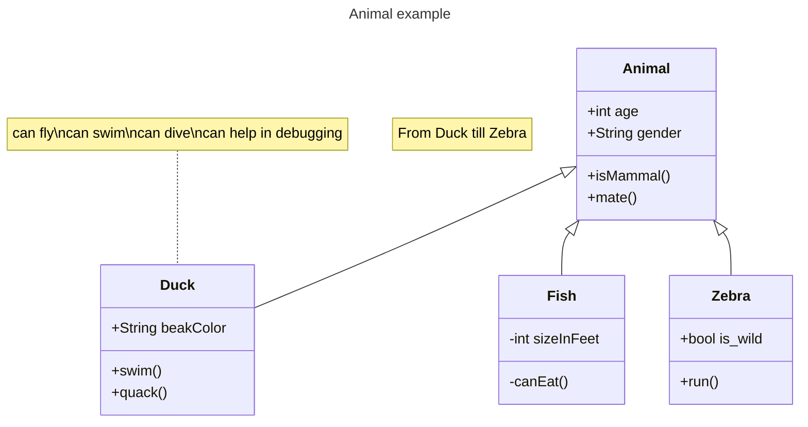

# markdown

## 画图 [mermaid](https://mermaid.js.org/intro/)

[mermaid 官网](https://mermaid.js.org/intro/) 




## 锚点设置

从哪儿跳：

```markdown
[说明文字](#jump)
```

跳到哪里：

```markdown
<span id = "jump">跳转到的位置</span>
```

## 箭头上写字

```markdown
X \stackrel{F}{\rightarrow} Y
```

$X \stackrel{F}{\rightarrow} Y$

## 箭头上架字符

```markdown
$\vec{a}$  向量
$\overline{a}$ 平均值
$\widehat{a}$ (线性回归，直线方程) 尖
$\widetilde{a}$ 
$\dot{a}$   一阶导数
$\ddot{a}$  二阶导数
```

$\vec{a}$  向量
$\overline{a}$ 平均值
$\widehat{a}$ (线性回归，直线方程) 尖
$\widetilde{a}$ 
$\dot{a}$   一阶导数
$\ddot{a}$  二阶导数

## markdown多行大括号

### 居中对齐的大括号

$$
f(i)=
\left\{\begin{matrix}
1,i\in Q \\
-1,i\notin Q
\end{matrix}\right.
$$

```markdown
$$
f(i)=
\left\{\begin{matrix}
1,i\in Q \\
-1,i\notin Q
\end{matrix}\right.
$$

```

### 标准大括号

左对齐的大括号

```markdown
$$
\begin{cases}
x+y=5 \\
2x+3y=12
\end{cases}
$$

```

$$
\begin{cases}
x+y=5 \\
2x+3y=12
\end{cases}
$$

### 波浪号

```
$\sim$
```

$\sim$

正比于符号

```
$\propto$
```

$\propto$

积分符号

```
\int
```

$\int$

任意

```
${\forall}$
```

${\forall}$

存在

```
${\exists}$
```

${\exists}$

等价于

```
$\iff$
```

$\iff$

```
$\partial$
```

$\partial$


```
\mathbf{I}
```

$\mathbf{I}$ 加粗黑体表示向量

```
$\pi$
```

$\pi$

```
$\prod$
$\cdot$
$\times$
$\circ$
$\odot$
```

$\prod$

$\cdot$

$\times$

- 

$\circ$

$\odot$


