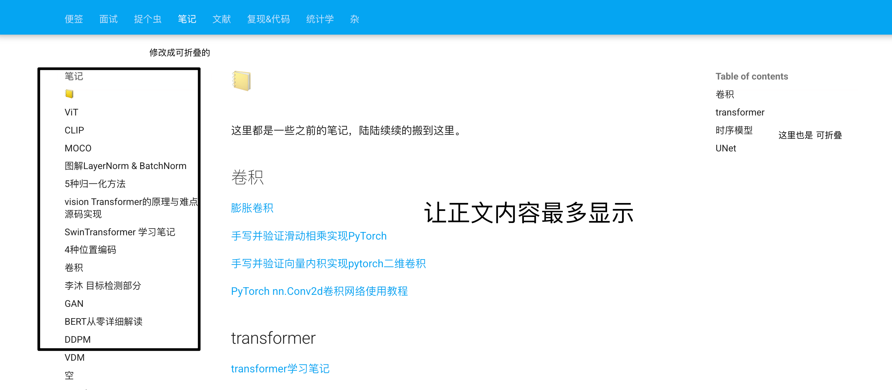

# MkDocs

## 学习链接

好看的页面设计：

- [https://note.tonycrane.cc/web/](https://note.tonycrane.cc/web/)
- [https://note.hobbitqia.cc/changelog/](https://note.hobbitqia.cc/changelog/)
- [官方 Material for MkDocs](https://squidfunk.github.io/mkdocs-material/)
- [Mkdocs-Wcowin中文主题](https://wcowin.work/)
- [MKdocs博客中文系列教程](https://www.zhihu.com/column/c_1754218140098387968)

- [ ] 文章标题下显示统计


- [ ] 卡片显示查看 pdf
- [ ] 折叠框
- [ ] 归档功能
- [ ] 优化渲染速度
- [x] 内嵌 pdf并显示


## TODO

- [ ] 归档功能
- [ ] 折叠导航、目录，文档内容占最多篇幅： [花书](https://zh.d2l.ai/chapter_recurrent-neural-networks/index.html) 



- [x] （solved：`mkdocs-jupyter`）mknotebooks 代码背景浅紫色，报看，肯定能改。[花书](https://zh.d2l.ai/chapter_recurrent-neural-networks/index.html) 
- [ ] 网页渲染速度太慢了

## 组件测试


## begin


主题配置：[**Material for MkDocs**](https://squidfunk.github.io/mkdocs-material/getting-started/)

本地调试：

```
(base) .. mkdocs-site % mkdocs -h
Usage: mkdocs [OPTIONS] COMMAND [ARGS]...

  MkDocs - Project documentation with Markdown.

Options:
  -V, --version         Show the version and exit.
  -q, --quiet           Silence warnings
  -v, --verbose         Enable verbose output
  --color / --no-color  Force enable or disable color and wrapping for the output. Default is auto-
                        detect.
  -h, --help            Show this message and exit.

Commands:
  build      Build the MkDocs documentation.
  get-deps   Show required PyPI packages inferred from plugins in mkdocs.yml.
  gh-deploy  Deploy your documentation to GitHub Pages.
  new        Create a new MkDocs project.
  serve      Run the builtin development server.
```

[参考模版源码](https://github.com/Yang-Xijie/yang-xijie.github.io)

[参考模版展示](https://yang-xijie.github.io/)

[官方文档：mkdocs配置 ](https://squidfunk.github.io/mkdocs-material/setup/changing-the-colors/)

[mkdocs入门教程]( https://b23.tv/jQs24a5)

## 文件组织形式

```bash
(base) ... docs % tree
.
├── Error  # 文件夹
│   └── 报错.md   # markdown文件
├── Leecode
│   └── 力扣.md
├── home
│   ├── page-1.md
│   └── page-2.md
├── index.md
├── mkdocs
│   ├── css
│   │   ├── no-footer.css
│   │   └── unordered-list-symbols.css
│   └── javascripts
│       └── katex.js
└── 便签  # 文件夹
  ├── TODO  # 图床
  │   ├── 1.png
  │   └── image-20241115095446260.png
  ├── TODO.md #markdown文件
  ├── mkdocs_learn
  │   └── image-20241115100605111-1636372-1636377.png
  ├── mkdocs_learn.md
  └── 备忘.md

10 directories, 14 files
```

前段与后端的对应


## 添加页面创建时间、最后一次修改时间

[官方文档链接](https://squidfunk.github.io/mkdocs-material/setup/adding-a-git-repository/#code-actions)


更换时间戳显示工具[mkdocs-document-dates](https://github.com/jaywhj/mkdocs-document-dates/blob/main/README_zh.md)

第一步：安装 python 依赖库

```python
pip install mkdocs-document-dates
```

第二步：修改配置文件`.yml`

```yaml
plugins:
  - document-dates
```

自定义配置：

```yaml
plugins:
  - document-dates:
      type: date               # 日期类型： date | datetime | timeago，默认 date
      locale: zh               # 本地化语言： zh zh_tw en es fr de ar ja ko ru ，默认：en
      date_format: '%Y-%m-%d'  # 日期格式
      time_format: '%H:%M:%S'  # 时间格式（仅在 type=datetime 时有效）
      position: bottom         # 显示位置：top（标题后） | bottom（文档末尾），默认 bottom
      exclude:                 # 排除的文件模式列表
        - temp.md              # 排除特定文件
        - private/*            # 排除 private 目录下的所有文件，包括子目录
        - drafts/*.md          # 排除当前目录 drafts 下的所有 markdown 文件，不包括子目录
```

第三步：修改工作流文件

```yaml
...

    - run: pip install mkdocs-document-dates
    - run: mkdocs gh-deploy --force
```


## 写作

更多写作

```
!!! note
    This is a note.
```

```
!!! tip
    This is a tip.
```

```
!!! warning
    This is a warning.
```

```
!!! danger
    This is a danger.
```

```
!!! success
    This is a success.
```

```
!!! info
    This is a info.
```

```
!!! quote
    This is a quote.
```

```
??? question "What is the meaning of life, the universe, and everything?"
```

!!! note
    This is a note.

!!! tip
    This is a tip.

!!! warning
    This is a warning.

!!! danger
    This is a danger.

!!! success
    This is a success.

!!! info
    This is a info.

!!! quote
    This is a quote.

??? question "What is the meaning of life, the universe, and everything?"

## mkdocs命令

* `mkdocs new [dir-name]` - Create a new project.
* `mkdocs serve` - Start the live-reloading docs server.
* `mkdocs build` - Build the documentation site.
* `mkdocs -h` - Print help message and exit.

**Project layout**

    mkdocs.yml    # The configuration file.
    docs/
        index.md  # The documentation homepage.
        ...       # Other markdown pages, images and other files.

## 一些修改

- 本地文件和在线文件的存储问题，上传上去的本地怎么管理，又不能完全在线

等你写得多到占用本地太多空间再说吧，笑）

- 
   图床 & typora& vscode&github

typora 可以自动创建图床文件夹

- 
   [mkdocs material 内容差参考](https://squidfunk.github.io/mkdocs-material/reference/code-blocks/#highlighting-specific-lines-lines)
- 
   [时间戳显示有问题 github actions error](https://zhuanlan.zhihu.com/p/688321385)
- 
   版本修改

[官方链接](https://squidfunk.github.io/mkdocs-material/setup/setting-up-versioning/)

[版本控制示例](https://mkdocs-material.github.io/example-versioning/latest/)

[版本控制源码](https://github.com/mkdocs-material/example-versioning)

好复杂，再说吧

- 
   文档标题加编号（可以但没必要，新建CSS文件，然后在yml配置文件中引用
- 
   mkdocs的文件组织结构

docs/文件夹（导航栏）/（起个别名）/文件夹/文件夹/md文件

docs/文件夹（导航栏）/文件夹（左侧栏下拉条）/md文件

docs/文件夹（导航横栏）/md文件（左侧栏）/一级标题（标题处）/二级标题（目录从二级标题开始显示）

一级标题直接会显示在左侧栏，或者在yml文件中起别名

- 
   英文文本 两端对齐(以后再说吧，人家都没弄，我也不折腾了)
- 
   这个[主题](https://wcowin.work/)超好看，有空折腾一下
- 
   git push origin main每次push就会把所有文件的时间全部更改了

改对了！重新把整个 [工作流文件](https://wcowin.work/Mkdocs-Wcowin/blog/websitebeauty/time/)复制了别人的一份。

- 
   文件结构变了，记得修改yml的路径


## 嵌入 pdf 文档并显示

[如何在github页面上mkdocs生成的网站中嵌入本地pdf文件？](https://cloud.tencent.com/developer/ask/sof/107585802)


**（1）修改配置文件：** 

```yaml
markdown_extensions:
  - pymdownx.pathconverter:
      base_path: 'docs/pdf_files' # 设置基础路径为你的 PDF 文件所在目录
      absolute: false # 将路径不转换为绝对路径
      tags: 'a script img link object embed' # 需要转换路径的 HTML 标签
```

（2）**新建 markdown 文件**，嵌入 pdf 链接即可，注意路径的配置，嵌入链接的方法和嵌入外链的逻辑是一样的，只是这里设置的本地的（指的是 现在 工作的路径）相对路径

```markdown
# 📒
这里都是一些之前的笔记，陆陆续续的搬到这里。

## 膨胀卷积

[点击这里查看 PDF 文件](../pdf_files/1_dilatedConv.pdf)
```


> 我最开始的报错是，路径错了；还有 `absolute: false` 这里设置成 false

## mkdocs & mermaid

项目地址：[https://github.com/fralau/mkdocs-mermaid2-plugin](https://github.com/fralau/mkdocs-mermaid2-plugin)

> 另附 ：[Mermaid 在线编辑器](https://mermaid-live.nodejs.cn/edit#pako:eNpVkcFOwzAMhl8l8gmkbgpdu7Q5ILEOdhkCiZ1od4jadIlYkipNNUbbdyfrBAKfbP-ff1l2D6WpOFCoj-ZUCmYd2q0LjXw85JmwsnWKtXs0m90PG-6QMpqfB7S62RjUCtM0Uh9ur_zqAqGs314wjpyQ-mO8Stk0_6L5gNb5ljXONPu_yu5kBvSYy1fh7f8rwnI_9ZTXjNZsVjKLMmYnBAJQ3ComK79-f-kU4ARXvADq04rXrDu6Ago9epR1zryddQnU2Y4HYE13EOA9j62vuqZijq8lO1imfpCG6Xdj1C_ka6A9fAINQzzHcRphnOA0jglOAjgDJWQe4yTC4R1JoxQvF2MAX5MDnsckChfLhQ-CQ5yQAHglnbHP1_NPXxi_AcRZec0) 

可以<u>正确解析</u>： 


第一步：终端安装

```python
pip install mkdocs-mermaid2-plugin
```

第二步：更新配置文件：

```yaml
plugins:
    - search
    - mermaid2
```

第三步：修改一下主题

```yaml
  - pymdownx.superfences:
      custom_fences:
        - name: mermaid
          class: mermaid
          format: !!python/name:mermaid2.fence_mermaid_custom
```

需要注意的问题：上面的缩进，非常容易报错，AI 自动给输出的全文本内容会有删减，细心点吧。

具体的位置：


示例代码 ````mermaid`

```
graph TD
    classDef component fill:#e2f0cb,stroke:#333,stroke-width:1px
    classDef operation fill:#ffd6cc,stroke:#333,stroke-width:1px

    %% 类层次结构
    ClassA[ClassA]:::component
    ClassB[ClassB]:::component
    
    %% 初始化关系
    subgraph 初始化过程
    I_B[创建ClassB实例]:::operation --> I_A[创建ClassA实例]:::operation
    end
    
    %% 方法调用关系
    ClassA -- "调用" --> ClassB
    ClassA.method_a -- "调用" --> ClassB.method_b
```

 正确解析出的效果


## 远程仓库渲染 mermaid

> 本地 localhost 能够渲染 mermaid，提交到远程仓库，工作流文件总是报错
>
> 

解决：修改工作流文件，安装 mermaid。


## mkdocs &jupyter notebook

==(1)== 

[mknotebooks](https://github.com/greenape/mknotebooks?tab=readme-ov-file)

[mknotebooks 项目常见问题解决方案](https://blog.csdn.net/gitblog_00395/article/details/144578305?utm_medium=distribute.pc_relevant.none-task-blog-2~default~baidujs_baidulandingword~default-0-144578305-blog-144739864.235^v43^pc_blog_bottom_relevance_base4&spm=1001.2101.3001.4242.1&utm_relevant_index=3)

第一步：

```bash
pip3 install mknotebooks
```

第二步，修改配置文件

```yaml
# mkdocs.yml
nav:
  - your_notebook.ipynb

plugins:
  - mknotebooks
```

即可成功，实现 jupyter notebook 嵌入到 mkdocs 的网页中

不咋好看也是尊嘟


(2) mkdocs-jupyter

[mkdocs-jupyter](https://github.com/danielfrg/mkdocs-jupyter?tab=readme-ov-file)

第一步：

```bash
pip install mkdocs-jupyter
```

第二步：修改导航栏和配置文件

```python
nav:
    - Home: index.md
    - Notebook page: notebook.ipynb
    - Python file: python_script.py
plugins:
    - mkdocs-jupyter
```

换了，很好看

 

第三步：部署到远程，还需要修改工作流文件：

```yaml
- run: pip install mkdocs-jupyter
```

 

## 嵌入 pdf 直接显示

终于显示成功了，这个 mkdocs 的找路径的逻辑我属实不理解


我的处理：

文件结构：

```bash
.
├── 1_0_fourier.md
├── 1_1_fourier.md
├── 1_2_signal.md
├── 1_3_complexExp.md
├── 1_4_signal.md
├── 1_FFT.md
├── 2_FFT.md
├── 5_3_DTFS.pdf
├── 5_4_DTFT.pdf
```

需求：

> 在 `1_4_signal.md` 中嵌入 `5_3_DTFS.pdf`

方法：

```html
<iframe src="../pdf_files/5_3_DTFS.pdf" width="100%" height="800px" style="border: 1px solid #ccc; overflow: auto;"> </iframe>
```

是在不明白，这里找地址的路径，那就复制两份 `5_3_DTFS.pdf` 吧。

## 归档


