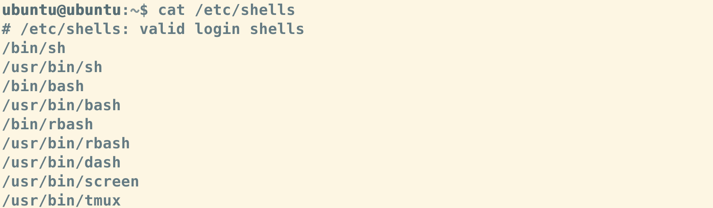
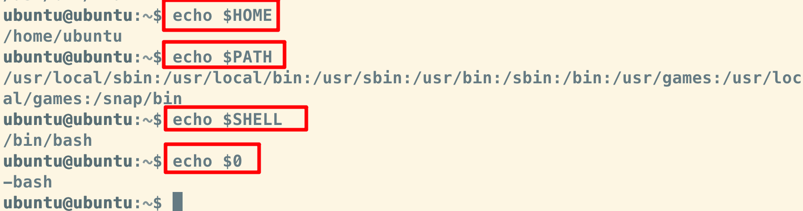
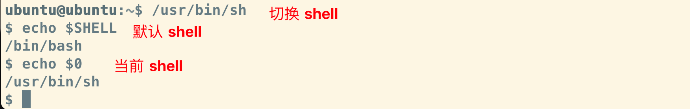
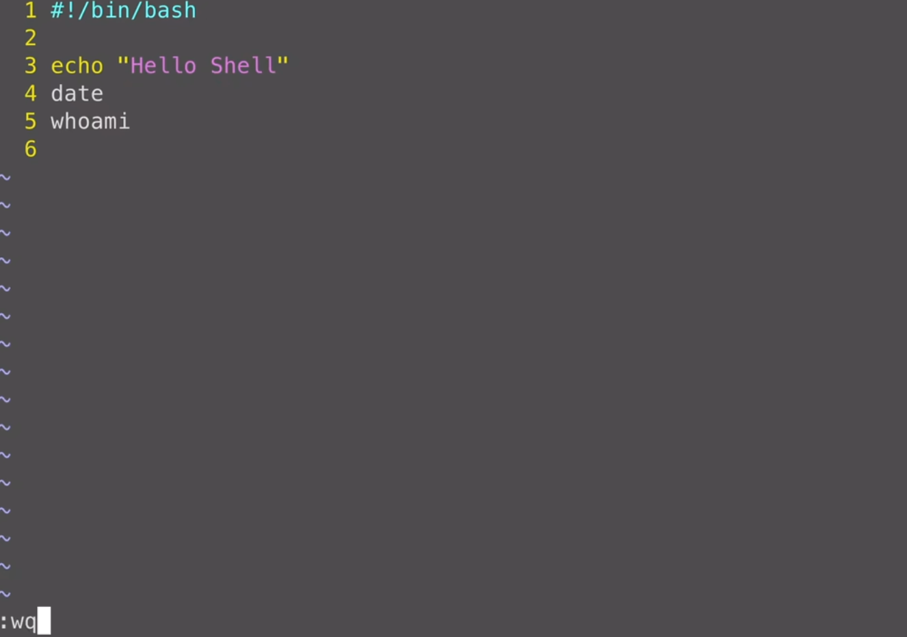
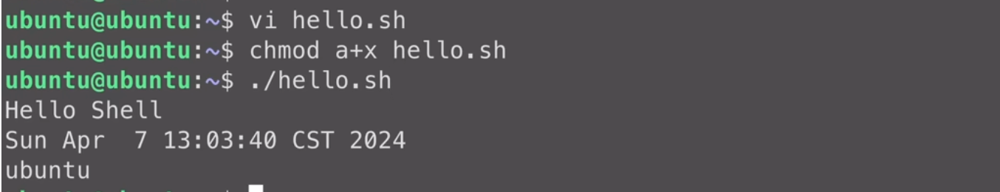

# Shell

mac 使用 shell

[参考](https://www.bilibili.com/video/BV17m411U7cC/?spm_id_from=333.1007.top_right_bar_window_history.content.click&vd_source=ddd7d236ab3e9b123c4086c415f4939e)


（1）进入 ubuntu 系统

```
multipass shell ubuntu
```


（2）cat命令查看一下，etc目录下的shells这个文件，这个文件记录了系统中所有的shell版本

```
cat /etc/shells
```


查看系统中所有的 bash版本




查看环境变量、系统的查找路径（系统会在这些路径中查找各种命令的执行文件）、shell环境变量就是用来存储当前系统默认使用的shell的路径的、`$0` 查看当前正在执行的脚本的名称



切换 shell



（3）shell 基础

① 新建


② 脚本文件的第一行：系统自动调用bash来解释执行


③ 运行一个脚本文件的例子

脚本文件中的内容



🔵 :wq保存并退出，回到命令行

🔵 在 linux 中执行脚本文件，要给这个文件添加执行权限，a+x 给所有用户添加执行权限

之后执行：执行的方式是在命令行中输入  `./` ，然后加上脚本文件的名称就可以了


