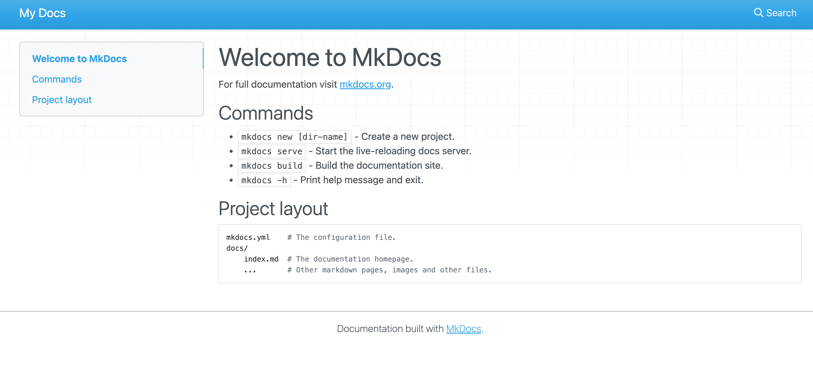

主题配置：[**Material for MkDocs**](https://squidfunk.github.io/mkdocs-material/getting-started/)

本地调试：

```
(base) .. mkdocs-site % mkdocs -h
Usage: mkdocs [OPTIONS] COMMAND [ARGS]...

  MkDocs - Project documentation with Markdown.

Options:
  -V, --version         Show the version and exit.
  -q, --quiet           Silence warnings
  -v, --verbose         Enable verbose output
  --color / --no-color  Force enable or disable color and wrapping for the output. Default is auto-
                        detect.
  -h, --help            Show this message and exit.

Commands:
  build      Build the MkDocs documentation.
  get-deps   Show required PyPI packages inferred from plugins in mkdocs.yml.
  gh-deploy  Deploy your documentation to GitHub Pages.
  new        Create a new MkDocs project.
  serve      Run the builtin development server.
```

[参考模版源码](https://github.com/Yang-Xijie/yang-xijie.github.io)

[参考模版展示](https://yang-xijie.github.io/)

[官方文档：mkdocs配置 ](https://squidfunk.github.io/mkdocs-material/setup/changing-the-colors/)

[mkdocs入门教程]( https://b23.tv/jQs24a5)

