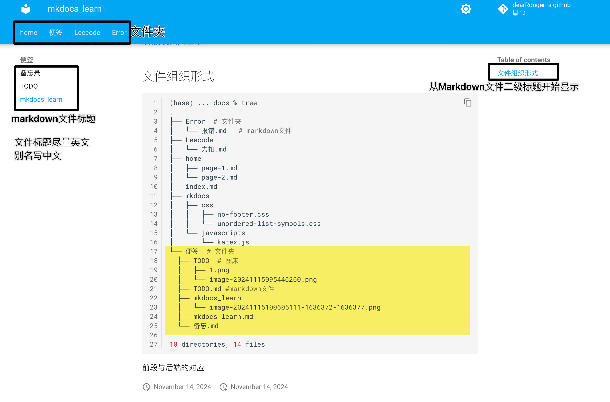

主题配置：[**Material for MkDocs**](https://squidfunk.github.io/mkdocs-material/getting-started/)

本地调试：

```
(base) .. mkdocs-site % mkdocs -h
Usage: mkdocs [OPTIONS] COMMAND [ARGS]...

  MkDocs - Project documentation with Markdown.

Options:
  -V, --version         Show the version and exit.
  -q, --quiet           Silence warnings
  -v, --verbose         Enable verbose output
  --color / --no-color  Force enable or disable color and wrapping for the output. Default is auto-
                        detect.
  -h, --help            Show this message and exit.

Commands:
  build      Build the MkDocs documentation.
  get-deps   Show required PyPI packages inferred from plugins in mkdocs.yml.
  gh-deploy  Deploy your documentation to GitHub Pages.
  new        Create a new MkDocs project.
  serve      Run the builtin development server.
```

[参考模版源码](https://github.com/Yang-Xijie/yang-xijie.github.io)

[参考模版展示](https://yang-xijie.github.io/)

[官方文档：mkdocs配置 ](https://squidfunk.github.io/mkdocs-material/setup/changing-the-colors/)

[mkdocs入门教程]( https://b23.tv/jQs24a5)

## 文件组织形式

```bash
(base) ... docs % tree
.
├── Error  # 文件夹
│   └── 报错.md   # markdown文件
├── Leecode
│   └── 力扣.md
├── home
│   ├── page-1.md
│   └── page-2.md
├── index.md
├── mkdocs
│   ├── css
│   │   ├── no-footer.css
│   │   └── unordered-list-symbols.css
│   └── javascripts
│       └── katex.js
└── 便签  # 文件夹
  ├── TODO  # 图床
  │   ├── 1.png
  │   └── image-20241115095446260.png
  ├── TODO.md #markdown文件
  ├── mkdocs_learn
  │   └── image-20241115100605111-1636372-1636377.png
  ├── mkdocs_learn.md
  └── 备忘.md

10 directories, 14 files
```

前段与后端的对应



## 添加页面创建时间、最后一次修改时间

[官方文档链接](https://squidfunk.github.io/mkdocs-material/setup/adding-a-git-repository/#code-actions)


